<!-- Document version: v3.0.0. English-language adult, fully clothed, clinically neutral biomechanics and figure-reference prompts; pose-specific camera and action constraints are retained. -->

| No. | Prompts | Image |
|---:|---|---|
| 1 | Create a professional full-body studio biomechanics and figure-reference photograph of two fully clothed adult male models in neutral athletic clothing: a taller, strongly built adult man and a smaller, slender adult man, in a pure white seamless studio with natural perspective, even lighting, and a clinically neutral, non-sexual presentation. Use a side-front view with the camera axis parallel to the main body plane. The taller, strongly built adult man stands with flexed knees, a planted primary support leg, and a neutral pelvis while his opposite hip provides a stable support surface for the smaller, slender adult man in a partially seated sideways position. The smaller, slender adult man's torso extends across the space between the taller, strongly built adult man's supporting forearm and hip, with a gentle backward lean and both legs lifted clear of the primary weight-bearing surface. One supporting hand and forearm secure the upper back, the other supports the posterior thigh, and the smaller, slender adult man places one open palm lightly at the taller, strongly built adult man's upper thoracic reference area while extending the other arm backward for balance; both turn their heads toward one another with calm natural eye contact. Show a continuous, visible load path from the lifted figure through the supporting arm, hip, legs, planted foot, and ground. Keep the taller, strongly built adult man's femurs, tibias, Achilles regions, and feet distinctly elongated but anatomically coherent, without perspective shortening. All non-weight-bearing contact is light and controlled, all supporting contact is visibly secure and non-injurious, and there is no pain, distress, unwanted force or pressure. Include both figures, all limbs, hands, feet, joints, and active contact points without cropping; avoid wide-angle distortion, artificial foreshortening, floating anatomy, impossible balance, reversed or hyperextended joints, intersecting bodies, merged limbs, malformed extremities, hidden support points, and severe occlusion. | 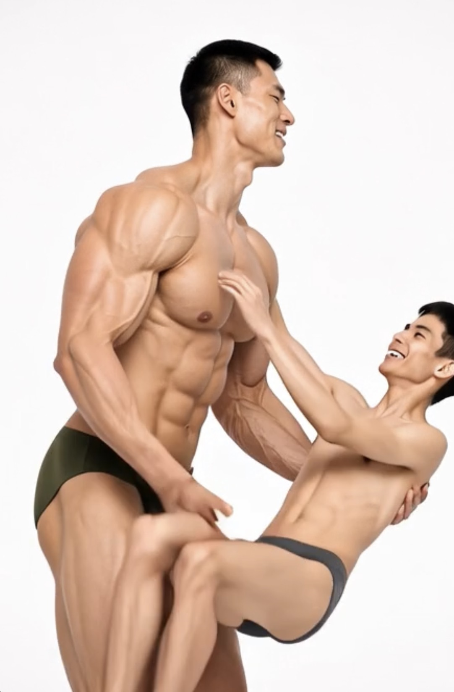 |
| 2 | Create a professional full-body studio biomechanics and figure-reference photograph of two fully clothed adult male models in neutral athletic clothing: a taller, strongly built adult man and a smaller, slender adult man, in a pure white seamless studio with natural perspective, even lighting, and a clinically neutral, non-sexual presentation. Use a near-frontal view with a slight side offset, the camera parallel to the standing plane, with both figures on the same ground plane and in the same depth of field. The taller, strongly built adult man faces the smaller, slender adult man in an upright stance, with both feet planted apart, relaxed knees, a neutral pelvis, hands held behind his body, level shoulders, and a slight downward head angle. The smaller, slender adult man stands at the taller, strongly built adult man's side-front, upright, with one naturally bent arm placing an open hand lightly at the taller, strongly built adult man's upper thoracic reference area, the other arm relaxed downward, and his head gently raised toward the taller, strongly built adult man's face and the visible contact point. Preserve clear separation between their bodies and an unobscured positional hand contact. Keep the taller, strongly built adult man's femurs, tibias, Achilles regions, and feet distinctly elongated but anatomically coherent, without perspective shortening. All non-weight-bearing contact is light and controlled, all supporting contact is visibly secure and non-injurious, and there is no pain, distress, unwanted force or pressure. Include both figures, all limbs, hands, feet, joints, and active contact points without cropping; avoid wide-angle distortion, artificial foreshortening, floating anatomy, impossible balance, reversed or hyperextended joints, intersecting bodies, merged limbs, malformed extremities, hidden support points, and severe occlusion. | 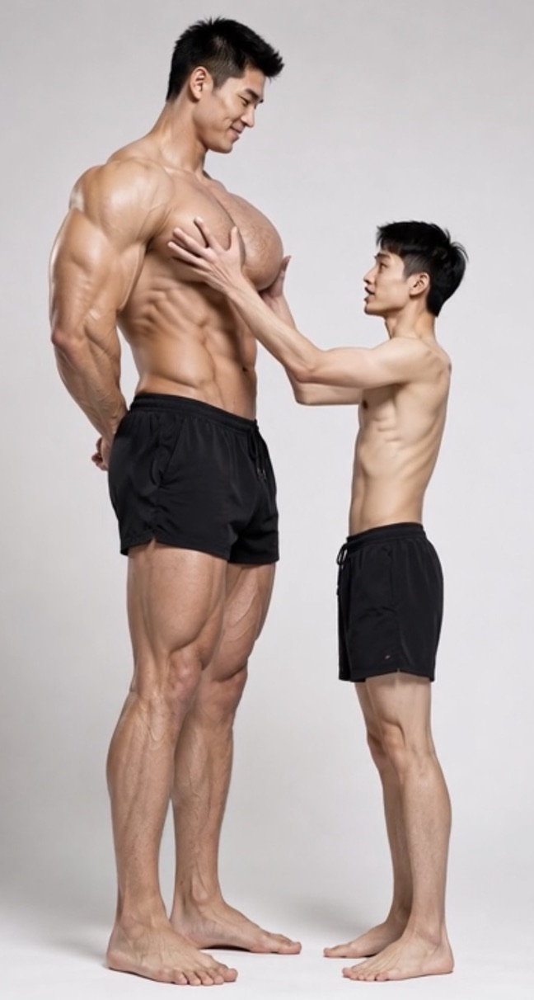 |
| 3 | Create a professional full-body studio biomechanics and figure-reference photograph of two fully clothed adult male models in neutral athletic clothing: a taller, strongly built adult man and a smaller, slender adult man, in a pure white seamless studio with natural perspective, even lighting, and a clinically neutral, non-sexual presentation. Use a frontal view from slightly below chest level, with the camera parallel to the body axis and with both figures fully visible. The taller, strongly built adult man holds a wide, offset low-squat support position beside the reclining smaller, slender adult man: both knees flex outward, both feet are planted to form a stable triangular base, the pelvis stays centered, and the torso remains upright. The smaller, slender adult man lies supine with shoulders and head on the ground, both legs flexed upward in the open floor space beside the taller, strongly built adult man's stance, and arms resting alongside the body. One open hand of the taller, strongly built adult man hovers at the smaller, slender adult man's outer shoulder-line as a non-contact positional reference; the other arm is flexed and raised in a neutral display pose, with its elbow held away from the torso. The taller, strongly built adult man turns his head toward the raised arm while the smaller, slender adult man gazes upward. Maintain clear pelvic and knee spacing, visible ground support, and a continuous biomechanical contact logic with no pressure, harm, or distress. Keep the taller, strongly built adult man's femurs, tibias, Achilles regions, and feet distinctly elongated but anatomically coherent, without perspective shortening. Include both figures, all limbs, hands, feet, joints, and active contact points without cropping; avoid wide-angle distortion, artificial foreshortening, floating anatomy, impossible balance, reversed or hyperextended joints, intersecting bodies, merged limbs, malformed extremities, hidden support points, severe occlusion, restrictive positioning or undue physical intensity. | 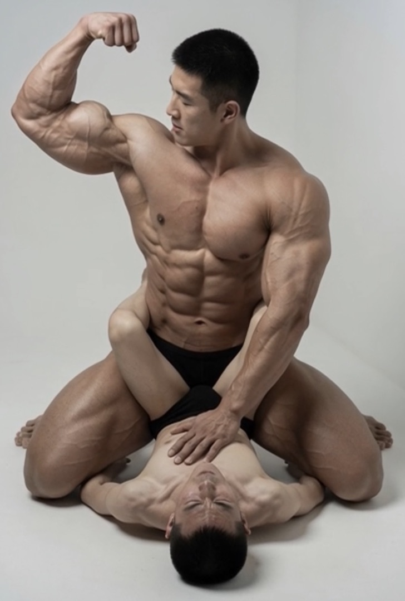 |
| 4 | Create a professional full-body studio biomechanics and figure-reference photograph of two fully clothed adult male models in neutral athletic clothing: a taller, strongly built adult man and a smaller, slender adult man, in a pure white seamless studio with natural perspective, even lighting, and a clinically neutral, non-sexual presentation. Use a strict side view with the camera parallel to the body axis and include the complete extension of the lifted leg. The taller, strongly built adult man faces the smaller, slender adult man in a one-leg standing balance, with the support leg straight or slightly flexed, the full foot planted, and the pelvis neutral. His other leg lifts forward from the hip with a flexed knee; the forefoot and arch pause beside the smaller, slender adult man's outer shoulder-line as a clearly non-contact alignment marker, with a neutral ankle and a visible air gap from the head and torso. The taller, strongly built adult man's hands remain behind his body, his torso stays nearly vertical, and his head angles slightly downward toward the contact point. The smaller, slender adult man faces him while standing with softly unlocked knees, a slight backward lean for balance, relaxed arms, and a gaze toward the lifted leg. Keep the visible alignment relation clear, stable, and non-injurious. Keep the taller, strongly built adult man's femurs, tibias, Achilles regions, and feet distinctly elongated but anatomically coherent, without perspective shortening. Include both figures, all limbs, hands, feet, joints, and active contact points without cropping; avoid wide-angle distortion, artificial foreshortening, floating anatomy, impossible balance, reversed or hyperextended joints, intersecting bodies, merged limbs, malformed extremities, hidden support points, severe occlusion, unwanted force or pressure. | 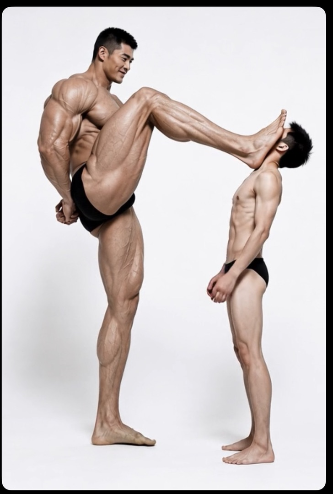 |
| 5 | Create a professional full-body studio biomechanics and figure-reference photograph of two fully clothed adult male models in neutral athletic clothing: a taller, strongly built adult man and a smaller, slender adult man, in a pure white seamless studio with natural perspective, even lighting, and a clinically neutral, non-sexual presentation. Use a near-frontal low view parallel to the ground and include every toe, knee, and support point. The taller, strongly built adult man stands upright facing forward with hands on his hips, level shoulders, and a stable neutral pelvis. One foot is fully planted as the primary support, while the other leg lifts forward with a flexed knee; its foot forms a clear, light, non-injurious positional contact at a neutral reference point immediately in front of the seated smaller, slender adult man. The smaller, slender adult man sits on the ground with the pelvis supported, legs extended forward, one or both hands placed behind him for support, a slight backward torso lean, and his head raised toward the taller, strongly built adult man's lifted leg. Keep the seated pose from obscuring the standing support leg and make the high-low relation and ground support easy to read. Keep the taller, strongly built adult man's femurs, tibias, Achilles regions, and feet distinctly elongated but anatomically coherent, without perspective shortening. All contact remains voluntary, controlled, non-injurious, and limited to the defined exercise function. Include both figures, all limbs, hands, feet, joints, and active contact points without cropping; avoid wide-angle distortion, artificial foreshortening, floating anatomy, impossible balance, reversed or hyperextended joints, intersecting bodies, merged limbs, malformed extremities, hidden support points, and severe occlusion. | 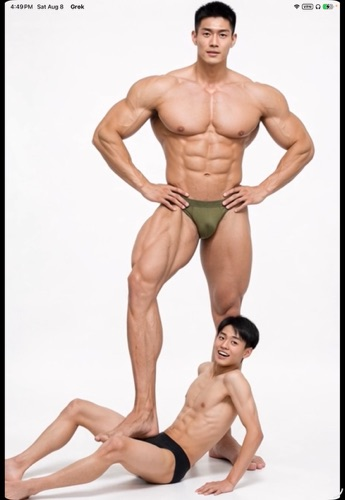 |
| 6 | Create a professional full-body studio biomechanics and figure-reference photograph of two fully clothed adult male models in neutral athletic clothing: a taller, strongly built adult man and a smaller, slender adult man, in a pure white seamless studio with natural perspective, even lighting, and a clinically neutral, non-sexual presentation. Use an eye-level frontal view with the camera parallel to the body axis, fully showing the taller, strongly built adult man's arms, lifted leg, and the smaller, slender adult man's body. The taller, strongly built adult man stands in a neutral front double-arm flex display, with elbows opened to either side, level shoulders, an upright torso, and one fully planted support foot. His other leg rises from the hip with a flexed knee, placing the thigh across the space just in front of the smaller, slender adult man's shoulder line; keep the ankle neutral. The smaller, slender adult man stands at the taller, strongly built adult man's front-side, outside the open space of the planted and lifted leg, with both feet steady on the ground, an upright torso, one hand supporting the lifted lower leg from below, the other arm relaxed downward, and his head gently raised. The taller, strongly built adult man looks toward the camera. Make the auxiliary hand support, planted foot, pelvis, and lifted leg a continuous visible balance system. Keep the taller, strongly built adult man's femurs, tibias, Achilles regions, and feet distinctly elongated but anatomically coherent, without perspective shortening. All contact remains voluntary, controlled, non-injurious, and limited to the defined exercise function. Include both figures, all limbs, hands, feet, joints, and active contact points without cropping; avoid wide-angle distortion, artificial foreshortening, floating anatomy, impossible balance, reversed or hyperextended joints, intersecting bodies, merged limbs, malformed extremities, hidden support points, and severe occlusion. | 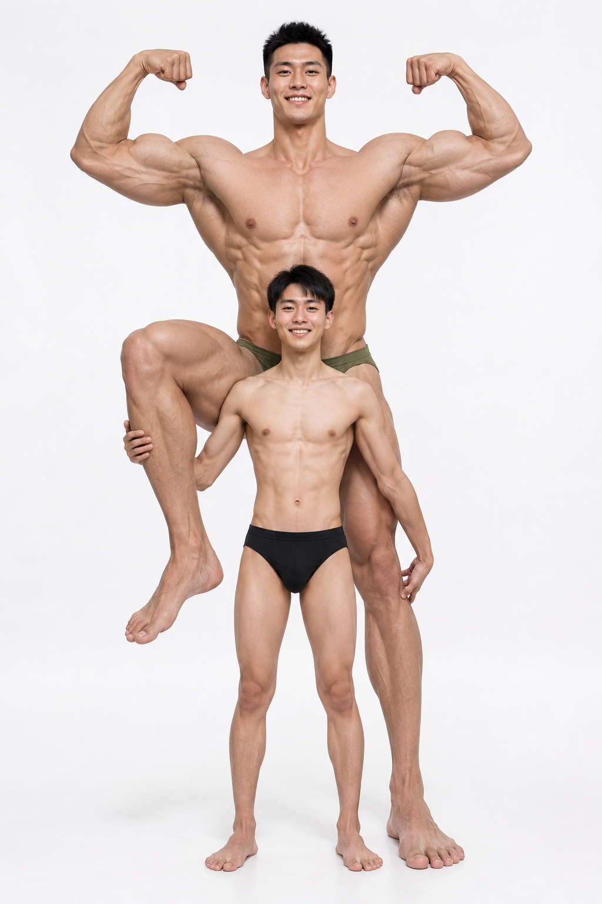 |
| 7 | Create a professional full-body studio biomechanics and figure-reference photograph of two fully clothed adult male models in neutral athletic clothing: a taller, strongly built adult man and a smaller, slender adult man, in a pure white seamless studio with natural perspective, even lighting, and a clinically neutral, non-sexual presentation. Use a side-front view parallel to the standing plane, fully preserving the relation between the lifted leg and the smaller, slender adult man's head. The taller, strongly built adult man has one fully planted primary support leg and lifts the other leg forward with a flexed knee. The sole and forefoot pause beside the smaller, slender adult man's outer shoulder-line as a non-contact alignment marker, with the ankle neutral and a visible air gap from the head and torso. The taller, strongly built adult man's arms hang naturally, torso stays upright, pelvis remains stable, and head angles down toward the contact relation. The smaller, slender adult man faces him while standing with a slight backward lean, both hands visibly supporting the taller, strongly built adult man's ankle and instep, neutral wrists, stable shoulders, and a gaze directed at the contact point. Show a plausible load path through the supporting hands and the taller, strongly built adult man's planted leg. Keep the taller, strongly built adult man's femurs, tibias, Achilles regions, and feet distinctly elongated but anatomically coherent, without perspective shortening. Include both figures, all limbs, hands, feet, joints, and active contact points without cropping; avoid wide-angle distortion, artificial foreshortening, floating anatomy, impossible balance, reversed or hyperextended joints, intersecting bodies, merged limbs, malformed extremities, hidden support points, severe occlusion, unwanted force or pressure. | 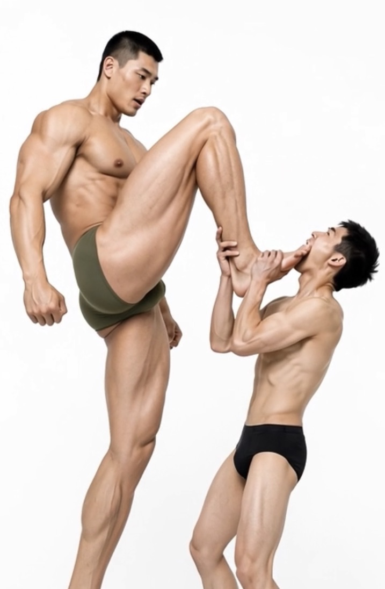 |
| 8 | Create a professional full-body studio biomechanics and figure-reference photograph of two fully clothed adult male models in neutral athletic clothing: a taller, strongly built adult man and a smaller, slender adult man, in a pure white seamless studio with natural perspective, even lighting, and a clinically neutral, non-sexual presentation. Use an eye-level frontal view with both figures on the same ground plane and fully visible from head to foot. The taller, strongly built adult man stands vertically with both feet fully planted, relaxed knees, arms at his sides, a neutral pelvis, and a downward gaze. The smaller, slender adult man sits on the ground with the pelvis supported, both knees flexed, feet forward, and the shoulders leaning slightly back to stabilize the seated position. He wraps both arms around one lower leg of the taller, strongly built adult man, with open hands resting visibly along the tibia, while keeping the contact as a controlled positional hold as a clearly functional positional hold. Make the lower-leg contact, planted feet, and seated support surfaces clearly visible. Keep the taller, strongly built adult man's femurs, tibias, Achilles regions, and feet distinctly elongated but anatomically coherent, without perspective shortening. All contact remains voluntary, controlled, non-injurious, and limited to the defined exercise function. Include both figures, all limbs, hands, feet, joints, and active contact points without cropping; avoid wide-angle distortion, artificial foreshortening, floating anatomy, impossible balance, reversed or hyperextended joints, intersecting bodies, merged limbs, malformed extremities, hidden support points, and severe occlusion. | 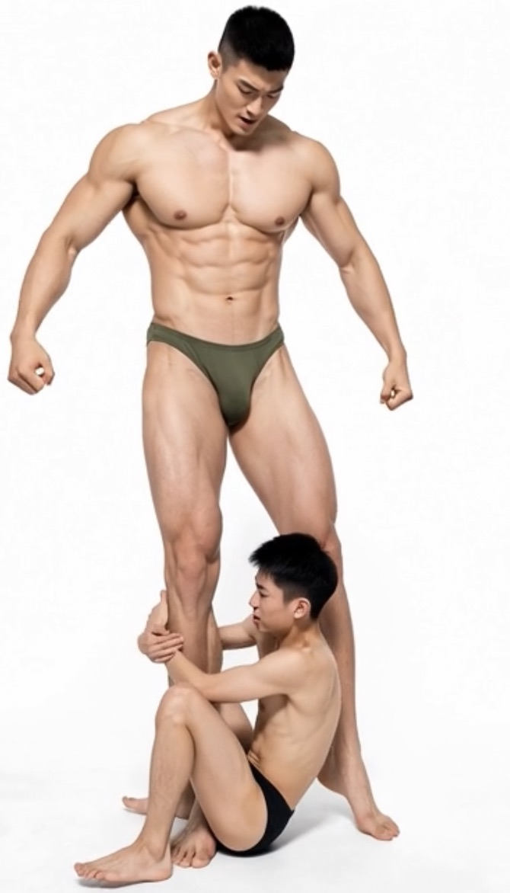 |
| 9 | Create a professional full-body studio biomechanics and figure-reference photograph of two fully clothed adult male models in neutral athletic clothing: a taller, strongly built adult man and a smaller, slender adult man, in a pure white seamless studio with natural perspective, even lighting, and a clinically neutral, non-sexual presentation. Use a frontal view from slightly below eye level, fully showing the planted leg, lifted foot, reclining smaller, slender adult man, and all ground support. The taller, strongly built adult man stands above the smaller, slender adult man with one leg vertically weight-bearing through a fully planted foot and the other leg extended downward. The lifted forefoot pauses beside the smaller, slender adult man's outer shoulder-line as a visible non-contact alignment marker, keeping clear air around the head and torso. The taller, strongly built adult man's torso stays nearly vertical, arms hang naturally, pelvis is centered above the support leg, and head angles downward. The smaller, slender adult man lies supine with shoulders and back on the ground, knees flexed to one side, both hands visibly supporting the taller, strongly built adult man's ankle from either side, and gaze raised toward him. Show the alignment marker and supporting hands without overlap, with a credible load path through the planted leg and ground. Keep the taller, strongly built adult man's femurs, tibias, Achilles regions, and feet distinctly elongated but anatomically coherent, without perspective shortening. Include both figures, all limbs, hands, feet, joints, and active contact points without cropping; avoid wide-angle distortion, artificial foreshortening, floating anatomy, impossible balance, reversed or hyperextended joints, intersecting bodies, merged limbs, malformed extremities, hidden support points, severe occlusion, unwanted force or pressure. | 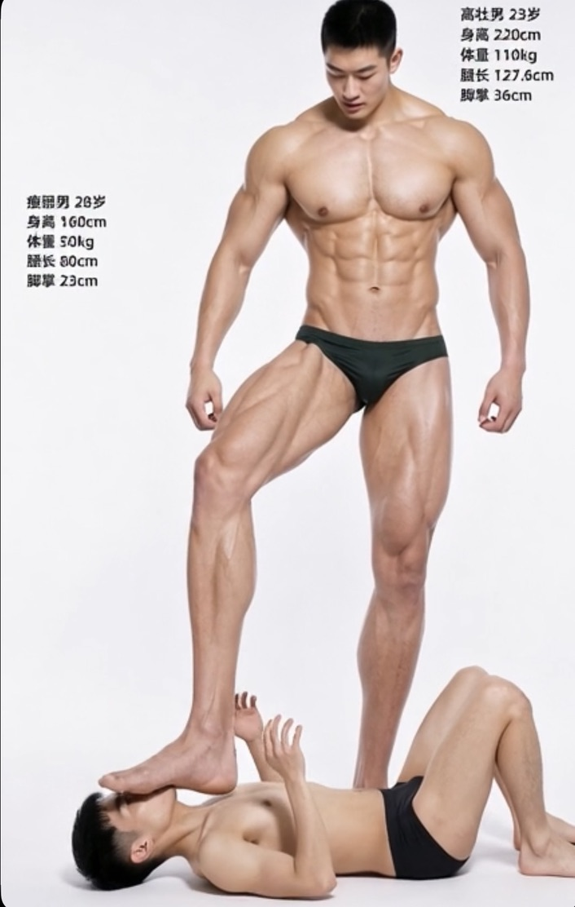 |
| 10 | Create a professional full-body studio biomechanics and figure-reference photograph of two fully clothed adult male models in neutral athletic clothing: a taller, strongly built adult man and a smaller, slender adult man, in a pure white seamless studio with natural perspective, even lighting, and a clinically neutral, non-sexual presentation. Use a side view with the camera parallel to both body axes and include the complete forward extension of the lifted leg. The taller, strongly built adult man stands in profile with one foot planted as the weight-bearing support and the other leg raised from the hip with a flexed knee and foot extended forward. His hands are held behind his body, shoulders remain stable, torso nearly vertical, and head looks down toward the smaller, slender adult man. In front of him, the smaller, slender adult man holds a low deep squat with flexed knees, lowered pelvis, planted feet, and neutral wrists; both hands support the underside and side of the raised foot, fingers naturally curved. Make the support path visibly continuous from the smaller, slender adult man's hands through the taller, strongly built adult man's lifted leg, pelvis, support leg, planted foot, and ground. Keep the taller, strongly built adult man's femurs, tibias, Achilles regions, and feet distinctly elongated but anatomically coherent, without perspective shortening. All contact remains voluntary, controlled, non-injurious, and limited to the defined exercise function. Include both figures, all limbs, hands, feet, joints, and active contact points without cropping; avoid wide-angle distortion, artificial foreshortening, floating anatomy, impossible balance, reversed or hyperextended joints, intersecting bodies, merged limbs, malformed extremities, hidden support points, and severe occlusion. | 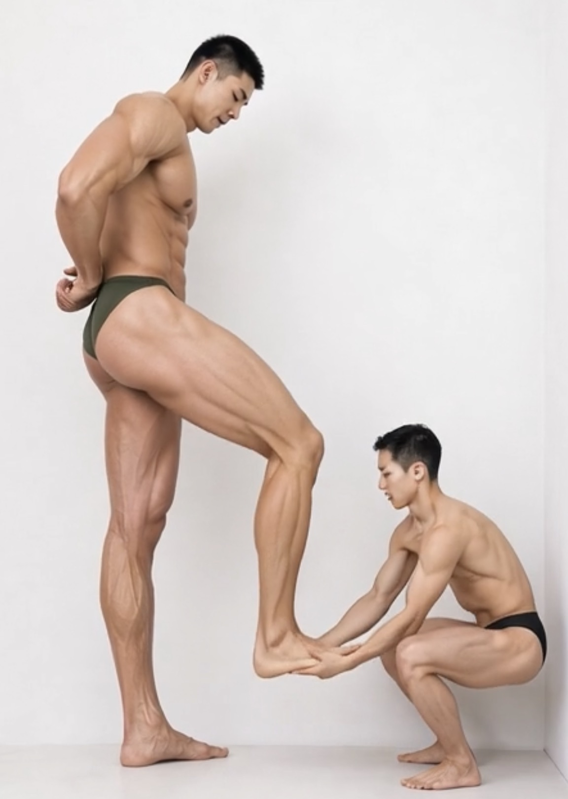 |
| 11 | Create a professional full-body studio biomechanics and figure-reference photograph of two fully clothed adult male models in neutral athletic clothing: a taller, strongly built adult man and a smaller, slender adult man, in a pure white seamless studio with natural perspective, even lighting, and a clinically neutral, non-sexual presentation. Use a near-frontal view with a slight side offset and include the ground plane and both complete figures. The taller, strongly built adult man is beside the smaller, slender adult man in a half-kneeling position, with one knee on the ground and the opposite foot planted under a raised knee to create a stable support base. His pelvis is neutral, torso upright, and head angled slightly downward. The smaller, slender adult man sits on the ground with both legs extended forward; his pelvis and hands or elbows support the torso as his back leans slightly rearward. The raised knee of the taller, strongly built adult man stays near the smaller, slender adult man's shoulder side without contacting or loading the body, while his hands rest along his own sides. The smaller, slender adult man looks up at the taller, strongly built adult man, who returns the gaze. Preserve clear side spacing and visible ground supports. Keep the taller, strongly built adult man's femurs, tibias, Achilles regions, and feet distinctly elongated but anatomically coherent, without perspective shortening. All contact remains voluntary, light, and limited to the defined exercise function. Include both figures, all limbs, hands, feet, joints, and active contact points without cropping; avoid wide-angle distortion, artificial foreshortening, floating anatomy, impossible balance, reversed or hyperextended joints, intersecting bodies, merged limbs, malformed extremities, hidden support points, and severe occlusion. | 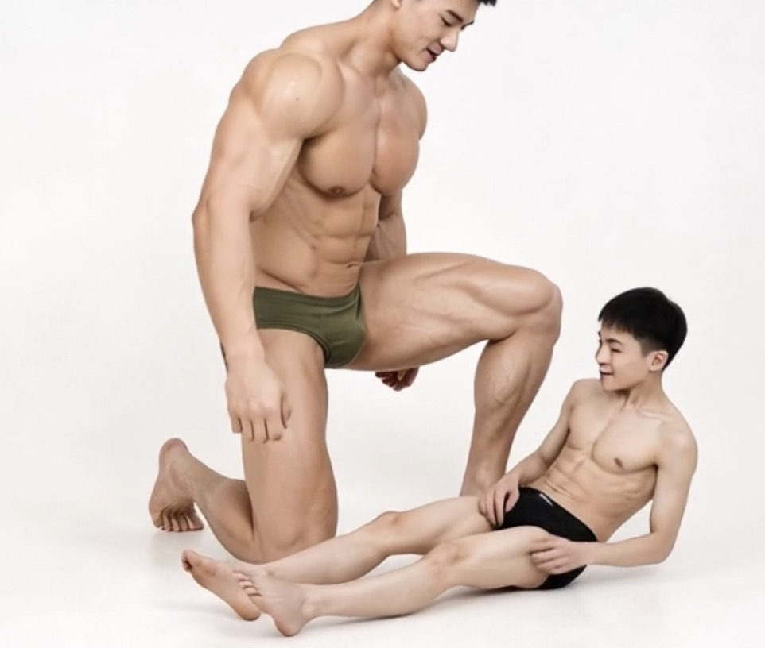 |
| 12 | Create a professional full-body studio biomechanics and figure-reference photograph of two fully clothed adult male models in neutral athletic clothing: a taller, strongly built adult man and a smaller, slender adult man, in a pure white seamless studio with natural perspective, even lighting, and a clinically neutral, non-sexual presentation. Use a frontal view from slightly below eye level, with the camera parallel to the body axis and both figures fully visible. The taller, strongly built adult man holds a wide, offset low-squat support position beside the reclining smaller, slender adult man, with flexed knees opened outward, both feet fully planted, a centered pelvis, upright torso, relaxed arms downward, and a downward head angle. The smaller, slender adult man lies with shoulders and head on the ground, both legs flexed upward in the open floor space beside the taller, strongly built adult man's stance, with knees naturally separated, and arms extended along the floor. Maintain clear spacing between the taller, strongly built adult man's knees and pelvis, visible ground support, and a continuous non-injurious contact logic without pressure on the torso. Keep the taller, strongly built adult man's femurs, tibias, Achilles regions, and feet distinctly elongated but anatomically coherent, without perspective shortening. All contact remains voluntary, light, and limited to the defined exercise function. Include both figures, all limbs, hands, feet, joints, and active contact points without cropping; avoid wide-angle distortion, artificial foreshortening, floating anatomy, impossible balance, reversed or hyperextended joints, intersecting bodies, merged limbs, malformed extremities, hidden support points, and severe occlusion. | 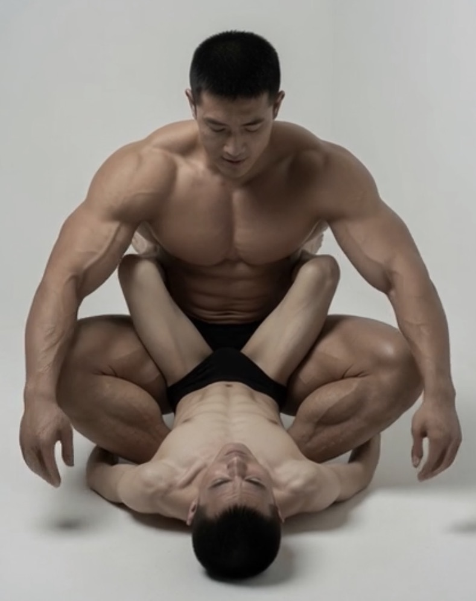 |
| 13 | Create a professional full-body studio biomechanics and figure-reference photograph of two fully clothed adult male models in neutral athletic clothing: a taller, strongly built adult man and a smaller, slender adult man, in a pure white seamless studio with natural perspective, even lighting, and a clinically neutral, non-sexual presentation. Use a near-frontal view with a slight side offset, the camera parallel to the main body plane, and fully show the lifted figure's wrist, back, legs, and feet. The taller, strongly built adult man stands while lifting the smaller, slender adult man sideways clear of the ground, with a straight planted primary support leg, a softly flexed opposite leg to stabilize the pelvis, and an upright torso. The smaller, slender adult man extends across the space with the back gently arched, legs flexed and lifted to one side, and one arm raised. The taller, strongly built adult man uses an open hand and guiding forearm beneath the raised forearm without gripping the wrist, and supports the posterior thigh with the other hand, while the smaller, slender adult man's other hand creates a visible counterbalancing traction line; both turn their heads toward one another with calm eye contact. Show the load path from the lifted body through the arms, trunk, pelvis, support leg, foot, and ground. Keep the taller, strongly built adult man's femurs, tibias, Achilles regions, and feet distinctly elongated but anatomically coherent, without perspective shortening. All contact remains voluntary, controlled, non-injurious, and limited to the defined exercise function. Include both figures, all limbs, hands, feet, joints, and active contact points without cropping; avoid wide-angle distortion, artificial foreshortening, floating anatomy, impossible balance, reversed or hyperextended joints, intersecting bodies, merged limbs, malformed extremities, hidden support points, and severe occlusion. | 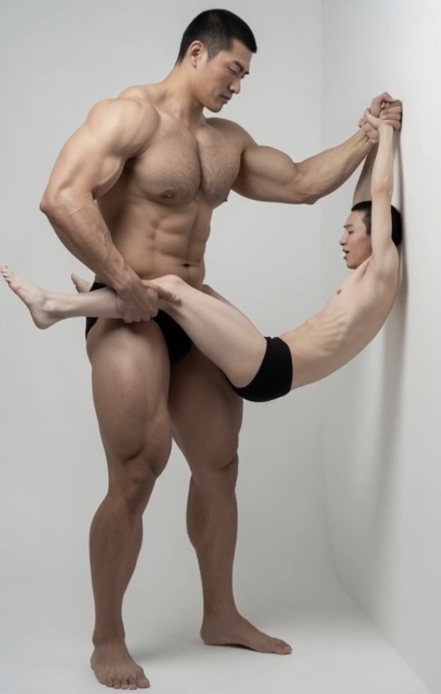 |
| 14 | Create a professional full-body studio biomechanics and figure-reference photograph of two fully clothed adult male models in neutral athletic clothing: a taller, strongly built adult man and a smaller, slender adult man, in a pure white seamless studio with natural perspective, even lighting, and a clinically neutral, non-sexual presentation. Use a strict side view with the camera parallel to both body axes and include their complete standing separation. The taller, strongly built adult man faces the smaller, slender adult man while standing upright with both full feet planted, relaxed knees, a neutral pelvis, hands held behind the body, a vertical torso, and a slightly lowered head. The smaller, slender adult man faces him in an upright stance with softly unlocked knees, relaxed arms, and an upward gaze toward the taller, strongly built adult man's face. Keep both figures on the same ground plane and same body plane, with parallel central axes and no foreground overlap. Preserve the taller, strongly built adult man's elongated femurs, tibias, Achilles regions, and feet as an anatomically coherent vertical lower-body line without perspective shortening. All contact remains voluntary, light, and limited to the defined exercise function. Include both figures, all limbs, hands, feet, joints, and active contact points without cropping; avoid wide-angle distortion, artificial foreshortening, floating anatomy, impossible balance, reversed or hyperextended joints, intersecting bodies, merged limbs, malformed extremities, hidden support points, and severe occlusion. | 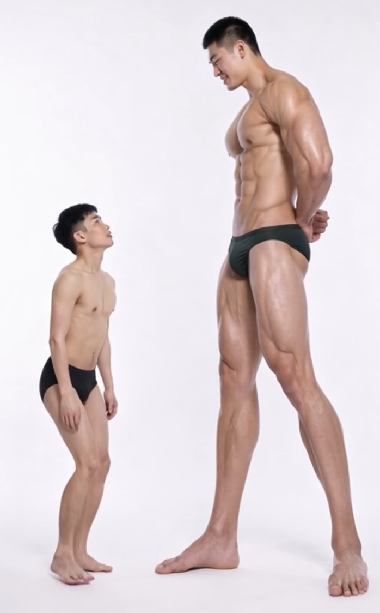 |
| 15 | Create a professional full-body studio biomechanics and figure-reference photograph of two fully clothed adult male models in neutral athletic clothing: a taller, strongly built adult man and a smaller, slender adult man, in a pure white seamless studio with natural perspective, even lighting, and a clinically neutral, non-sexual presentation. Use a frontal view from slightly below eye level, completely showing the taller, strongly built adult man's open knees, planted feet, and the reclining smaller, slender adult man's raised legs. The taller, strongly built adult man holds a wide squat with both feet symmetrically planted, knees tracking outward, pelvis lowered, and torso lifted upright. His hands visibly support the smaller, slender adult man's two upwardly extended legs. The smaller, slender adult man lies supine with shoulders and back on the ground, both legs raised from the hips and nearly vertical, neutral ankles, and arms resting beside the body. Make the upward leg path and the taller, strongly built adult man's hand placements clear, with all ground support and load paths visibly continuous. Keep the taller, strongly built adult man's femurs, tibias, Achilles regions, and feet distinctly elongated but anatomically coherent, without perspective shortening. All supporting contact is secure and non-injurious, with no pain, distress, unwanted force or pressure. Include both figures, all limbs, hands, feet, joints, and active contact points without cropping; avoid wide-angle distortion, artificial foreshortening, floating anatomy, impossible balance, reversed or hyperextended joints, intersecting bodies, merged limbs, malformed extremities, hidden support points, and severe occlusion. | 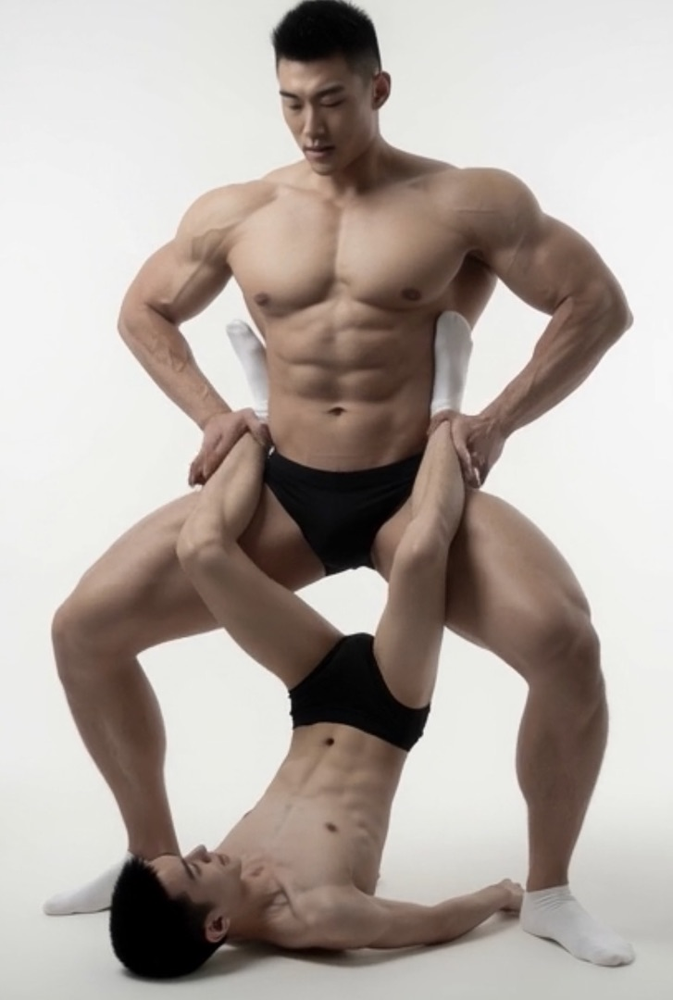 |
| 16 | Create a professional full-body studio biomechanics and figure-reference photograph of two fully clothed adult male models in neutral athletic clothing: a taller, strongly built adult man and a smaller, slender adult man, in a pure white seamless studio with natural perspective, even lighting, and a clinically neutral, non-sexual presentation. Use an eye-level frontal view, fully showing the standing figure, reclining figure, foot alignment marker, and ground support. The taller, strongly built adult man stands with one foot forward and one back, one leg vertically weight-bearing, and the other foot elevated beside the smaller, slender adult man's outer shoulder-line as a non-contact spatial marker, with a clear gap from the upper torso. Keep the ankle neutral, knee naturally extended, and pelvis centered above the primary support leg. His hands rest on his hips, torso remains upright, shoulders level, and head angles downward. The smaller, slender adult man lies supine with legs extended forward and arms alongside the body, keeping the upper torso grounded beneath the clearly visible spatial marker. Keep the taller, strongly built adult man's femurs, tibias, Achilles regions, and feet distinctly elongated but anatomically coherent, without perspective shortening. All positioning remains voluntary, non-injurious, and limited to the exercise study. Include both figures, all limbs, hands, feet, joints, and active contact points without cropping; avoid wide-angle distortion, artificial foreshortening, floating anatomy, impossible balance, reversed or hyperextended joints, intersecting bodies, merged limbs, malformed extremities, hidden support points, and severe occlusion. | 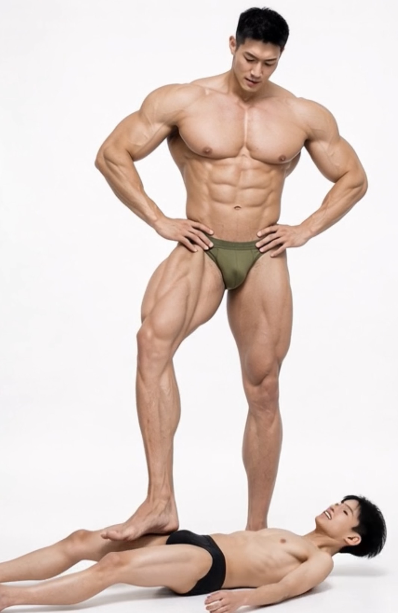 |
| 17 | Create a professional full-body studio biomechanics and figure-reference photograph of two fully clothed adult male models in neutral athletic clothing: a taller, strongly built adult man and a smaller, slender adult man, in a pure white seamless studio with natural perspective, even lighting, and a clinically neutral, non-sexual presentation. Use a near-frontal view with a slight side offset, camera parallel to the standing plane, and show both figures from head to planted feet. The taller, strongly built adult man stands directly behind the smaller, slender adult man with feet separated for support, softly flexed knees, and a stable pelvis. One open hand provides a light stabilizing reference at the smaller, slender adult man's outer upper back, while the other guides the outer forearm and leaves clear space around the waist and pelvis. The smaller, slender adult man remains standing on planted feet, maintains an upright stance with only a gentle backward counterbalance, lets both arms rest downward, and keeps the shoulders supported without collapse. The taller, strongly built adult man's head inclines toward the smaller, slender adult man, while the smaller, slender adult man turns his head back toward him for calm cooperative eye contact. Keep the rear figure's elongated lower limbs fully visible and show all support surfaces. Keep the taller, strongly built adult man's femurs, tibias, Achilles regions, and feet distinctly elongated but anatomically coherent, without perspective shortening. The hold is controlled, non-injurious, and free of pain, distress, unwanted force or pressure. Include both figures, all limbs, hands, feet, joints, and active contact points without cropping; avoid wide-angle distortion, artificial foreshortening, floating anatomy, impossible balance, reversed or hyperextended joints, intersecting bodies, merged limbs, malformed extremities, hidden support points, and severe occlusion. | 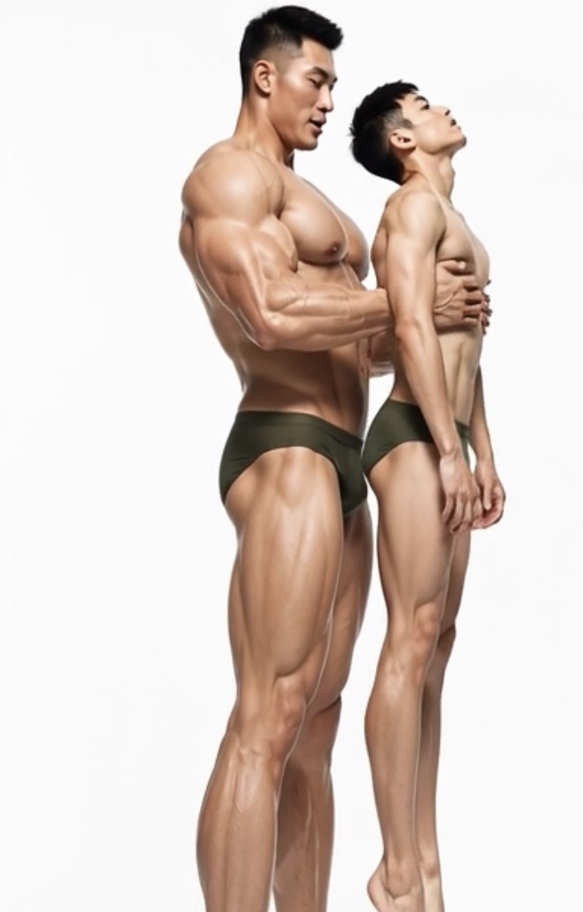 |
| 18 | Create a professional full-body studio biomechanics and figure-reference photograph of two fully clothed adult male models in neutral athletic clothing: a taller, strongly built adult man and a smaller, slender adult man, in a pure white seamless studio with natural perspective, even lighting, and a clinically neutral, non-sexual presentation. Use a side-front view with the camera parallel to the standing plane, fully showing the taller, strongly built adult man's flexed arm and the smaller, slender adult man's body. The taller, strongly built adult man stands in profile with one hand on his hip and the other arm raised in a clear neutral flex display: the elbow opens outward, the forearm folds inward, the shoulder line stays level, both feet are planted, and the pelvis remains neutral. The smaller, slender adult man stands at the side-front with softly unlocked knees, relaxed arms, head raised, and gaze concentrated on the flexed arm. The taller, strongly built adult man turns his head toward the smaller, slender adult man while keeping the torso upright without leaning. Preserve clear depth separation and unobstructed limbs. Keep the taller, strongly built adult man's femurs, tibias, Achilles regions, and feet distinctly elongated but anatomically coherent, without perspective shortening. All contact remains voluntary, light, and limited to the defined exercise function. Include both figures, all limbs, hands, feet, joints, and active contact points without cropping; avoid wide-angle distortion, artificial foreshortening, floating anatomy, impossible balance, reversed or hyperextended joints, intersecting bodies, merged limbs, malformed extremities, hidden support points, and severe occlusion. | 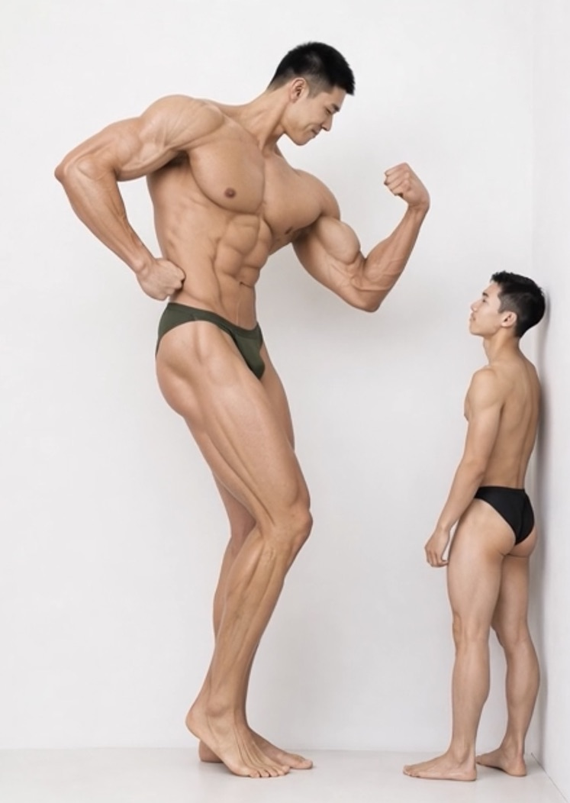 |
| 19 | Create a professional full-body studio biomechanics and figure-reference photograph of two fully clothed adult male models in neutral athletic clothing: a taller, strongly built adult man and a smaller, slender adult man, in a pure white seamless studio with natural perspective, even lighting, and a clinically neutral, non-sexual presentation. Use a frontal view with the camera parallel to the body axis and fully include both heads, feet, and their side spacing. The taller, strongly built adult man faces forward with both full feet planted, relaxed knees, a neutral pelvis, hands gathered inward before the upper torso, elbows opening outward, a vertical torso, and his head slightly turned toward the smaller, slender adult man. The smaller, slender adult man stands at the taller, strongly built adult man's side-front with an upright stance, arms resting naturally, head raised, and gaze directed toward the taller, strongly built adult man's upper torso and face. Keep them in close but clearly separated standing space, with no obscuring overlap or unnecessary contact. Preserve a clear view of the taller, strongly built adult man's elongated lower-limb structure and feet. Keep the taller, strongly built adult man's femurs, tibias, Achilles regions, and feet distinctly elongated but anatomically coherent, without perspective shortening. All contact remains voluntary, light, and limited to the defined exercise function. Include both figures, all limbs, hands, feet, joints, and active contact points without cropping; avoid wide-angle distortion, artificial foreshortening, floating anatomy, impossible balance, reversed or hyperextended joints, intersecting bodies, merged limbs, malformed extremities, hidden support points, and severe occlusion. | 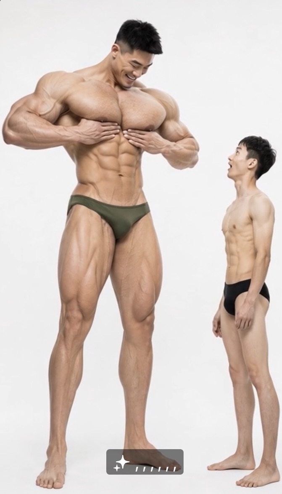 |
| 20 | Create a professional full-body studio biomechanics and figure-reference photograph of two fully clothed adult male models in neutral athletic clothing: a taller, strongly built adult man and a smaller, slender adult man, in a pure white seamless studio with natural perspective, even lighting, and a clinically neutral, non-sexual presentation. Use a frontal view from slightly below eye level, fully showing the taller, strongly built adult man's open knees, hands, and the reclining smaller, slender adult man's legs. The taller, strongly built adult man maintains a wide, offset low-squat support position beside the smaller, slender adult man, with flexed knees opened to the sides, both feet planted for weight bearing, a centered pelvis, upright torso, and downward gaze. His hands gently support the smaller, slender adult man's flexed thighs, fingers naturally following the leg contours and wrists and elbows neutral. The smaller, slender adult man lies supine with legs flexed from the hips within open floor space beside the taller, strongly built adult man's planted stance; his own hands rest visibly on his thighs for symmetrical stabilization, and his head remains facing upward. Keep all knee, pelvis, hand, and foot relationships visible, with a continuous non-injurious support logic and no pressure on the torso. Keep the taller, strongly built adult man's femurs, tibias, Achilles regions, and feet distinctly elongated but anatomically coherent, without perspective shortening. All contact remains voluntary, light, and limited to the defined exercise function. Include both figures, all limbs, hands, feet, joints, and active contact points without cropping; avoid wide-angle distortion, artificial foreshortening, floating anatomy, impossible balance, reversed or hyperextended joints, intersecting bodies, merged limbs, malformed extremities, hidden support points, and severe occlusion. | 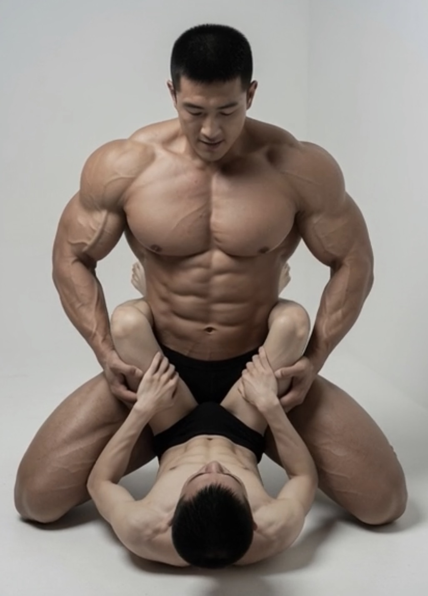 |
| 21 | Create a professional full-body studio biomechanics and figure-reference photograph of two fully clothed adult male models in neutral athletic clothing: a taller, strongly built adult man and a smaller, slender adult man, in a pure white seamless studio with natural perspective, even lighting, and a clinically neutral, non-sexual presentation. Use a near-frontal view with a slight side offset, camera parallel to the body plane, completely showing the lifted leg, the smaller, slender adult man's standing pose, and all ground support. The taller, strongly built adult man bears weight through one vertically planted leg and lifts the other leg side-front from the hip with a flexed knee and foot directed toward the smaller, slender adult man. Both arms extend outward for balance, shoulders remain nearly level, and the pelvis stays neutral. The smaller, slender adult man stands beside the lifted leg with naturally flexed knees; one hand supports the ankle while the other rests close to the shin as auxiliary stabilization, and his head raises toward the lifted leg. The taller, strongly built adult man turns his head toward him. Show the hand-to-leg support and standing base clearly, without overlap. Keep the taller, strongly built adult man's femurs, tibias, Achilles regions, and feet distinctly elongated but anatomically coherent, without perspective shortening. All contact remains voluntary, controlled, non-injurious, and limited to the defined exercise function. Include both figures, all limbs, hands, feet, joints, and active contact points without cropping; avoid wide-angle distortion, artificial foreshortening, floating anatomy, impossible balance, reversed or hyperextended joints, intersecting bodies, merged limbs, malformed extremities, hidden support points, and severe occlusion. | 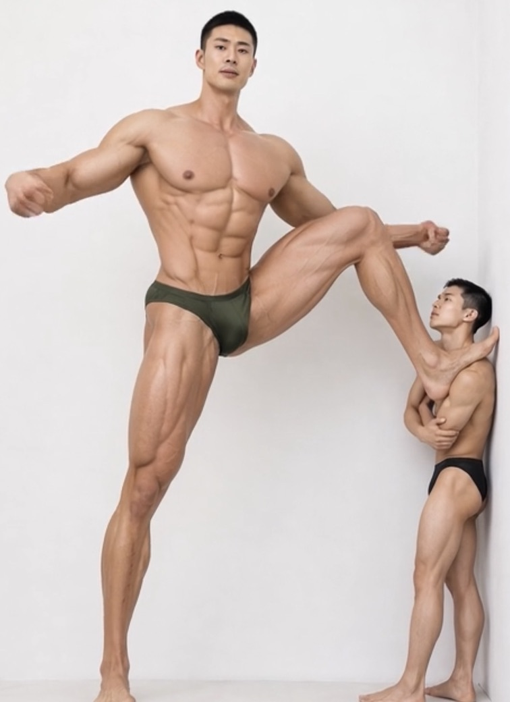 |
| 22 | Create a professional full-body studio biomechanics and figure-reference photograph of two fully clothed adult male models in neutral athletic clothing: a taller, strongly built adult man and a smaller, slender adult man, in a pure white seamless studio with natural perspective, even lighting, and a clinically neutral, non-sexual presentation. Use a side-front view with the camera parallel to the standing plane and fully show the taller, strongly built adult man's flexed leg, both arms, and the smaller, slender adult man's entire body. The taller, strongly built adult man stands tall with both hands interlaced behind his head, shoulder blades open, torso lengthening upward, and a neutral pelvis. One full foot remains planted as the primary support while the other leg lifts backward with a flexed knee and toe clear of the floor. His head turns slightly toward the camera and his gaze remains forward. The smaller, slender adult man stands to the side with both feet planted, arms relaxed downward, head raised, and gaze directed toward the taller, strongly built adult man's balance pose. Maintain clear space between both figures and show the lifted leg without contact or obstruction. Preserve a stable line from the taller, strongly built adult man's planted foot through the leg, pelvis, and upright torso. Keep the taller, strongly built adult man's femurs, tibias, Achilles regions, and feet distinctly elongated but anatomically coherent, without perspective shortening. All contact remains voluntary, light, and limited to the defined exercise function. Include both figures, all limbs, hands, feet, joints, and active contact points without cropping; avoid wide-angle distortion, artificial foreshortening, floating anatomy, impossible balance, reversed or hyperextended joints, intersecting bodies, merged limbs, malformed extremities, hidden support points, and severe occlusion. | 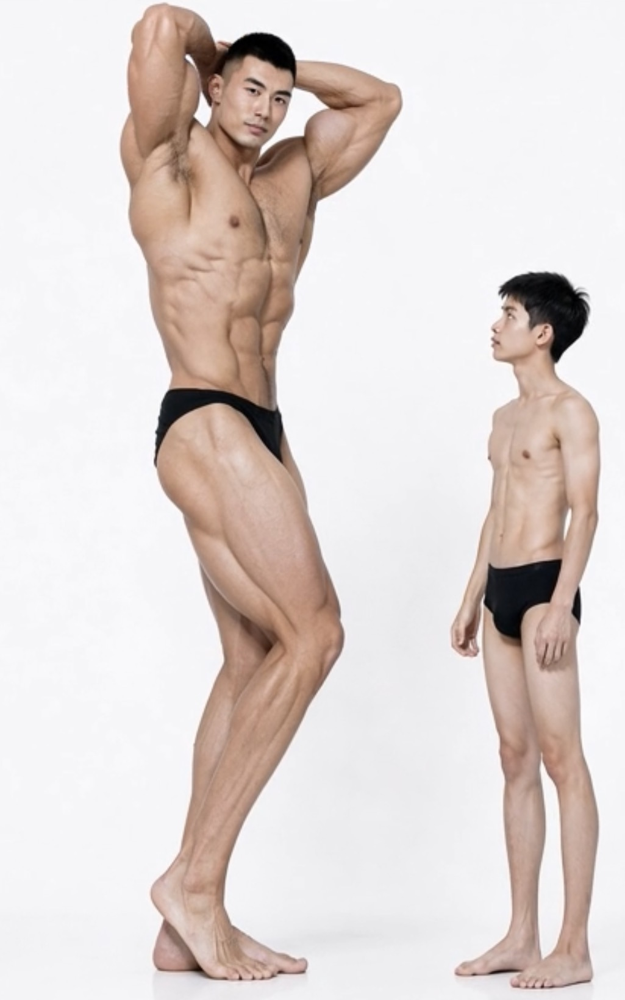 |
| 23 | Create a professional full-body studio biomechanics and figure-reference photograph of two fully clothed adult male models in neutral athletic clothing: a taller, strongly built adult man and a smaller, slender adult man, in a pure white seamless studio with natural perspective, even lighting, and a clinically neutral, non-sexual presentation. Use a frontal view from slightly below eye level, fully showing the taller, strongly built adult man's flexed arms, standing leg, raised leg, and the reclining smaller, slender adult man. The taller, strongly built adult man holds a front double-arm flex display with elbows raised outward, level shoulders, and an upright torso. One foot is planted directly beneath the pelvis as the support, while the other leg lifts with a flexed knee. Keep the raised foot close to, but not touching, the smaller, slender adult man's outer shoulder-line alignment marker; the ankle stays neutral and the contact relationship is represented as a clearly visible non-contact spatial reference. The smaller, slender adult man reclines on the ground with the upper body supported by bent elbows, legs extended forward, head raised, and gaze toward the taller, strongly built adult man's face and lifted foot. Make the elbow supports, planted foot, pelvic alignment, and non-contact foot-to-shoulder relation clear. Keep the taller, strongly built adult man's femurs, tibias, Achilles regions, and feet distinctly elongated but anatomically coherent, without perspective shortening. All contact remains voluntary, light, and limited to the defined exercise function. Include both figures, all limbs, hands, feet, joints, and active contact points without cropping; avoid wide-angle distortion, artificial foreshortening, floating anatomy, impossible balance, reversed or hyperextended joints, intersecting bodies, merged limbs, malformed extremities, hidden support points, and severe occlusion. | 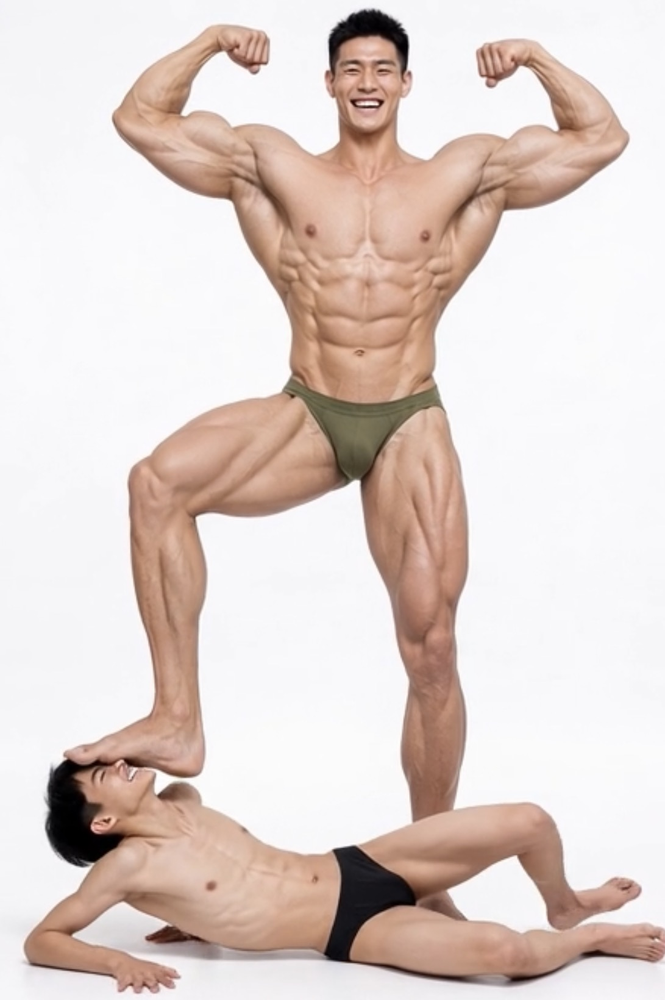 |
| 24 | Create a professional full-body studio biomechanics and figure-reference photograph of two fully clothed adult male models in neutral athletic clothing: a taller, strongly built adult man and a smaller, slender adult man, in a pure white seamless studio with natural perspective, even lighting, and a clinically neutral, non-sexual presentation. Use a low side-front view parallel to the ground, looking from the forefoot side while fully including the complete extended leg. The taller, strongly built adult man sits on the floor with the pelvis grounded, torso leaning slightly back, one leg extended toward the camera, the other knee flexed, and both hands placed behind the body to stabilize the pelvis. The smaller, slender adult man sits side-front with legs crossed or flexed, torso leaning forward, and both open hands supporting the extended foot from below and along its outer side; fingers follow the foot contour naturally without obscuring the ankle. The taller, strongly built adult man's head faces forward while the smaller, slender adult man's gaze is directed to the clear foot-support relationship. Show a continuous support system through the seated hands, pelvis, extended leg, and the smaller, slender adult man's open hand placement. Keep the taller, strongly built adult man's femurs, tibias, Achilles regions, and feet distinctly elongated but anatomically coherent, without perspective shortening. All contact remains voluntary, controlled, non-injurious, and limited to the defined exercise function. Include both figures, all limbs, hands, feet, joints, and active contact points without cropping; avoid wide-angle distortion, artificial foreshortening, floating anatomy, impossible balance, reversed or hyperextended joints, intersecting bodies, merged limbs, malformed extremities, hidden support points, and severe occlusion. | 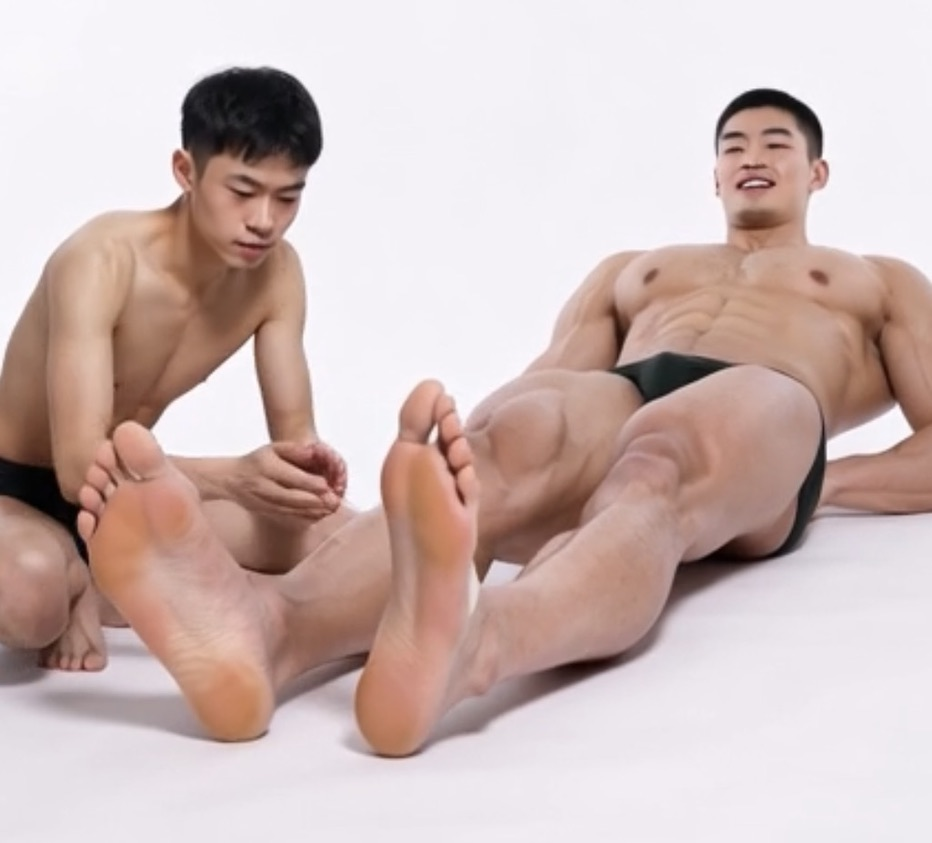 |
| 25 | Create a professional full-body studio biomechanics and figure-reference photograph of two fully clothed adult male models in neutral athletic clothing: a taller, strongly built adult man and a smaller, slender adult man, in a pure white seamless studio with natural perspective, even lighting, and a clinically neutral, non-sexual presentation. Use a near-frontal side-offset view parallel to the ground, fully showing both figures in a low athletic balance position. The taller, strongly built adult man stands behind the smaller, slender adult man in a broad squat, with both feet planted, knees flexed and tracking naturally, pelvis lowered, and torso lifted with controlled alignment. Rather than enclosing the other figure, his open hands provide visible open functional stabilization near the smaller, slender adult man's outer shoulder line and upper arm. The smaller, slender adult man holds a low squat with feet apart, knees tracking over the toes, torso inclined forward, arms extended or flexed forward for balance, and head turned slightly to the side. The taller, strongly built adult man angles his head downward toward the movement relation. Keep the contact sparse, open, and clearly functional, with no restraint or torso pressure. Show an uninterrupted load path through each figure's feet, legs, and pelvis. Keep the taller, strongly built adult man's femurs, tibias, Achilles regions, and feet distinctly elongated but anatomically coherent, without perspective shortening. All contact remains voluntary, light, and limited to the defined exercise function. Include both figures, all limbs, hands, feet, joints, and active contact points without cropping; avoid wide-angle distortion, artificial foreshortening, floating anatomy, impossible balance, reversed or hyperextended joints, intersecting bodies, merged limbs, malformed extremities, hidden support points, and severe occlusion. | 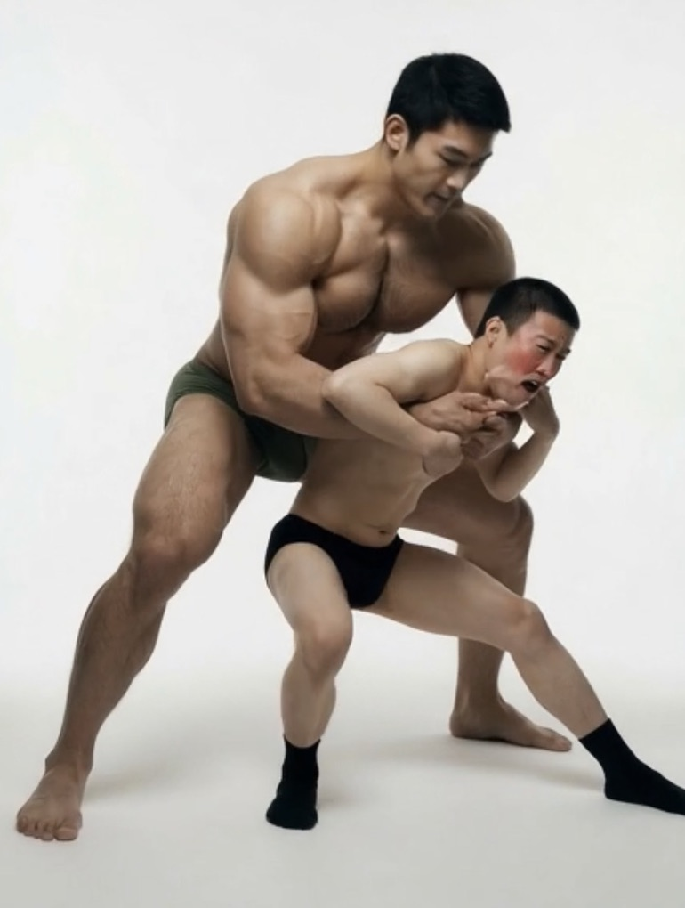 |
| 26 | Create a professional full-body studio biomechanics and figure-reference photograph of two fully clothed adult male models in neutral athletic clothing: a taller, strongly built adult man and a smaller, slender adult man, in a pure white seamless studio with natural perspective, even lighting, and a clinically neutral, non-sexual presentation. Use a side-front view with the camera parallel to the main body plane and fully show the lifted smaller, slender adult man's extended body. The taller, strongly built adult man stands upright while performing a controlled partner lift, with one support leg straight and planted, the other leg softly flexed, and the pelvis level. The smaller, slender adult man is lifted clear of the floor in a sideways extension, with the back gently lengthened, hips clear of the ground, legs flexed and raised to one side, and one arm reaching upward. The taller, strongly built adult man uses an open hand and guiding forearm beneath the raised forearm rather than a restraining wrist grip, and the other hand supports the posterior thigh. The smaller, slender adult man's free hand maintains a visible counterbalance line; both heads turn toward one another. Show the load path from the lifted body through the taller, strongly built adult man's hands, forearms, shoulders, trunk, pelvis, planted leg, and ground. Keep the taller, strongly built adult man's femurs, tibias, Achilles regions, and feet distinctly elongated but anatomically coherent, without perspective shortening. All contact remains voluntary, controlled, non-injurious, and limited to the defined exercise function. Include both figures, all limbs, hands, feet, joints, and active contact points without cropping; avoid wide-angle distortion, artificial foreshortening, floating anatomy, impossible balance, reversed or hyperextended joints, intersecting bodies, merged limbs, malformed extremities, hidden support points, and severe occlusion. | 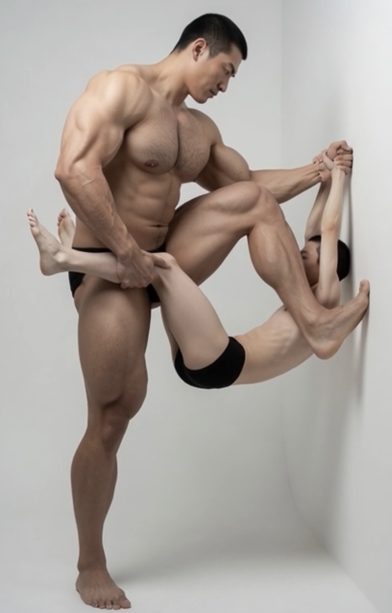 |
| 27 | Create a professional full-body studio biomechanics and figure-reference photograph of two fully clothed adult male models in neutral athletic clothing: a taller, strongly built adult man and a smaller, slender adult man, in a pure white seamless studio with natural perspective, even lighting, and a clinically neutral, non-sexual presentation. Use a frontal view from slightly below eye level, fully showing the taller, strongly built adult man's open knees, planted feet, hands, and the reclining smaller, slender adult man's body. The taller, strongly built adult man holds a wide deep squat with both feet fully planted, toes naturally opened, knees tracking in the same direction, pelvis lowered, and torso nearly vertical. His open hands provide supportive guidance at the smaller, slender adult man's raised outer ankles, with forearms directed downward and neutral wrists. The smaller, slender adult man lies supine with both legs flexed upward and opened outward in a controlled mobility position, ankles neutral, arms resting alongside the body, and head directed toward the camera. Keep the ankle supports clear, light, and non-restraining, with all load transferred through the taller, strongly built adult man's planted feet rather than onto the reclining figure. Keep the taller, strongly built adult man's femurs, tibias, Achilles regions, and feet distinctly elongated but anatomically coherent, without perspective shortening. All contact remains voluntary, light, and limited to the defined exercise function. Include both figures, all limbs, hands, feet, joints, and active contact points without cropping; avoid wide-angle distortion, artificial foreshortening, floating anatomy, impossible balance, reversed or hyperextended joints, intersecting bodies, merged limbs, malformed extremities, hidden support points, and severe occlusion. | 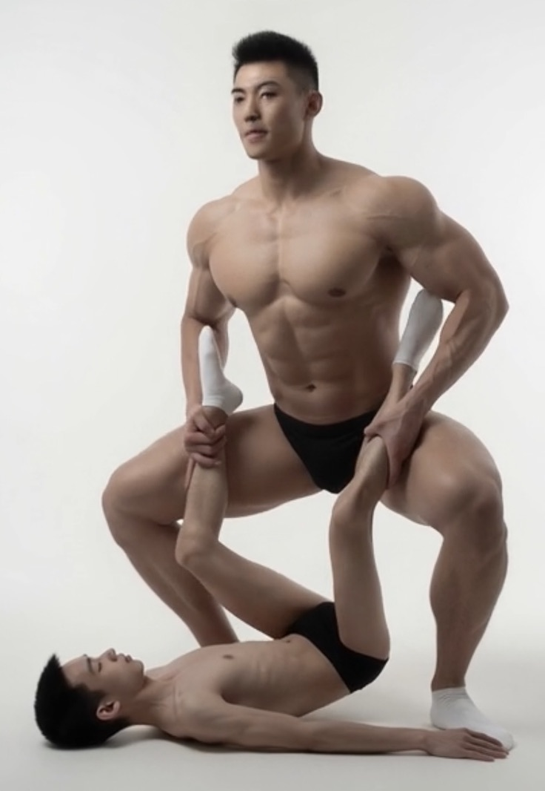 |
| 28 | Create a professional full-body studio biomechanics and figure-reference photograph of two fully clothed adult male models in neutral athletic clothing: a taller, strongly built adult man and a smaller, slender adult man, in a pure white seamless studio with natural perspective, even lighting, and a clinically neutral, non-sexual presentation. Use a strict side view with the camera parallel to both body axes and include the taller, strongly built adult man's complete standing posture and the smaller, slender adult man's forward-fold space. The taller, strongly built adult man faces forward in an upright stance with both full feet planted, relaxed knees, hands on hips, a neutral pelvis, and a vertical torso without leaning. The smaller, slender adult man stands at the side-front with feet apart, knees softly flexed, hips shifted back, torso hinged forward, hands relaxed downward or near the knees, and head directed down. The taller, strongly built adult man turns his head toward the smaller, slender adult man and looks at the forward-fold posture. Keep both figures on the same ground plane with a clear side separation and no contact. Maintain a readable lower-body line from the taller, strongly built adult man's pelvis through the legs and feet. Keep the taller, strongly built adult man's femurs, tibias, Achilles regions, and feet distinctly elongated but anatomically coherent, without perspective shortening. All contact remains voluntary, light, and limited to the defined exercise function. Include both figures, all limbs, hands, feet, joints, and active contact points without cropping; avoid wide-angle distortion, artificial foreshortening, floating anatomy, impossible balance, reversed or hyperextended joints, intersecting bodies, merged limbs, malformed extremities, hidden support points, and severe occlusion. | 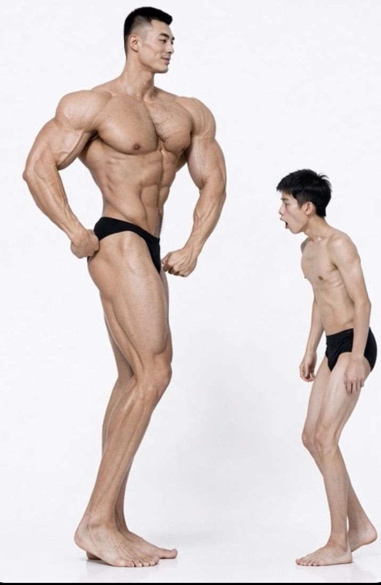 |
| 29 | Create a professional full-body studio biomechanics and figure-reference photograph of two fully clothed adult male models in neutral athletic clothing: a taller, strongly built adult man and a smaller, slender adult man, in a pure white seamless studio with natural perspective, even lighting, and a clinically neutral, non-sexual presentation. Use a side-front view with the camera parallel to the main body plane, fully showing both figures from head to foot. The taller, strongly built adult man stands upright with feet planted and weight evenly supported, one hand on the hip, the other held behind the body, a neutral pelvis, level shoulders, a vertical torso, and a slightly lowered gaze. The smaller, slender adult man stands directly in front at a close but respectful distance, with both feet planted, softly bent elbows, a slight backward torso lean for balance, and head raised toward the taller, strongly built adult man's face. His open hands stop near the taller, strongly built adult man's outer shoulder-line and upper-arm alignment markers instead of pressing against the torso, creating a visible non-contact positioning relation. Keep the foot supports and arm spacing clearly visible. Preserve the taller, strongly built adult man's elongated lower-limb line without exaggeration or compression. Keep the taller, strongly built adult man's femurs, tibias, Achilles regions, and feet distinctly elongated but anatomically coherent, without perspective shortening. All contact remains voluntary, light, and limited to the defined exercise function. Include both figures, all limbs, hands, feet, joints, and active contact points without cropping; avoid wide-angle distortion, artificial foreshortening, floating anatomy, impossible balance, reversed or hyperextended joints, intersecting bodies, merged limbs, malformed extremities, hidden support points, and severe occlusion. | 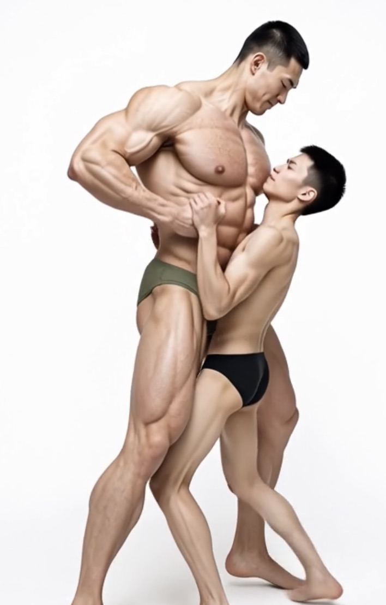 |
| 30 | Create a professional full-body studio biomechanics and figure-reference photograph of two fully clothed adult male models in neutral athletic clothing: a taller, strongly built adult man and a smaller, slender adult man, in a pure white seamless studio with natural perspective, even lighting, and a clinically neutral, non-sexual presentation. Use an eye-level frontal view, fully showing the taller, strongly built adult man's flexed arms, standing leg, lifted leg, and the smaller, slender adult man's complete body. The taller, strongly built adult man stands in a neutral front double-arm flex display, elbows opened outward, shoulders level, torso upright, and one full foot planted as the primary support. His other leg lifts from the hip with a flexed knee, the thigh passing across the space in front of the smaller, slender adult man's outer shoulder line, while the ankle remains naturally relaxed. The smaller, slender adult man stands at the taller, strongly built adult man's front-side, outside the open space of the planted and lifted leg, with both feet grounded, one open hand providing light auxiliary support under the lower leg or near the ankle, the other arm relaxed downward, and the head turned toward the taller, strongly built adult man. Keep the raised thigh and support hand clearly separated from the arm display and show an unbroken balance path through the planted leg and ground. Keep the taller, strongly built adult man's femurs, tibias, Achilles regions, and feet distinctly elongated but anatomically coherent, without perspective shortening. All contact remains voluntary, controlled, non-injurious, and limited to the defined exercise function. Include both figures, all limbs, hands, feet, joints, and active contact points without cropping; avoid wide-angle distortion, artificial foreshortening, floating anatomy, impossible balance, reversed or hyperextended joints, intersecting bodies, merged limbs, malformed extremities, hidden support points, and severe occlusion. | 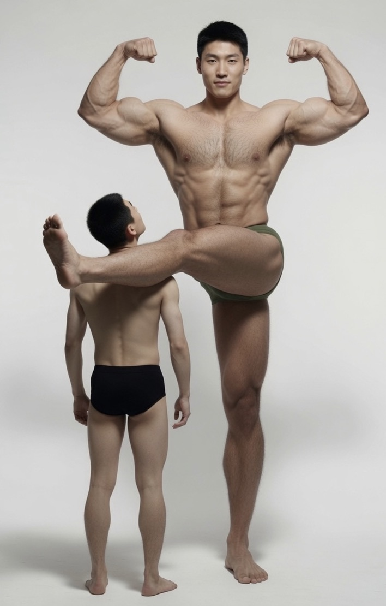 |
| 31 | Create a professional full-body studio biomechanics and figure-reference photograph of two fully clothed adult male models in neutral athletic clothing: a taller, strongly built adult man and a smaller, slender adult man, in a pure white seamless studio with natural perspective, even lighting, and a clinically neutral, non-sexual presentation. Use a side-front view with the camera parallel to the body plane, fully showing the raised foot, the smaller, slender adult man's head and upper torso, and the taller, strongly built adult man's flexed arms. The taller, strongly built adult man stands in a double-arm flex display with level shoulders and one vertical planted support leg. The other leg lifts from the hip with a flexed knee, while the forefoot and arch stop just beyond the smaller, slender adult man's outer shoulder-line alignment marker rather than touching the head; the ankle remains neutral. The smaller, slender adult man holds a supported crouch at the taller, strongly built adult man's side-front, knees flexed, torso slightly back for balance, and both hands openly guiding the ankle and outer foot edge with neutral wrists. The taller, strongly built adult man looks toward the camera or the visible alignment relation. Keep the standing base, auxiliary hand support, and non-contact foot marker unobscured. Keep the taller, strongly built adult man's femurs, tibias, Achilles regions, and feet distinctly elongated but anatomically coherent, without perspective shortening. All contact remains voluntary, light, and limited to the defined exercise function. Include both figures, all limbs, hands, feet, joints, and active contact points without cropping; avoid wide-angle distortion, artificial foreshortening, floating anatomy, impossible balance, reversed or hyperextended joints, intersecting bodies, merged limbs, malformed extremities, hidden support points, and severe occlusion. | 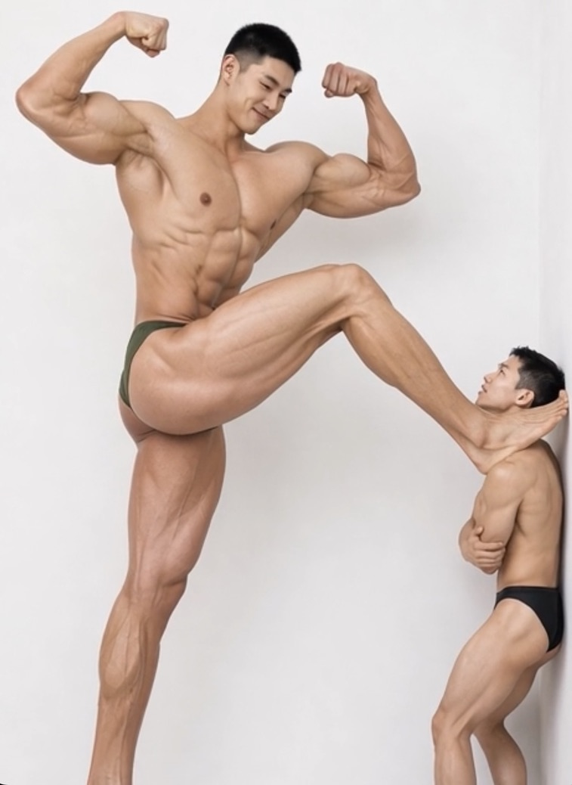 |
| 32 | Create a professional full-body studio biomechanics and figure-reference photograph of two fully clothed adult male models in neutral athletic clothing: a taller, strongly built adult man and a smaller, slender adult man, in a pure white seamless studio with natural perspective, even lighting, and a clinically neutral, non-sexual presentation. Use a near-frontal view with a slight side offset, the camera parallel to the body plane, and show both complete figures. The taller, strongly built adult man performs a side lunge: one leg flexes as the planted support while the other extends from the hip to the side, with the foot directed away from the body, stable pelvis, and flexed arms raised in a neutral display position. The smaller, slender adult man stands beside the extended leg with both feet grounded, one hand providing light guidance at the taller, strongly built adult man's forearm or upper arm, and the other hand held near the extended foot as a non-contact alignment marker. The taller, strongly built adult man turns his head toward the smaller, slender adult man, who raises his head toward him. Make the lunge foot, knee, pelvis, arm guidance, and standing base all visible without overlap. Keep the taller, strongly built adult man's femurs, tibias, Achilles regions, and feet distinctly elongated but anatomically coherent, without perspective shortening. All contact remains voluntary, controlled, non-injurious, and limited to the defined exercise function. Include both figures, all limbs, hands, feet, joints, and active contact points without cropping; avoid wide-angle distortion, artificial foreshortening, floating anatomy, impossible balance, reversed or hyperextended joints, intersecting bodies, merged limbs, malformed extremities, hidden support points, and severe occlusion. | 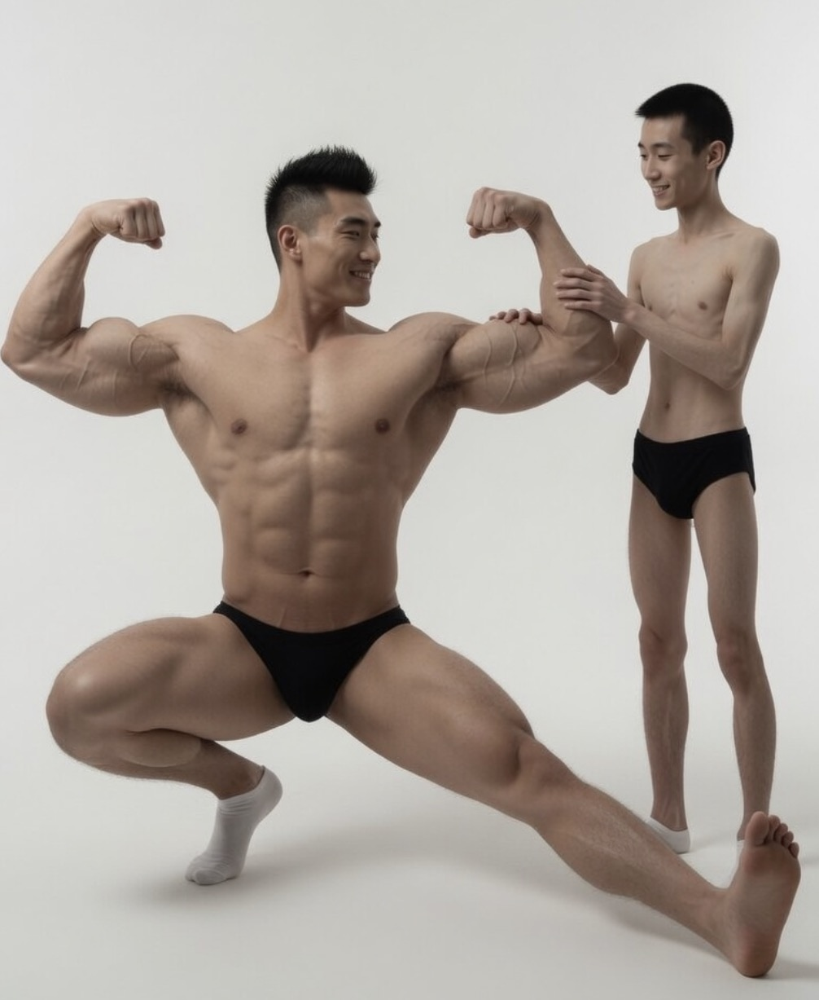 |
| 33 | Create a professional full-body studio biomechanics and figure-reference photograph of two fully clothed adult male models in neutral athletic clothing: a taller, strongly built adult man and a smaller, slender adult man, in a pure white seamless studio with natural perspective, even lighting, and a clinically neutral, non-sexual presentation. Use a frontal view from slightly below eye level, fully showing the taller, strongly built adult man's flexed arms, planted leg, raised leg, and the smaller, slender adult man's body. The taller, strongly built adult man stands in a front double-arm flex display with level shoulders, one foot planted vertically beneath a neutral pelvis, and the other leg raised with a flexed knee. The lifted thigh passes in front of the smaller, slender adult man's outer shoulder line with clear space from the upper torso. The smaller, slender adult man stands at the side-front with both feet planted, knees naturally flexed, head raised, and both arms open beneath the lifted thigh as an auxiliary, non-restraining support surface. The taller, strongly built adult man looks toward the camera or gently toward the smaller, slender adult man. Make the hand-to-thigh support, planted foot, and lifted-leg line visible while preserving separation from the chest and neck. Keep the taller, strongly built adult man's femurs, tibias, Achilles regions, and feet distinctly elongated but anatomically coherent, without perspective shortening. All contact remains voluntary, controlled, non-injurious, and limited to the defined exercise function. Include both figures, all limbs, hands, feet, joints, and active contact points without cropping; avoid wide-angle distortion, artificial foreshortening, floating anatomy, impossible balance, reversed or hyperextended joints, intersecting bodies, merged limbs, malformed extremities, hidden support points, and severe occlusion. | 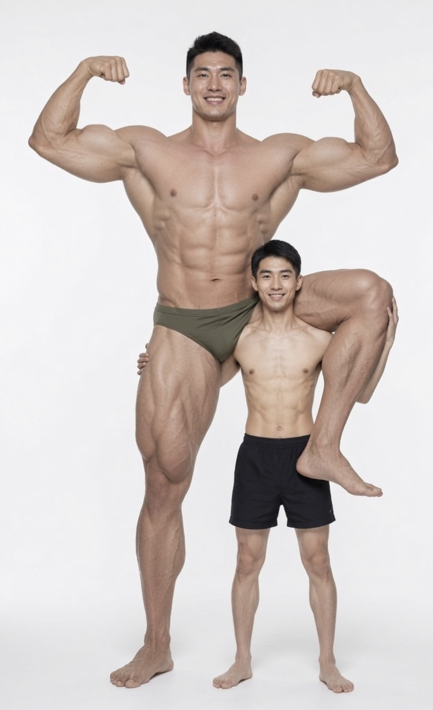 |
| 34 | Create a professional full-body studio biomechanics and figure-reference photograph of two fully clothed adult male models in neutral athletic clothing: a taller, strongly built adult man and a smaller, slender adult man, in a pure white seamless studio with natural perspective, even lighting, and a clinically neutral, non-sexual presentation. Use a strict side view with the camera parallel to the body axis, fully showing the taller, strongly built adult man's planted leg, lifted foot, and the smaller, slender adult man's non-weight-bearing four-point rehabilitation posture. The taller, strongly built adult man balances on one vertical planted leg and raises the other leg with a flexed knee; the forefoot stops beside the smaller, slender adult man's outer shoulder-line alignment marker, with no contact, pressure, or body loading. His arms rest naturally at his sides, torso remains upright, pelvis stays back from the other figure, and head looks downward toward the spacing relation. The smaller, slender adult man maintains hands and knees on the ground with wrists under shoulders, knees under hips, a relatively level back, and head gently directed downward. Keep the figures offset with open space between the lifted foot and upper body. Make all four ground supports and the taller, strongly built adult man's planted foot easy to see. Keep the taller, strongly built adult man's femurs, tibias, Achilles regions, and feet distinctly elongated but anatomically coherent, without perspective shortening. All contact remains voluntary, light, and limited to the defined exercise function. Include both figures, all limbs, hands, feet, joints, and active contact points without cropping; avoid wide-angle distortion, artificial foreshortening, floating anatomy, impossible balance, reversed or hyperextended joints, intersecting bodies, merged limbs, malformed extremities, hidden support points, and severe occlusion. | 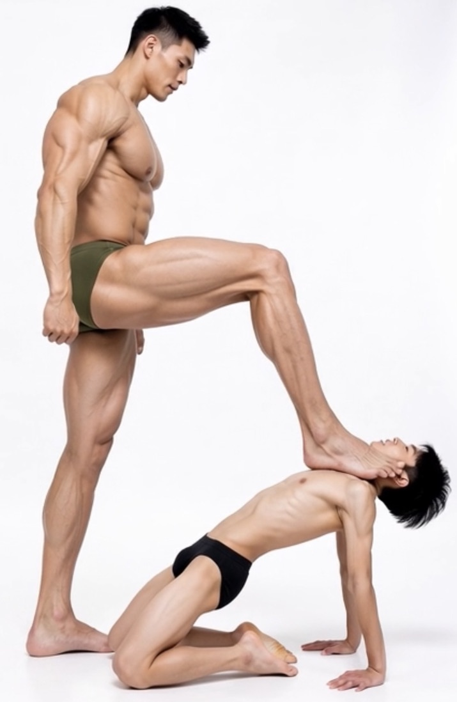 |
| 35 | Create a professional full-body studio biomechanics and figure-reference photograph of two fully clothed adult male models in neutral athletic clothing: a taller, strongly built adult man and a smaller, slender adult man, in a pure white seamless studio with natural perspective, even lighting, and a clinically neutral, non-sexual presentation. Use an eye-level frontal view that fully includes both figures and their clear side spacing. The taller, strongly built adult man faces forward in an upright stance with feet apart and fully planted, hands on hips, relaxed knees, neutral pelvis, vertical torso, and head slightly turned toward the smaller, slender adult man. The smaller, slender adult man stands at the side-front with softly unlocked knees, arms resting along the sides, head raised, and gaze toward the taller, strongly built adult man's face and upper torso. Keep the figures separate with no contact, no overlap, and no ambiguity in the ground relationship. Preserve the taller, strongly built adult man's elongated femurs, tibias, Achilles regions, and feet as an anatomically coherent lower-body line. Maintain level shoulders, natural balance, and an unobscured view of every major limb. All contact remains voluntary, light, and limited to the defined exercise function. Include both figures, all limbs, hands, feet, joints, and active contact points without cropping; avoid wide-angle distortion, artificial foreshortening, floating anatomy, impossible balance, reversed or hyperextended joints, intersecting bodies, merged limbs, malformed extremities, hidden support points, and severe occlusion. | 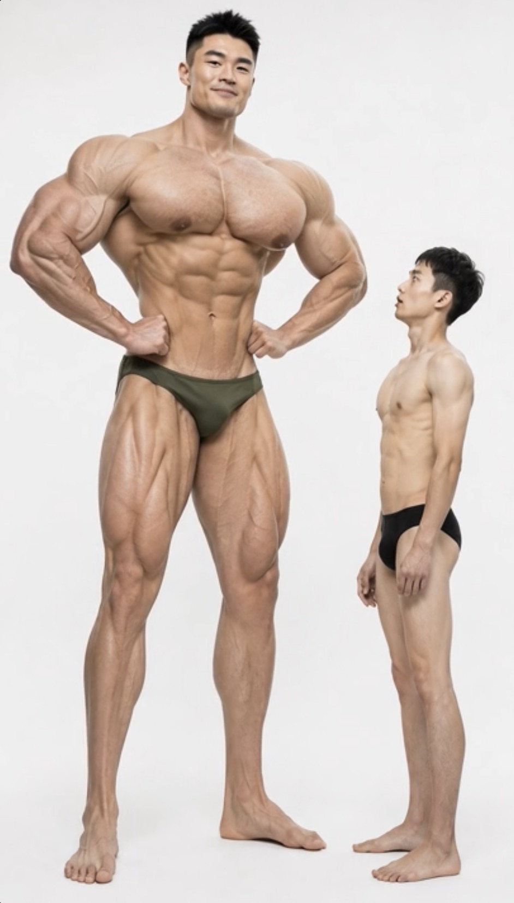 |
| 36 | Create a professional full-body studio biomechanics and figure-reference photograph of two fully clothed adult male models in neutral athletic clothing: a taller, strongly built adult man and a smaller, slender adult man, in a pure white seamless studio with natural perspective, even lighting, and a clinically neutral, non-sexual presentation. Use a near-frontal side-offset view parallel to the body plane, fully showing the taller, strongly built adult man's planted legs, open supporting arms, and the lifted smaller, slender adult man. The taller, strongly built adult man performs a controlled front partner lift with feet apart, knees softly flexed, neutral pelvis, and upright torso. One open arm supports the smaller, slender adult man's upper back from the side, while the other provides a broad, visible support beneath the outer pelvis and upper thigh rather than enclosing the torso. The smaller, slender adult man is lifted clear of the floor with a close but professional support relation, knees flexed downward, arms held in front for balance or lightly placed at the taller, strongly built adult man's outer upper arms, and head oriented toward him. The taller, strongly built adult man looks downward. Make the support path clear through both arms, shoulders, trunk, pelvis, planted legs, and ground. Keep the taller, strongly built adult man's femurs, tibias, Achilles regions, and feet distinctly elongated but anatomically coherent, without perspective shortening. All contact remains voluntary, controlled, non-injurious, and limited to the defined exercise function. Include both figures, all limbs, hands, feet, joints, and active contact points without cropping; avoid wide-angle distortion, artificial foreshortening, floating anatomy, impossible balance, reversed or hyperextended joints, intersecting bodies, merged limbs, malformed extremities, hidden support points, and severe occlusion. | 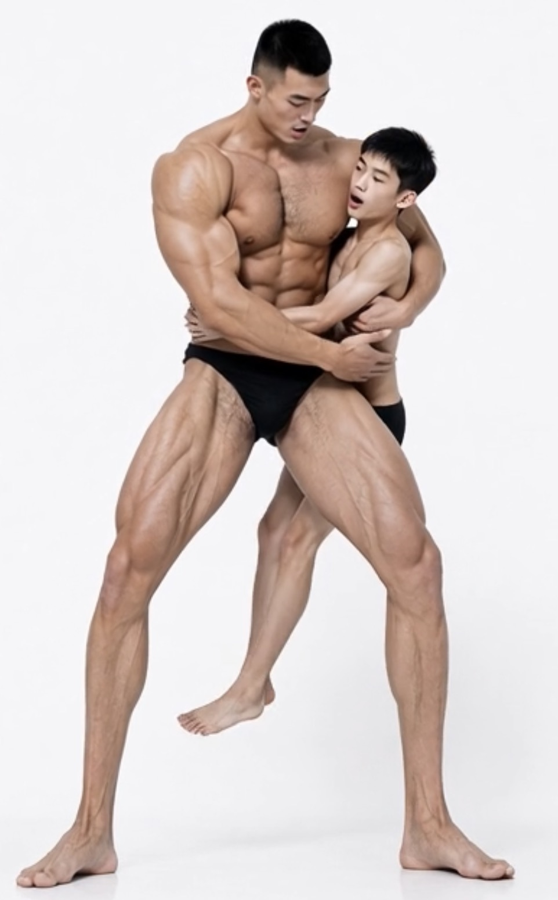 |
| 37 | Create a professional full-body studio biomechanics and figure-reference photograph of two fully clothed adult male models in neutral athletic clothing: a taller, strongly built adult man and a smaller, slender adult man, in a pure white seamless studio with natural perspective, even lighting, and a clinically neutral, non-sexual presentation. Use a near-frontal view with a slight side offset, fully showing the taller, strongly built adult man's low squat, the smaller, slender adult man's upright stance, and all planted feet. The taller, strongly built adult man holds a wide deep squat with both feet grounded, knees tracking naturally over the toes, hips lowered, and torso upright. One open hand provides light guidance at the outer thigh or knee of the smaller, slender adult man, while the other hand rests near the taller, strongly built adult man's own thigh to reinforce balance. The smaller, slender adult man stands at the side-front with both feet weight-bearing, one open hand lightly placed near the taller, strongly built adult man's outer shoulder or upper arm, the other arm relaxed downward, and head turned toward him. The taller, strongly built adult man turns his head toward the camera or the smaller, slender adult man. Keep every point of guidance open, non-restraining, and clearly visible. Preserve a stable lower-body load path through the taller, strongly built adult man's feet, knees, hips, and trunk. Keep the taller, strongly built adult man's femurs, tibias, Achilles regions, and feet distinctly elongated but anatomically coherent, without perspective shortening. All contact remains voluntary, light, and limited to the defined exercise function. Include both figures, all limbs, hands, feet, joints, and active contact points without cropping; avoid wide-angle distortion, artificial foreshortening, floating anatomy, impossible balance, reversed or hyperextended joints, intersecting bodies, merged limbs, malformed extremities, hidden support points, and severe occlusion. | 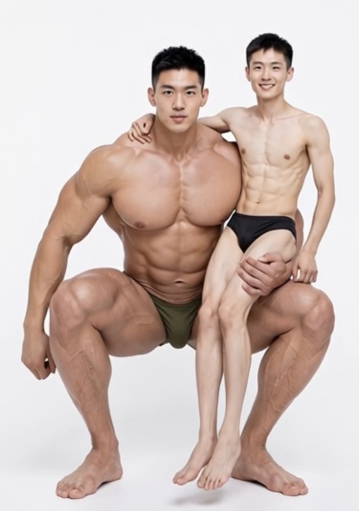 |
| 38 | Create a professional full-body studio biomechanics and figure-reference photograph of two fully clothed adult male models in neutral athletic clothing: a taller, strongly built adult man and a smaller, slender adult man, in a pure white seamless studio with natural perspective, even lighting, and a clinically neutral, non-sexual presentation. Use a strict side view with the camera at a natural standing level and parallel to both body axes, fully showing the taller, strongly built adult man's upright posture and the smaller, slender adult man's raised line of sight. The taller, strongly built adult man faces the smaller, slender adult man while standing upright with both full feet planted, hands held behind the body, level shoulders, neutral pelvis, vertical torso, and head slightly lowered. The smaller, slender adult man faces him in an upright stance with naturally extended but unlocked legs, relaxed arms downward, head clearly raised, and gaze focused on the taller, strongly built adult man's face. Keep both figures on the same ground and body plane with a clear open gap and no contact or overlap. Preserve the taller, strongly built adult man's elongated femurs, tibias, Achilles regions, and feet as an anatomically coherent standing lower-body line. Make every foot, knee, pelvis, shoulder, and head fully visible. All contact remains voluntary, light, and limited to the defined exercise function. Include both figures, all limbs, hands, feet, joints, and active contact points without cropping; avoid wide-angle distortion, artificial foreshortening, floating anatomy, impossible balance, reversed or hyperextended joints, intersecting bodies, merged limbs, malformed extremities, hidden support points, and severe occlusion. | 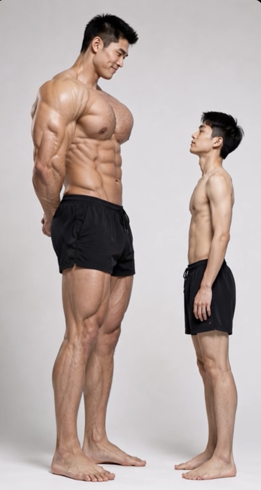 |
| 39 | Create a professional full-body studio biomechanics and figure-reference photograph of two fully clothed adult male models in neutral athletic clothing: a taller, strongly built adult man and a smaller, slender adult man, in a pure white seamless studio with natural perspective, even lighting, and a clinically neutral, non-sexual presentation. Use a frontal view from slightly below eye level, fully showing the kneeling support figure, the taller, strongly built adult man's seated balance position, and both foot placements. The smaller, slender adult man holds a stable kneeling base with an upright torso and open hands lightly guiding the taller, strongly built adult man's outer lower legs. The taller, strongly built adult man performs an assisted shoulder-level balance reference: he sits above the smaller, slender adult man's shoulder line with clear spacing from the neck, legs placed to either side without wrapping, knees naturally flexed, feet hanging freely, hands held near the outer thighs or gently open in space for balance, and torso upright. The taller, strongly built adult man looks downward while the smaller, slender adult man looks upward with calm eye contact. Show the continuous balance path from the seated pelvis through the smaller, slender adult man's broad shoulder support, knees, and the ground, without compression or restraint. Keep the taller, strongly built adult man's femurs, tibias, Achilles regions, and feet distinctly elongated but anatomically coherent, without perspective shortening. All contact remains voluntary, light, and limited to the defined exercise function. Include both figures, all limbs, hands, feet, joints, and active contact points without cropping; avoid wide-angle distortion, artificial foreshortening, floating anatomy, impossible balance, reversed or hyperextended joints, intersecting bodies, merged limbs, malformed extremities, hidden support points, and severe occlusion. | 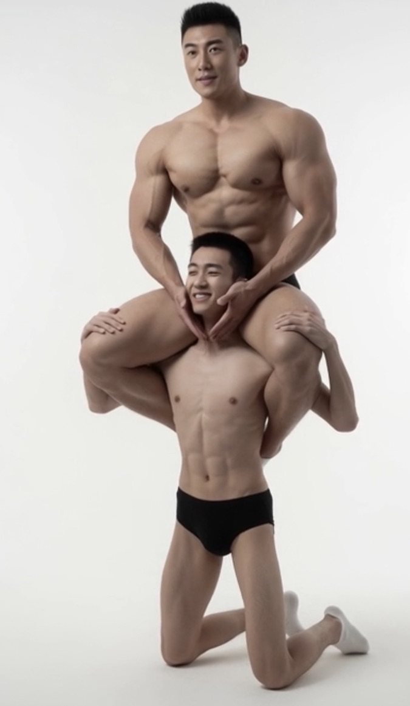 |
| 40 | Create a professional full-body studio biomechanics and figure-reference photograph of two fully clothed adult male models in neutral athletic clothing: a taller, strongly built adult man and a smaller, slender adult man, in a pure white seamless studio with natural perspective, even lighting, and a clinically neutral, non-sexual presentation. Use a side-front view parallel to the ground, fully showing the smaller, slender adult man's four-point rehabilitation posture and the taller, strongly built adult man's wide, offset movement stance. The smaller, slender adult man supports himself on both open hands and both knees, with wrists below shoulders, knees below hips, a relatively level back, and head turned slightly side-front. The taller, strongly built adult man takes a wide, offset lunge alongside and over the open space beside the smaller, slender adult man rather than straddling or loading the back: one leg reaches forward as a planted support, the opposite knee stays close to the ground, and the torso inclines forward without collapsing. His open hands hover at, or make only light non-weight-bearing guidance near, the outer shoulder-line and upper-back alignment markers. Make the figures' ground supports, open space, and non-contact guidance visible. Keep the taller, strongly built adult man's long lower-body structure clear through the lunge. Keep the taller, strongly built adult man's femurs, tibias, Achilles regions, and feet distinctly elongated but anatomically coherent, without perspective shortening. All contact remains voluntary, light, and limited to the defined exercise function. Include both figures, all limbs, hands, feet, joints, and active contact points without cropping; avoid wide-angle distortion, artificial foreshortening, floating anatomy, impossible balance, reversed or hyperextended joints, intersecting bodies, merged limbs, malformed extremities, hidden support points, and severe occlusion. | 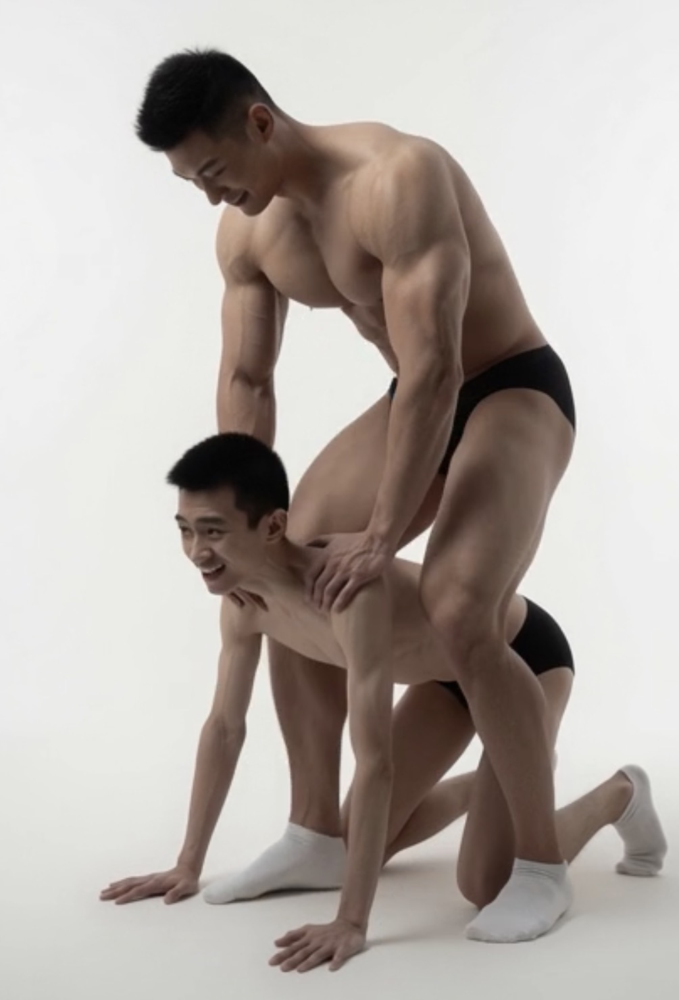 |
| 41 | Create a professional full-body studio biomechanics and figure-reference photograph of two fully clothed adult male models in neutral athletic clothing: a taller, strongly built adult man and a smaller, slender adult man, in a pure white seamless studio with natural perspective, even lighting, and a clinically neutral, non-sexual presentation. Use a frontal view with a slight side offset, fully showing the taller, strongly built adult man's upright body, the smaller, slender adult man's side-front gesture, and both sets of planted feet. The taller, strongly built adult man faces forward with full feet planted, relaxed knees, hands on hips, level shoulders, neutral pelvis, and head slightly turned toward the smaller, slender adult man. The smaller, slender adult man stands at the side-front with a stable separated stance, one open hand held near the taller, strongly built adult man's outer hip-line or waist-line alignment marker without pressing into the body, the other arm relaxed downward, and head raised with gaze directed toward the taller, strongly built adult man. Keep a clear open gap around the hand marker and preserve the side spacing between the figures. Make both standing bases and all major joints unobscured. Keep the taller, strongly built adult man's femurs, tibias, Achilles regions, and feet distinctly elongated but anatomically coherent, without perspective shortening. All contact remains voluntary, light, and limited to the defined exercise function. Include both figures, all limbs, hands, feet, joints, and active contact points without cropping; avoid wide-angle distortion, artificial foreshortening, floating anatomy, impossible balance, reversed or hyperextended joints, intersecting bodies, merged limbs, malformed extremities, hidden support points, and severe occlusion. | 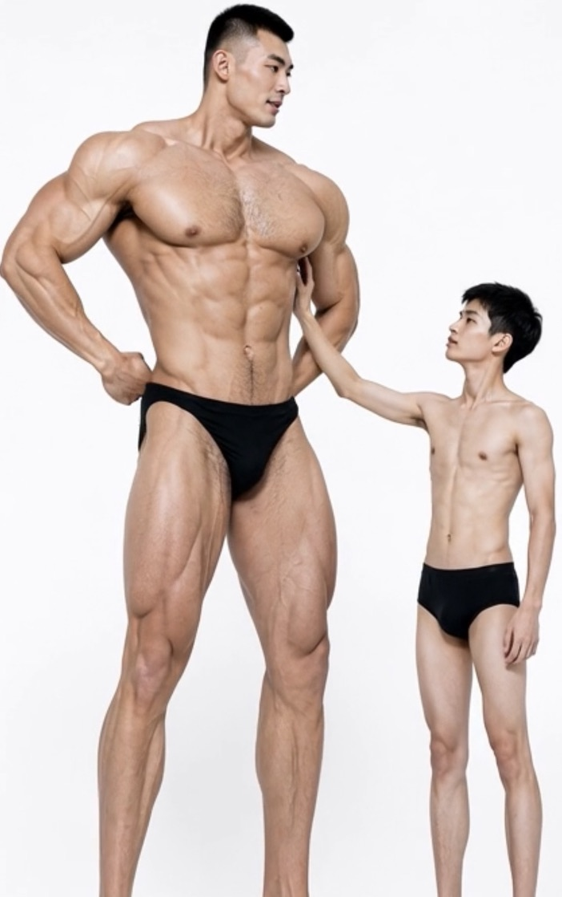 |
| 42 | Create a professional full-body studio biomechanics and figure-reference photograph of two fully clothed adult male models in neutral athletic clothing: a taller, strongly built adult man and a smaller, slender adult man, in a pure white seamless studio with natural perspective, even lighting, and a clinically neutral, non-sexual presentation. Use a frontal view from slightly below eye level, fully showing the taller, strongly built adult man's wide deep squat, open hand guidance, and the reclining smaller, slender adult man's raised legs. The taller, strongly built adult man places both full feet apart on the ground, opens the knees naturally, lowers the pelvis while keeping the torso upright, and uses open hands to guide the smaller, slender adult man's two flexed raised legs at their outer lower-leg regions. The smaller, slender adult man lies with shoulders, back, and head grounded, lifts both legs from the hips with knees flexed and opened outward, keeps the ankles near but not against the taller, strongly built adult man's outer thigh line, and rests both arms along the floor. The taller, strongly built adult man looks downward. Make the grounded feet, open hand guidance, raised-leg paths, and all spacing clear and continuous, with no torso loading or restrictive arrangement. Keep the taller, strongly built adult man's femurs, tibias, Achilles regions, and feet distinctly elongated but anatomically coherent, without perspective shortening. All contact remains voluntary, controlled, non-injurious, and limited to the defined exercise function. Include both figures, all limbs, hands, feet, joints, and active contact points without cropping; avoid wide-angle distortion, artificial foreshortening, floating anatomy, impossible balance, reversed or hyperextended joints, intersecting bodies, merged limbs, malformed extremities, hidden support points, and severe occlusion. | 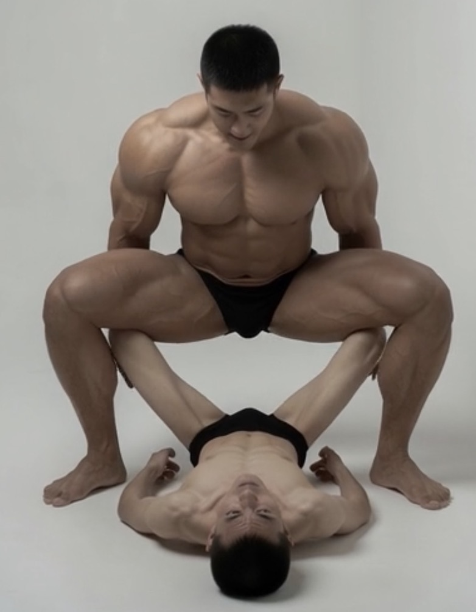 |
| 43 | Create a full-body studio biomechanics and movement-reference photograph of two fully clothed adult male models in neutral athletic clothing, presented as a non-sexual, clinically neutral partner-balance study. Use a direct front view at eye level with a pure white seamless background and natural perspective. Keep both bodies completely visible from head to foot, including all hands, knees, ankles, and grounded feet; avoid cropping, wide-angle distortion, perspective compression, and foreshortening. The smaller, slender adult man stands with both feet planted, knees softly flexed, and open hands stabilizing the outer thighs of the taller, strongly built adult man. The taller man is seated securely on the smaller man's shoulder platform, with bent legs placed symmetrically to either side without constricting the carrier, an upright torso, level shoulders, and a symmetric flexed-arm figure-reference display. He faces the camera while the carrier looks upward to monitor the supported pose. Make the support path explicit from the seated pelvis through the carrier's shoulders, legs, and feet to the floor. Give the taller man visibly elongated yet anatomically coherent femurs, tibias, Achilles regions, and feet, all fully readable despite the seated position. Maintain natural joint ranges, open hand placement, steady balance, and clear separation of overlapping limbs; exclude unstable floating anatomy, merged bodies, hidden support, reversed joints, or any restrictive or nonfunctional presentation. Render the movement with calm cooperative body language, clear skeletal landmarks, individually readable hands and feet, and a continuous floor-to-body support logic suitable for a professional biomechanics and figure-reference session. Use unobstructed lighting so every support surface, joint direction, and major limb contour remains legible. | 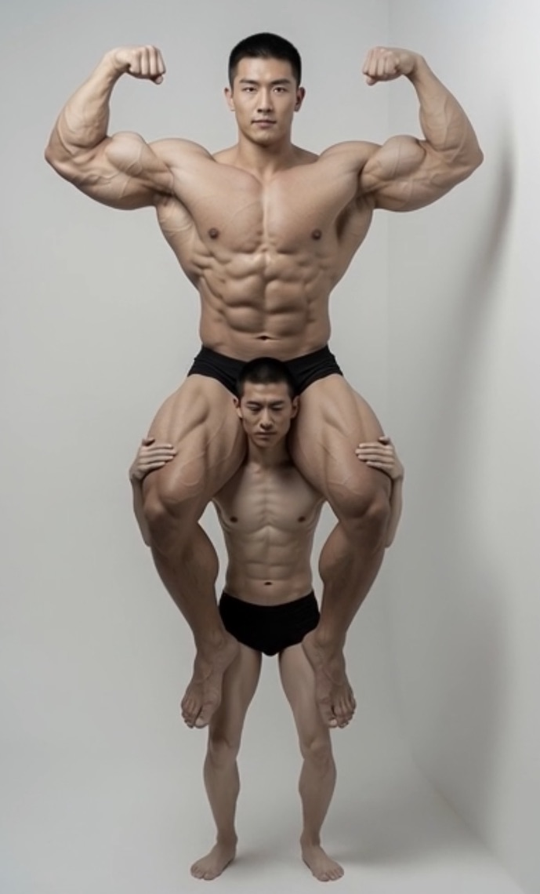 |
| 44 | Create a full-body studio biomechanics and movement-reference photograph of two fully clothed adult male models in neutral athletic clothing, presented as a non-sexual, clinically neutral floor-balance study. Use a low front-oblique view with a pure white seamless background and natural perspective. Keep every head, torso, pelvis, hand, knee, ankle, and foot fully in frame; avoid cropping, wide-angle distortion, perspective compression, and foreshortening. The smaller, slender adult man lies supine with his back and head supported by the floor, arms opened comfortably beside him, legs extended or softly bent, and eyes directed toward the taller man. Beside him, the taller, strongly built adult man holds a compact, deeply flexed lower-body position with his own stable floor support clearly visible. His feet are held as controlled, non-weight-bearing alignment markers near the smaller man's outer shoulder-line and upper-torso plane, maintaining an obvious gap from the body. His bent arms stay close to his sides and his trunk remains compact without twisting. Make the safe load path clear through the taller man's own grounded support and the smaller man's floor support, with no bodyweight transferred through the proximity cue. Preserve the taller man's distinctly elongated, anatomically coherent femurs, tibias, Achilles regions, and feet even in the tucked pose. Keep all joints within normal range and exclude pressure, stepping, contact-driven compression, floating anatomy, intersecting limbs, concealed supports, or sexualized staging. Render the movement with calm cooperative body language, clear skeletal landmarks, individually readable hands and feet, and a continuous floor-to-body support logic suitable for a professional biomechanics and figure-reference session. Use unobstructed lighting so every support surface, joint direction, and major limb contour remains legible. | 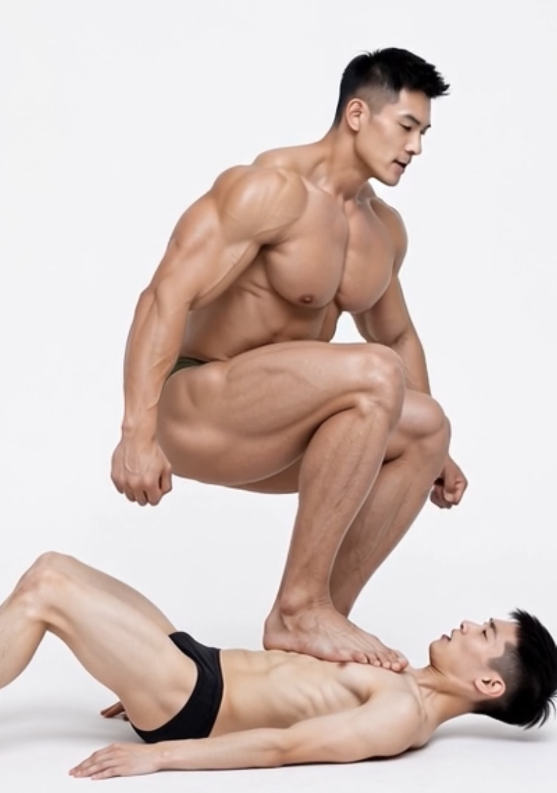 |
| 45 | Create a full-body studio biomechanics and movement-reference photograph of two fully clothed adult male models in neutral athletic clothing, presented as a non-sexual, clinically neutral seated mobility study. Use a low frontal view close to floor level with a pure white seamless background and natural perspective. Keep both figures fully visible, including every toe, ankle, knee, hand, pelvis, and head; avoid cropping, wide-angle distortion, perspective exaggeration, and foreshortening. The taller, strongly built adult man sits on the floor with his pelvis grounded and upper body reclined onto both hands placed behind him. His nearer leg extends continuously toward the camera with a relaxed neutral ankle, while the other leg remains bent for balance. The smaller, slender adult man sits at the taller man's front-side, legs bent or folded comfortably, torso inclined forward, and both open hands supporting the extended foot from beneath at the sole and outer side without pulling. The taller man looks forward; the smaller man follows the supported foot and then the taller man's face with a calm, attentive gaze. Emphasize an unbroken long-leg silhouette through the taller man's elongated femur, tibia, Achilles region, and foot while retaining natural perspective. Show neutral wrists, clear hand placement, stable seated bases, and realistic contact mechanics. Exclude forced ankle flexion, unsupported limbs, clipping, merged hands, obscured toes, unstable postures, or non-anatomical proportions. Render the movement with calm cooperative body language, clear skeletal landmarks, individually readable hands and feet, and a continuous floor-to-body support logic suitable for a professional biomechanics and figure-reference session. Use unobstructed lighting so every support surface, joint direction, and major limb contour remains legible. | 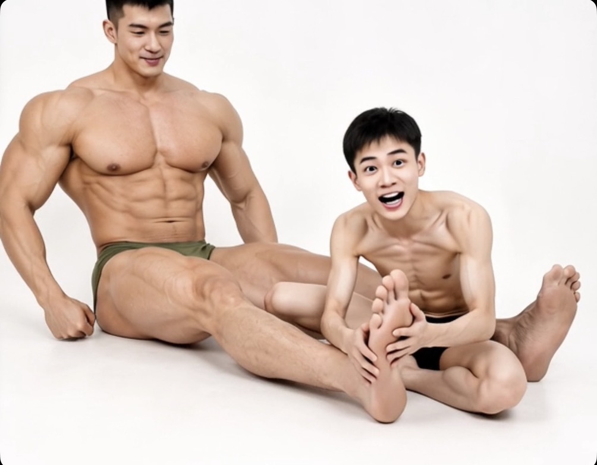 |
| 46 | Create a full-body studio biomechanics and movement-reference photograph of two fully clothed adult male models in neutral athletic clothing, presented as a non-sexual, clinically neutral standing anatomy study. Use a direct front view at eye level with a pure white seamless background and natural perspective. Keep both figures fully visible from head to grounded feet, with hands, knees, ankles, and the light contact point clearly readable; avoid cropping, wide-angle distortion, perspective compression, and foreshortening. The taller, strongly built adult man stands upright with feet set apart and evenly planted, knees relaxed, pelvis neutral, level shoulders, and softly closed hands resting alongside his body. The smaller, slender adult man stands at his side with a stable parallel stance, one open hand making a light, non-restraining tactile reference at the outer upper arm, and the other arm relaxed by his side. The smaller man turns his head toward the taller man, who returns a slight head turn toward him. Keep the contact visibly light and voluntary, with no pulling or compression. Preserve the taller man's distinctly elongated yet anatomically coherent femurs, tibias, Achilles regions, and feet as clear vertical landmarks. Maintain realistic posture, natural joint angles, and an uncluttered separation of the figures; exclude body intersections, hidden feet, reversed knees, floating soles, exaggerated body distortion, or unnecessary close framing. Render the movement with calm cooperative body language, clear skeletal landmarks, individually readable hands and feet, and a continuous floor-to-body support logic suitable for a professional biomechanics and figure-reference session. Use unobstructed lighting so every support surface, joint direction, and major limb contour remains legible. | 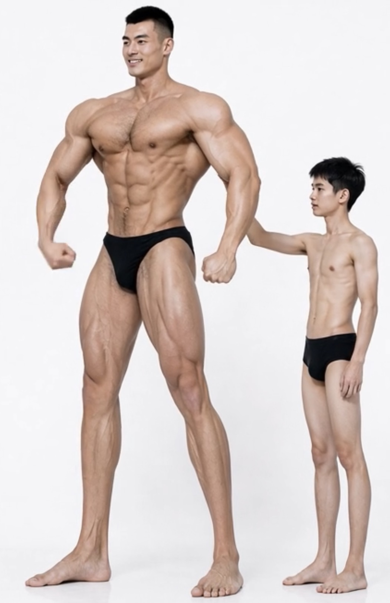 |
| 47 | Create a full-body studio biomechanics and movement-reference photograph of two fully clothed adult male models in neutral athletic clothing, presented as a non-sexual, clinically neutral rehabilitation and balance study. Use a front-oblique side view parallel to the main movement plane, with a pure white seamless background and natural perspective. Keep every hand, knee, ankle, foot, pelvis, and head fully visible; avoid cropping, wide-angle distortion, perspective compression, and foreshortening. The smaller, slender adult man adopts a non-weight-bearing hands-and-knees recovery position with neutral wrists under the shoulders, knees under the hips, and a comfortably long, level back. The taller, strongly built adult man takes a wide, offset athletic squat around rather than over the smaller man, with both feet firmly planted well to either side and clear protective space above the back. His hands rest on his own thighs or hips, his trunk inclines only slightly forward, and he looks downward to assess spacing. There is no load transfer onto the smaller man's back and no enclosing or unnecessary close contact. Emphasize the taller man's long, coherent femurs, tibias, Achilles regions, and feet as they remain visibly extended within the low stance. Show safe balance, continuous ground support, neutral joints, and unambiguous clearance; exclude stepping, body enclosure, spinal loading, hidden limbs, joint reversal, body intersection, or unstable anatomy. Render the movement with calm cooperative body language, clear skeletal landmarks, individually readable hands and feet, and a continuous floor-to-body support logic suitable for a professional biomechanics and figure-reference session. Use unobstructed lighting so every support surface, joint direction, and major limb contour remains legible. Preserve distinctly elongated yet anatomically coherent femurs, tibias, Achilles regions, and feet on the taller, strongly built adult man. | 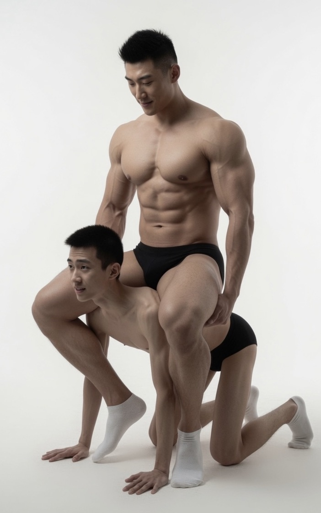 |
| 48 | Create a full-body studio biomechanics and movement-reference photograph of two fully clothed adult male models in neutral athletic clothing, presented as a non-sexual, clinically neutral partner-lift study. Use a front-oblique view with a pure white seamless background and natural perspective. Keep both bodies fully visible from head to foot, including every hand, knee, ankle, and grounded sole; avoid cropping, wide-angle distortion, perspective compression, and foreshortening. The taller, strongly built adult man stands in a stable split stance with softly flexed knees and a neutral pelvis. He performs a secure front carry: an open forearm and hand support the smaller, slender adult man's upper back or waist while the other open hand supports the outer thigh. The smaller man is lifted clear of the floor with bent legs hanging naturally, torso held close to the carrier's center, open arms resting lightly around the upper back rather than the neck, and a calm face turned toward the taller man. Both maintain natural eye contact. Make the entire load path visible from the lifted torso and thigh through the carrier's hands, arms, pelvis, legs, and planted feet. Preserve the taller man's distinctly elongated, anatomically coherent lower-body proportions, including femurs, tibias, Achilles regions, and feet. Exclude restraint, unnecessary close posing, unsupported floating, hidden grip points, bent-back distortion, merged bodies, or implausible balance. Render the movement with calm cooperative body language, clear skeletal landmarks, individually readable hands and feet, and a continuous floor-to-body support logic suitable for a professional biomechanics and figure-reference session. Use unobstructed lighting so every support surface, joint direction, and major limb contour remains legible. | 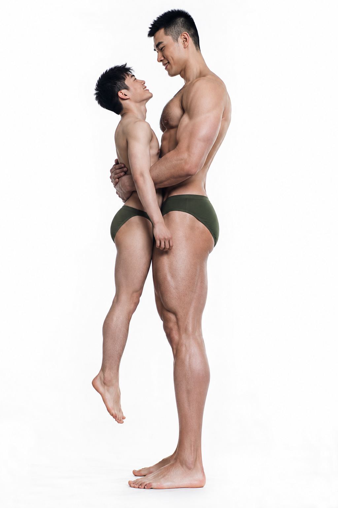 |
| 49 | Create a full-body studio biomechanics and movement-reference photograph of two fully clothed adult male models in neutral athletic clothing, presented as a non-sexual, clinically neutral spatial-reference study. Use a low direct front view with a pure white seamless background and natural perspective. Keep both figures completely visible, including all grounded elbows, hands, knees, ankles, and feet; avoid cropping, wide-angle distortion, perspective compression, and foreshortening. The taller, strongly built adult man stands upright in a relaxed, stable stance directly beside and slightly behind the smaller, slender adult man, with both soles planted, knees easy, pelvis neutral, arms resting naturally, and gaze lowered in an attentive coaching manner. The smaller man reclines on the floor with his upper body supported through both elbows and upper back, hips close to the floor, knees comfortably bent or one leg long, and hands placed near his sides for stability. He lifts his head to look toward the standing partner. Maintain clear vertical spacing between the figures without any foot-to-body contact or threatening placement. Emphasize the taller man's long femurs, tibias, Achilles regions, and feet as fully visible vertical reference landmarks. Show stable floor supports, open space around major joints, and natural body alignment; exclude pressure, stepping, hidden limbs, unsupported elbows, body overlap, reversed joints, or perspective tricks. Render the movement with calm cooperative body language, clear skeletal landmarks, individually readable hands and feet, and a continuous floor-to-body support logic suitable for a professional biomechanics and figure-reference session. Use unobstructed lighting so every support surface, joint direction, and major limb contour remains legible. Preserve distinctly elongated yet anatomically coherent femurs, tibias, Achilles regions, and feet on the taller, strongly built adult man. | 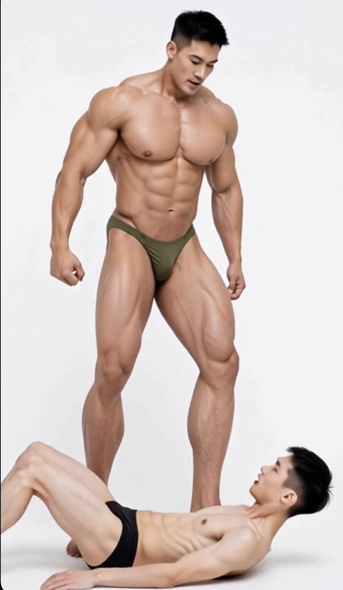 |
| 50 | Create a full-body studio biomechanics and movement-reference photograph of two fully clothed adult male models in neutral athletic clothing, presented as a non-sexual, clinically neutral movement-coaching study. Use a front-oblique side view aligned with the main body plane, with a pure white seamless background and natural perspective. Keep both figures fully visible, including hands, knees, ankles, feet, and the space between them; avoid cropping, wide-angle distortion, perspective compression, and foreshortening. The smaller, slender adult man holds a non-weight-bearing hands-and-knees recovery pose with open palms on the floor, knees comfortably apart, and a long neutral back. The taller, strongly built adult man stands in a wide, offset stance beside him, with one foot firmly grounded and the other lifted only as a light, non-loading proximity marker near the outer shoulder-line rather than on the back. His open hands hover near the smaller man's shoulder area as a spotter, without downward force. He inclines his trunk slightly forward and looks down to monitor safety. Preserve distinct clearance between the bodies and show the taller man's elongated femurs, tibias, Achilles regions, and feet without shortening. Make all ground support and balance paths clear. Exclude stepping, pressure, back loading, body enclosure, hidden contact, unstable four-limb support, intersecting anatomy, or dramatic perspective distortion. Render the movement with calm cooperative body language, clear skeletal landmarks, individually readable hands and feet, and a continuous floor-to-body support logic suitable for a professional biomechanics and figure-reference session. Use unobstructed lighting so every support surface, joint direction, and major limb contour remains legible. | 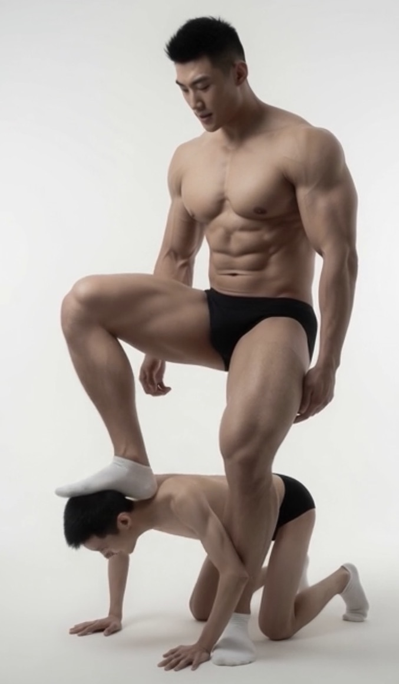 |
| 51 | Create a full-body studio biomechanics and movement-reference photograph of two fully clothed adult male models in neutral athletic clothing, presented as a non-sexual, clinically neutral mobility study. Use a low direct front view with a pure white seamless background and natural perspective. Keep all heads, hands, torsos, pelvises, knees, ankles, and feet visible without cropping, wide-angle distortion, perspective compression, or foreshortening. The taller, strongly built adult man holds a stable wide squat with both feet fully grounded, knees tracking naturally outward, pelvis centered, torso upright, level shoulders, and a symmetric flexed-arm figure-reference display. The smaller, slender adult man remains in a non-weight-bearing hands-and-knees position in the open space in front of the taller man's stance, with palms beneath shoulders, knees beneath hips, a gently lengthened back, and head lifted to observe the taller man. Maintain substantial clearance between the smaller man and the taller man's legs; this is a spatial alignment exercise, not contact or enclosure. Preserve the taller man's elongated, anatomically coherent femurs, tibias, Achilles regions, and feet within the squat. Show continuous ground support, neutral wrists and ankles, clearly separated silhouettes, and realistic joint angles. Exclude body enclosure, limb occlusion, knee collapse, floating feet, spinal distortion, or any undue physical intensity. Render the movement with calm cooperative body language, clear skeletal landmarks, individually readable hands and feet, and a continuous floor-to-body support logic suitable for a professional biomechanics and figure-reference session. Use unobstructed lighting so every support surface, joint direction, and major limb contour remains legible. | 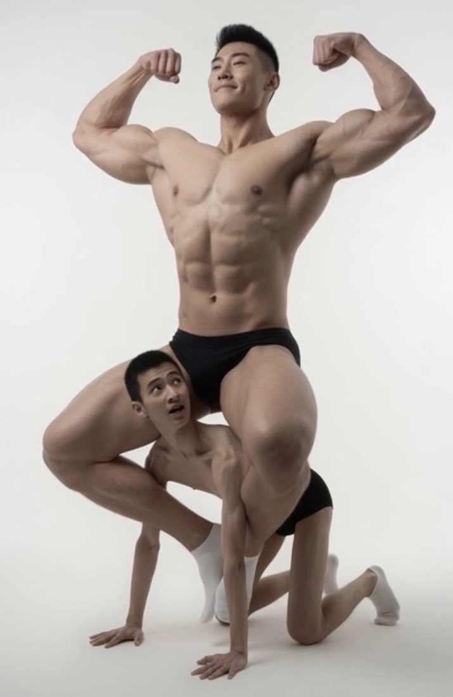 |
| 52 | Create a full-body studio biomechanics and movement-reference photograph of two fully clothed adult male models in neutral athletic clothing, presented as a non-sexual, clinically neutral standing-contact study. Use a front-oblique view parallel to their shared body plane, with a pure white seamless background and natural perspective. Keep both figures fully visible from head to grounded feet, including the hands, wrists, and torso reference points; avoid cropping, wide-angle distortion, perspective compression, and foreshortening. The taller, strongly built adult man stands upright with both feet planted, relaxed knees, neutral pelvis, a vertical trunk, and a calm downward gaze. A hand lightly guides the smaller, slender adult man's forearm near the wrist without gripping or restraining, while the other hand rests near the taller man's own hip. The smaller man stands facing him with an independent stable base, both open palms held close to the taller man's upper torso as non-contact alignment references while preserving a clear gap from the chest and abdomen. His elbows stay naturally bent, his trunk remains upright with only a slight backward counterbalance, and he looks calmly toward the taller man. Make all body gaps and optional light contact explicit. Preserve the taller man's long femurs, tibias, Achilles regions, and feet. Exclude restrictive holding, pressure, unnecessary close contact, hidden feet, hyperextension, body intersections, or perspective shortening. Render the movement with calm cooperative body language, clear skeletal landmarks, individually readable hands and feet, and a continuous floor-to-body support logic suitable for a professional biomechanics and figure-reference session. Use unobstructed lighting so every support surface, joint direction, and major limb contour remains legible. Preserve distinctly elongated yet anatomically coherent femurs, tibias, Achilles regions, and feet on the taller, strongly built adult man. | 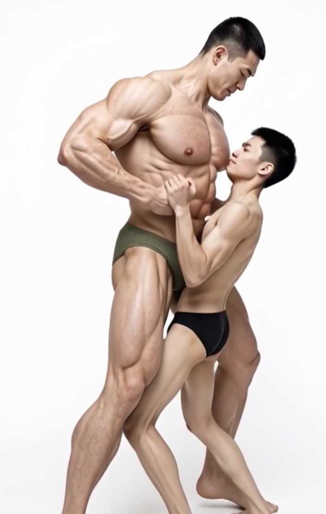 |
| 53 | Create a full-body studio biomechanics and movement-reference photograph of two fully clothed adult male models in neutral athletic clothing, presented as a non-sexual, clinically neutral standing anatomy study. Use a direct front view at eye level with a pure white seamless background and natural perspective. Keep all heads, hands, torsos, pelvises, knees, ankles, and feet completely visible; avoid cropping, wide-angle distortion, perspective compression, and foreshortening. The taller, strongly built adult man stands with both feet set apart and planted, knees naturally relaxed, level shoulders, neutral pelvis, and both hands resting on his own hips. He turns his head slightly toward the smaller, slender adult man. The smaller man stands at the taller man's side with a stable upright stance, one open hand placed lightly at the outer waist-side as a voluntary posture-reference cue, the other arm relaxed, and his gaze lifted toward the taller man's face. Keep the hand contact visibly gentle, non-restraining, and clearly limited to a clear posture-reference cue. Preserve a clear shared floor plane and the taller man's elongated, anatomically coherent femurs, tibias, Achilles regions, and feet as complete visual landmarks. Maintain natural joint ranges, uncluttered silhouettes, and balanced spacing. Exclude pulling, pressure, hidden soles, distorted hands, reversed knees, body intersections, or any forced interaction. Render the movement with calm cooperative body language, clear skeletal landmarks, individually readable hands and feet, and a continuous floor-to-body support logic suitable for a professional biomechanics and figure-reference session. Use unobstructed lighting so every support surface, joint direction, and major limb contour remains legible. | 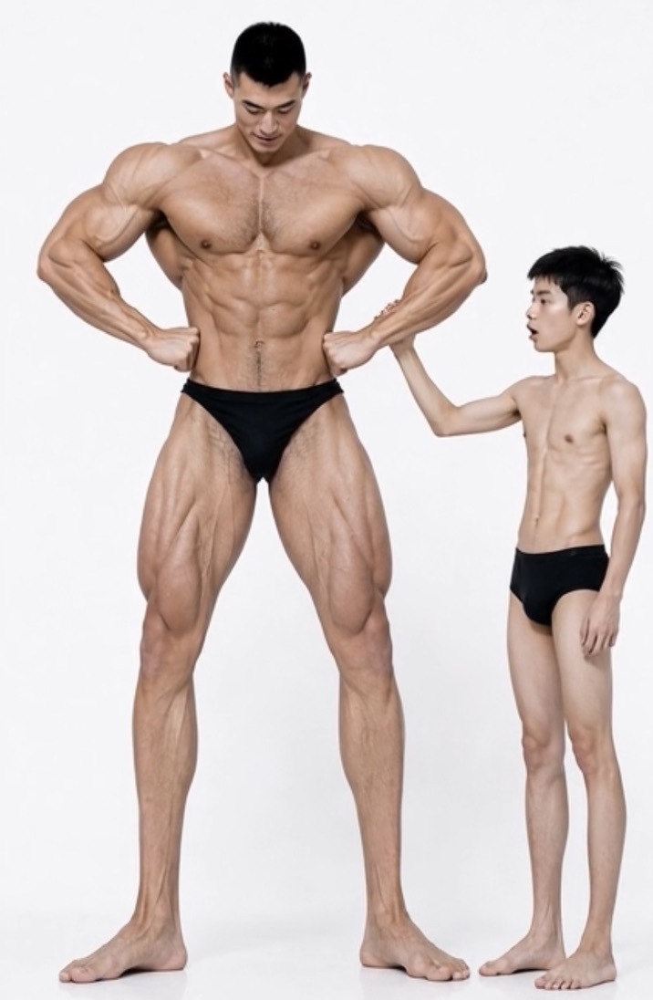 |
| 54 | Create a full-body studio biomechanics and movement-reference photograph of two fully clothed adult male models in neutral athletic clothing, presented as a non-sexual, clinically neutral assisted-carry study. Use a front-oblique view with a pure white seamless background and natural perspective. Keep both figures fully visible, including heads, hands, knees, ankles, feet, and all grip points; avoid cropping, wide-angle distortion, perspective compression, and foreshortening. The taller, strongly built adult man stands with feet separated for balance, knees softly flexed, pelvis neutral, and a controlled vertical trunk. He supports the smaller, slender adult man in a controlled front carry with clear support roles, using an open hand and forearm at the back or waist and the other open hand under the outer hip or thigh. The smaller man is lifted clear of the floor with legs hanging naturally, arms resting openly near the carrier's shoulders rather than encircling the neck, and his head turned toward the taller man for calm visual coordination. The taller man looks downward to check the carry. Make a continuous load path visible from the lifted figure through the carrier's arms, torso, grounded legs, and feet. Preserve the taller man's distinctly elongated femurs, tibias, Achilles regions, and feet without compression. Exclude restrictive grips, unnecessary close posing, floating support, unnatural back bending, hidden hands, merged anatomy, or unstable balance. Render the movement with calm cooperative body language, clear skeletal landmarks, individually readable hands and feet, and a continuous floor-to-body support logic suitable for a professional biomechanics and figure-reference session. Use unobstructed lighting so every support surface, joint direction, and major limb contour remains legible. | 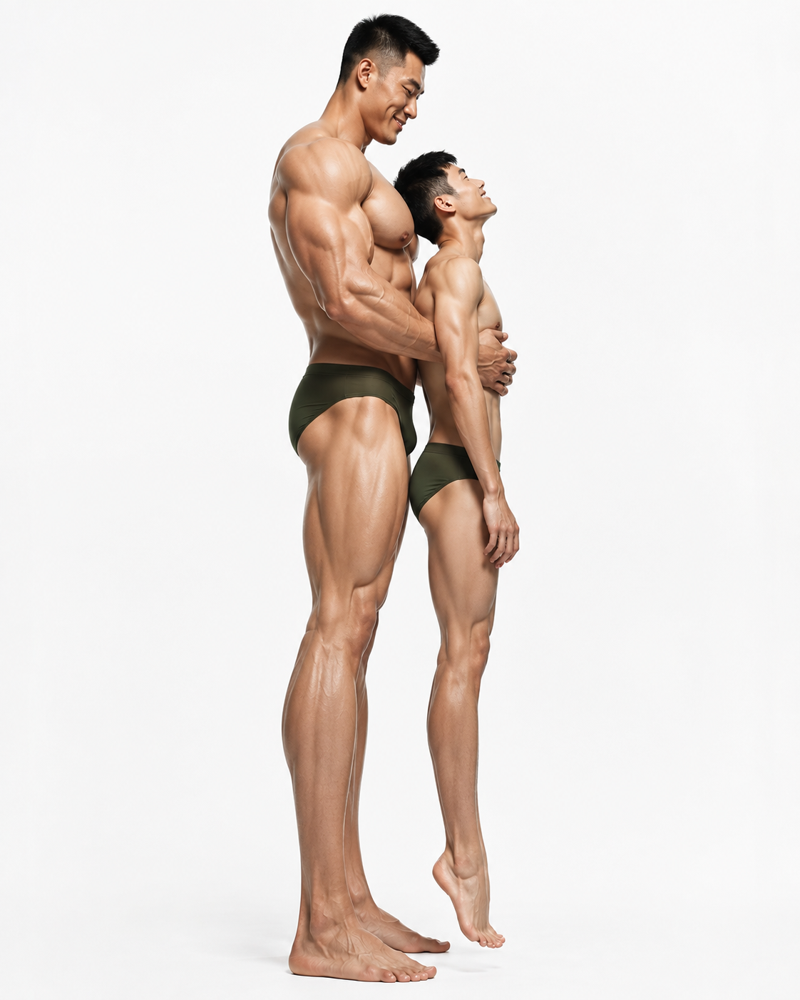 |
| 55 | Create a full-body studio biomechanics and movement-reference photograph of two fully clothed adult male models in neutral athletic clothing, presented as a non-sexual, clinically neutral assisted-leg-mobility study. Use a direct front view at eye level with a pure white seamless background and natural perspective. Keep both bodies fully visible, including all hands, knees, ankles, feet, and the support path; avoid cropping, wide-angle distortion, perspective compression, and foreshortening. The taller, strongly built adult man stands on a firmly planted supporting leg with his pelvis level and torso upright. He holds a symmetric flexed-arm figure-reference display with level shoulders while the other leg is lifted from the hip and softly bent, placing the knee and lower leg near the smaller man's shoulder line without closing the body gap. The smaller, slender adult man stands in front with both feet planted, knees gently flexed, and open hands supporting the lifted lower leg or ankle from beneath with neutral wrists. He looks upward to the leg while the taller man looks down to confirm alignment. Make the grounded leg the clear weight-bearing base and show the lifted leg as safely guided rather than suspended without support. Preserve the taller man's elongated femur, tibia, Achilles region, and foot. Exclude compression, facial contact, pulling, reversed knees, hidden grips, body intersections, or unstable balance. Render the movement with calm cooperative body language, clear skeletal landmarks, individually readable hands and feet, and a continuous floor-to-body support logic suitable for a professional biomechanics and figure-reference session. Use unobstructed lighting so every support surface, joint direction, and major limb contour remains legible. | 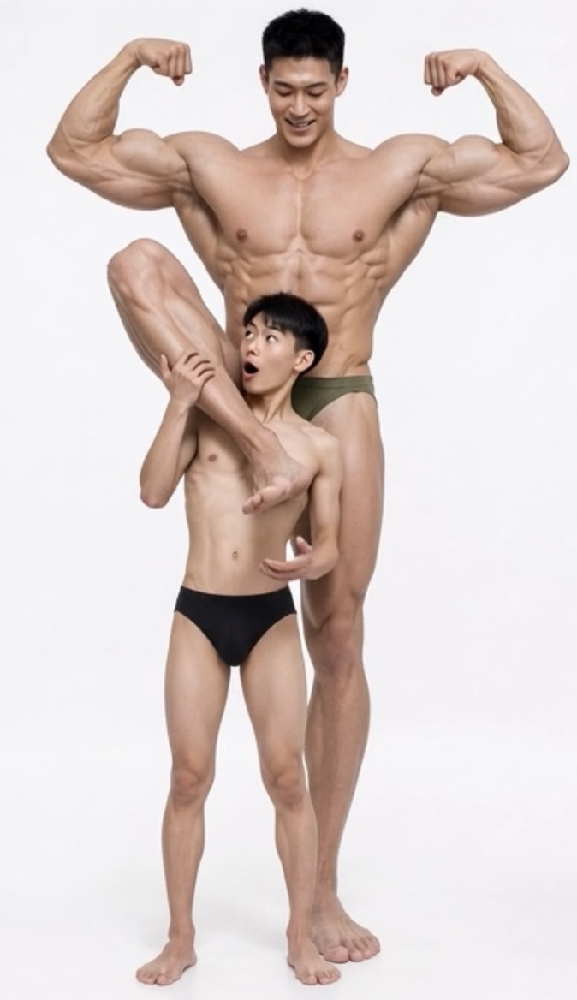 |
| 56 | Create a full-body studio biomechanics and movement-reference photograph of a fully clothed adult male model in neutral athletic clothing, presented as a non-sexual, clinically neutral standing figure study. Use a direct front view at eye level with a pure white seamless background and natural perspective. Keep the entire body visible from head to both grounded feet, including hands, elbows, knees, ankles, and toes; avoid cropping, wide-angle distortion, perspective compression, and foreshortening. The taller, strongly built adult man stands with both feet comfortably apart and fully planted, knees relaxed, pelvis neutral, and weight distributed evenly through the floor. His forearms cross firmly but naturally in front of the upper torso, elbows directed outward, while the trunk turns slightly toward the camera without spinal twisting. Keep shoulders level and the head directed forward or gently toward the front-side. Emphasize distinctly elongated yet anatomically coherent femurs, tibias, Achilles regions, and feet, maintaining a long-legged silhouette throughout the closed-arm stance. Show neutral ankles, continuous skeletal alignment, realistic hand placement, and balanced posture. Exclude tiptoeing, hyperextended or reversed knees, excessive spinal rotation, arms passing through the body, truncated feet, wide-angle distortion, or any non-human anatomical structure. Render the movement with calm cooperative body language, clear skeletal landmarks, individually readable hands and feet, and a continuous floor-to-body support logic suitable for a professional biomechanics and figure-reference session. Use unobstructed lighting so every support surface, joint direction, and major limb contour remains legible. | 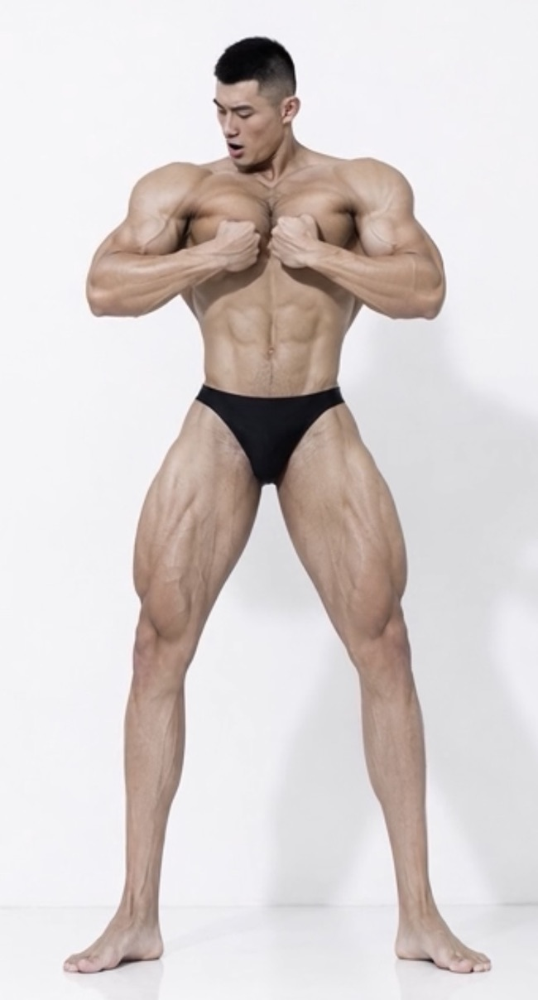 |
| 57 | Create a full-body studio biomechanics and movement-reference photograph of two fully clothed adult male models in neutral athletic clothing, presented as a non-sexual, clinically neutral assisted-foot-mobility study. Use a strict side view aligned with the main body plane, with a pure white seamless background and natural perspective. Keep both figures fully visible from head to foot, including hands, knees, ankles, the raised foot, and all grounded supports; avoid cropping, wide-angle distortion, perspective compression, and foreshortening. The taller, strongly built adult man stands upright on a planted leg with a neutral pelvis, hands held naturally behind his own body, and gaze lowered toward his guided foot. His other leg lifts from the hip and bends comfortably, with the ankle neutral. The smaller, slender adult man takes a low, balanced crouch in front of the raised foot, keeping both feet securely grounded, torso inclined forward, and open hands under the sole as gentle guide support with neutral wrists. He looks up toward the foot, not into an unnecessary close interaction. Make clear that the taller man's grounded leg carries bodyweight while the smaller man provides only light positional guidance. Preserve the taller man's elongated femur, tibia, Achilles region, and foot. Exclude forced lifting, unwanted foot contact, unstable crouching, ankle inversion, distorted hands, hidden support, or unrealistic balance. Render the movement with calm cooperative body language, clear skeletal landmarks, individually readable hands and feet, and a continuous floor-to-body support logic suitable for a professional biomechanics and figure-reference session. Use unobstructed lighting so every support surface, joint direction, and major limb contour remains legible. | 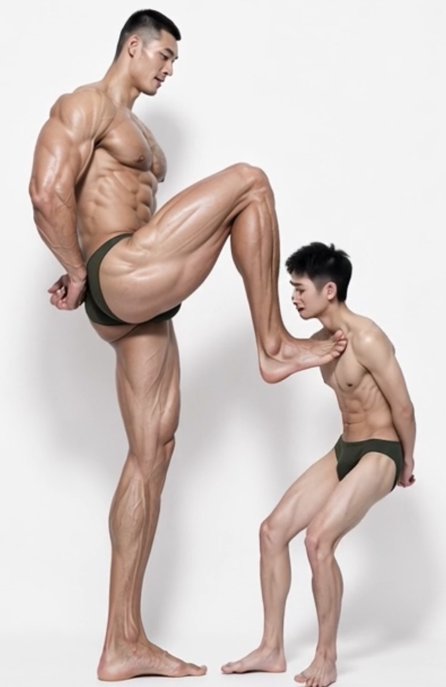 |
| 58 | Create a full-body studio biomechanics and movement-reference photograph of two fully clothed adult male models in neutral athletic clothing, presented as a non-sexual, clinically neutral balance-coaching study. Use a low direct front view with a pure white seamless background and natural perspective. Keep both figures fully visible, including every hand, knee, ankle, foot, and floor contact; avoid cropping, wide-angle distortion, perspective compression, and foreshortening. The taller, strongly built adult man stands on a planted supporting leg with level shoulders and a symmetric flexed-arm figure-reference display. His other leg is raised and bent with a neutral ankle, and the foot is held as a light, non-weight-bearing alignment marker near the smaller, slender adult man's outer shoulder-line rather than against the chest. The smaller man uses a safe seated-back support on the floor, with one or both hands planted behind him, knees bent, torso stable, and an open hand lightly guiding the taller man's ankle without pulling. He looks toward the taller man for coordination. Make the taller man's support route fully independent through his own grounded foot, with no pressure transferred to the smaller man. Preserve the taller man's elongated femur, tibia, Achilles region, and foot without near-camera exaggeration. Exclude stepping, compression, facial contact, restraint, wrist bending, body overlap, unsupported balance, or cropped limbs. Render the movement with calm cooperative body language, clear skeletal landmarks, individually readable hands and feet, and a continuous floor-to-body support logic suitable for a professional biomechanics and figure-reference session. Use unobstructed lighting so every support surface, joint direction, and major limb contour remains legible. | 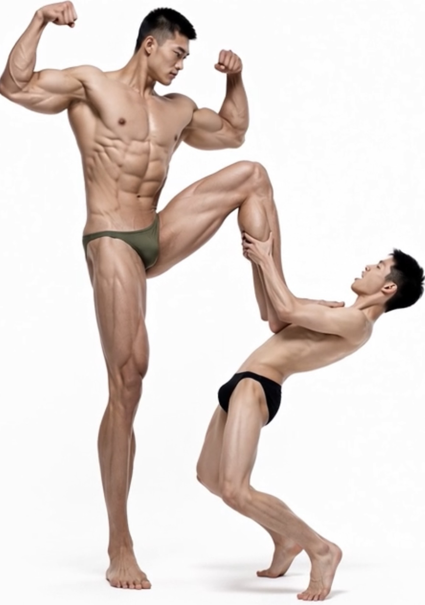 |
| 59 | Create a full-body studio biomechanics and movement-reference photograph of two fully clothed adult male models in neutral athletic clothing, presented as a non-sexual, clinically neutral mobility study. Use a front-oblique side view with a pure white seamless background and natural perspective. Keep all heads, hands, knees, ankles, feet, and space between the figures fully visible; avoid cropping, wide-angle distortion, perspective compression, and foreshortening. The smaller, slender adult man assumes a non-weight-bearing hands-and-knees recovery position with palms flat, knees separated comfortably, a stable neutral back, and face directed forward. The taller, strongly built adult man demonstrates a wide, offset squat nearby with both feet fully planted well outside the smaller man's personal space, knees tracking outward, hands resting at his own hips or thighs, and torso upright or only gently inclined forward. He looks downward as a coach monitoring distance. Maintain clear open floor space between the figures, no back loading, and no body enclosure. Preserve the taller man's visibly elongated, anatomically coherent femurs, tibias, Achilles regions, and feet even in the low stance. Show continuous ground support, natural knees and ankles, clear silhouettes, and realistic balance. Exclude body enclosure, stepping, compression, hidden limbs, spinal distortion, unstable hands-and-knees support, or perspective shortening. Render the movement with calm cooperative body language, clear skeletal landmarks, individually readable hands and feet, and a continuous floor-to-body support logic suitable for a professional biomechanics and figure-reference session. Use unobstructed lighting so every support surface, joint direction, and major limb contour remains legible. | 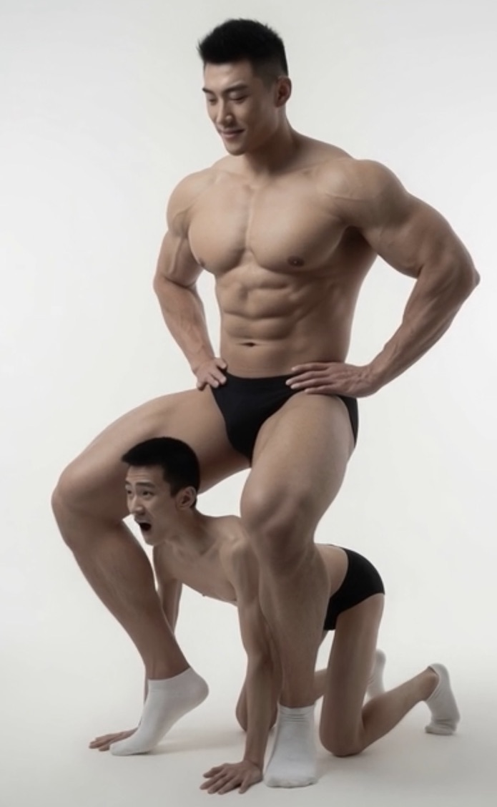 |
| 60 | Create a full-body studio biomechanics and movement-reference photograph of two fully clothed adult male models in neutral athletic clothing, presented as a non-sexual, clinically neutral dynamic-leg-range study. Use a strict side view aligned with the main body plane, with a pure white seamless background and natural perspective. Keep every head, hand, torso, pelvis, knee, ankle, and foot fully visible; avoid cropping, wide-angle distortion, perspective compression, and foreshortening. The taller, strongly built adult man balances on a firmly planted leg while the other leg rises from the hip in a controlled bent-knee arc. The raised foot passes safely above and beside the smaller, slender adult man's outer shoulder-line, with a visible protective gap and no facial, neck, or body contact. A hand lightly supports the lifted lower leg while the other arm rests naturally, and the taller man looks toward the smaller man to monitor the route. The smaller man turns partly away, lowers into a comfortable knee bend, lets both arms rest naturally, and keeps his head lowered so the clearance is obvious. Preserve the taller man's elongated femur, tibia, Achilles region, and foot as a continuous long-limbed line. Show stable ground support, neutral ankle alignment, and practical counterbalance. Exclude contact, pressure, head-level impact, reverse joints, tiptoeing, concealed feet, body intersection, or distorted perspective. Render the movement with calm cooperative body language, clear skeletal landmarks, individually readable hands and feet, and a continuous floor-to-body support logic suitable for a professional biomechanics and figure-reference session. Use unobstructed lighting so every support surface, joint direction, and major limb contour remains legible. | 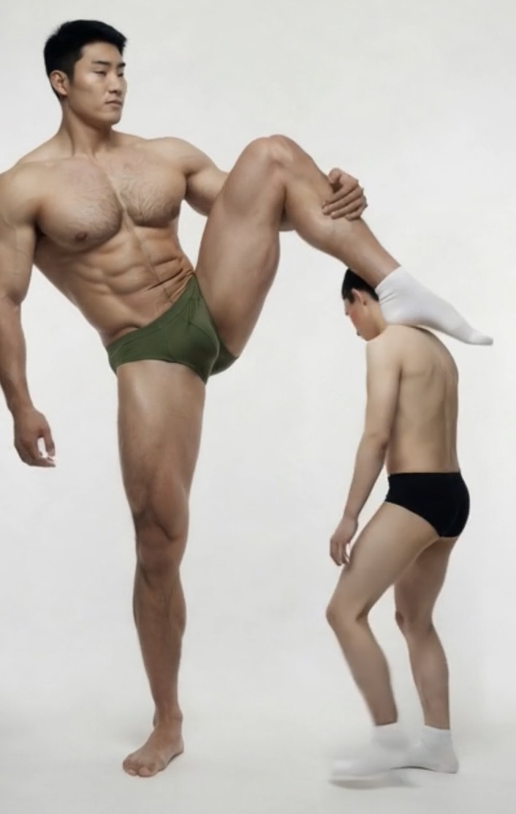 |
| 61 | Create a full-body studio biomechanics and movement-reference photograph of two fully clothed adult male models in neutral athletic clothing, presented as a non-sexual, clinically neutral partner-leg-alignment study. Use a low direct front view with a pure white seamless background and natural perspective. Keep both bodies completely visible, including heads, hands, pelvises, knees, ankles, feet, and all floor supports; avoid cropping, wide-angle distortion, perspective compression, and foreshortening. The taller, strongly built adult man stands on a stable planted leg with level shoulders and a symmetric flexed-arm figure-reference display. His other leg extends forward and upward from the hip in a continuous, naturally aligned line, with a neutral ankle and sole lightly meeting the sole of the smaller, slender adult man's lifted foot as a controlled non-loading alignment cue. The smaller man lies supine with upper back grounded, one leg bent as a stable floor support, the other leg raised toward the taller man's foot, arms relaxed beside the body, and gaze directed toward the contact cue. Neither figure transfers bodyweight through the soles. Preserve the taller man's elongated femur, tibia, Achilles region, and foot without shortening. Make all ground supports and joint directions clear. Exclude pressure, unstable reaching, twisted ankles, broken-looking leg lines, hidden feet, body intersections, or implausible balance. Render the movement with calm cooperative body language, clear skeletal landmarks, individually readable hands and feet, and a continuous floor-to-body support logic suitable for a professional biomechanics and figure-reference session. Use unobstructed lighting so every support surface, joint direction, and major limb contour remains legible. | 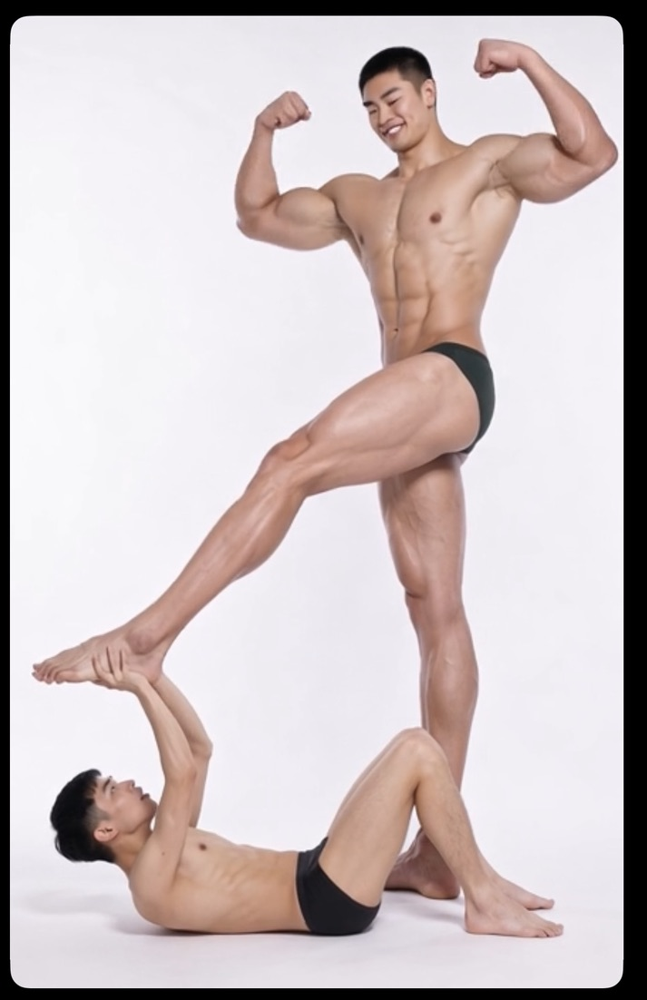 |
| 62 | Create a full-body studio biomechanics and movement-reference photograph of two fully clothed adult male models in neutral athletic clothing, presented as a non-sexual, clinically neutral mirrored-standing study. Use a front-oblique side view aligned with their shared body plane, with a pure white seamless background and natural perspective. Keep all heads, torsos, hands, knees, ankles, feet, and the separation between figures fully visible; avoid cropping, wide-angle distortion, perspective compression, and foreshortening. The taller, strongly built adult man stands in side profile with both feet planted, knees relaxed, neutral pelvis, and forearms crossed in front of the upper torso with softly bent elbows. His trunk rotates slightly toward the side without twisting through the pelvis. The smaller, slender adult man stands a clear step behind and to the side on an independent planted base, echoing a simplified folded-arm or flexed-arm reference pose while turning his head toward the taller man's upper body. The taller man looks toward him in return. Maintain clear depth ordering without letting either model obscure major joints. Emphasize the taller man's elongated, anatomically coherent femurs, tibias, Achilles regions, and feet. Show neutral joints, balanced ground support, and non-contact spatial coordination. Exclude tangled arms, physical restraint, body intersection, hidden soles, reversed knees, extreme torsion, or perspective compression. Render the movement with calm cooperative body language, clear skeletal landmarks, individually readable hands and feet, and a continuous floor-to-body support logic suitable for a professional biomechanics and figure-reference session. Use unobstructed lighting so every support surface, joint direction, and major limb contour remains legible. | 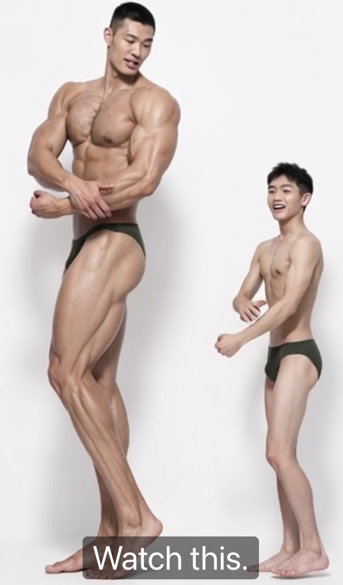 |
| 63 | Create a full-body studio biomechanics and movement-reference photograph of two fully clothed adult male models in neutral athletic clothing, presented as a non-sexual, clinically neutral assisted-lift study. Use a low direct front view with a pure white seamless background and natural perspective. Keep every head, torso, pelvis, hand, knee, ankle, foot, and floor-contact point fully visible; avoid cropping, wide-angle distortion, perspective compression, and foreshortening. The taller, strongly built adult man holds a stable half-squat with both feet planted wide, knees following natural alignment, pelvis lowered, and trunk upright. He carries the smaller, slender adult man vertically close to his own center, using an open forearm and hand behind the upper back and the other open hand under the outer thigh or hip. The lifted man bends his legs naturally, rests a hand openly on the carrier's shoulder-line, keeps the other hand near the carrier's upper torso without gripping, and turns his head sideways to maintain calm eye contact. The taller man turns his head toward him as well. Make the support route fully visible from the lifted figure through the carrier's arms, pelvis, flexed legs, and feet. Preserve the taller man's elongated femurs, tibias, Achilles regions, and feet even in the half-squat. Exclude restraint, hidden supports, arm separation, unstable hips, reversed knees, merged bodies, or any restrictive or nonfunctional presentation. Render the movement with calm cooperative body language, clear skeletal landmarks, individually readable hands and feet, and a continuous floor-to-body support logic suitable for a professional biomechanics and figure-reference session. Use unobstructed lighting so every support surface, joint direction, and major limb contour remains legible. | 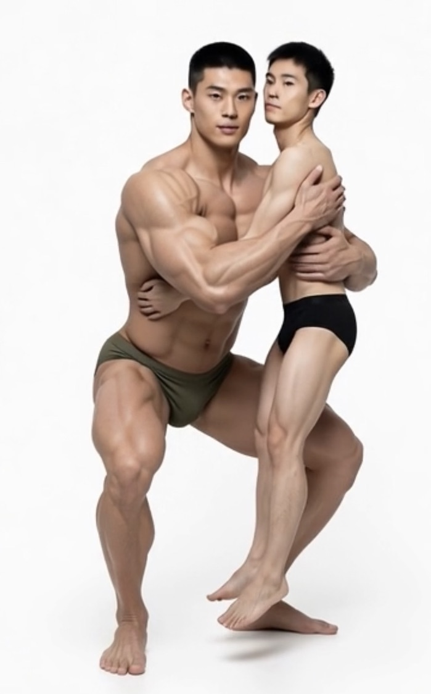 |
| 64 | Create a full-body studio biomechanics and movement-reference photograph of two fully clothed adult male models in neutral athletic clothing, presented as a non-sexual, clinically neutral assisted-leg-placement study. Use a strict side view aligned with the main body plane, with a pure white seamless background and natural perspective. Keep both figures completely visible, including hands, knees, ankles, feet, and all ground contacts; avoid cropping, wide-angle distortion, perspective compression, and foreshortening. The taller, strongly built adult man stands upright on a planted leg with a neutral pelvis, hands held naturally behind his own body, and head slightly lowered. The other leg lifts from the hip with a comfortable knee bend and neutral ankle. Its foot is placed beside the smaller, slender adult man's outer shoulder-line as a clearly non-loading spatial marker, maintaining visible clearance from the head and face. The smaller man stands in front on an independent grounded stance, turns the torso slightly away to create space, and uses open hands beneath the ankle and outer foot for optional light guidance rather than support. His head is angled toward the marker while keeping natural alignment. Preserve the taller man's long, coherent femur, tibia, Achilles region, and foot. Show independent weight-bearing through the taller man's planted leg. Exclude pressure, body contact at the head, pulling, unstable balance, tiptoeing, reversed knees, hidden soles, or perspective distortion. Render the movement with calm cooperative body language, clear skeletal landmarks, individually readable hands and feet, and a continuous floor-to-body support logic suitable for a professional biomechanics and figure-reference session. Use unobstructed lighting so every support surface, joint direction, and major limb contour remains legible. Preserve distinctly elongated yet anatomically coherent femurs, tibias, Achilles regions, and feet on the taller, strongly built adult man. | 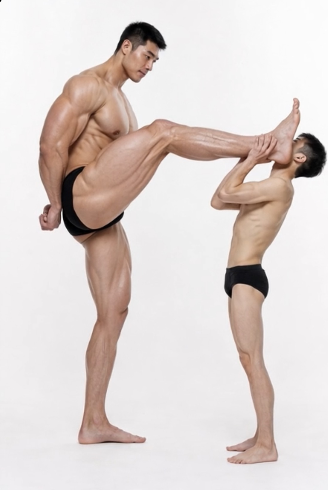 |
| 65 | Create a full-body studio biomechanics and movement-reference photograph of two fully clothed adult male models in neutral athletic clothing, presented as a non-sexual, clinically neutral kneeling balance study. Use a low direct front view with a pure white seamless background and natural perspective. Keep both figures fully visible from head to foot, including grounded knee, hands, ankles, and all floor contact; avoid cropping, wide-angle distortion, perspective compression, and foreshortening. The taller, strongly built adult man kneels on a stable lower-leg support beside the smaller, slender adult man, with the other leg bent, foot firmly grounded, pelvis controlled, and shoulders level in a symmetric flexed-arm figure-reference display. The raised foot is held beside the smaller man's outer shoulder-line and upper-torso plane as a non-contact placement cue, never transferring bodyweight into the partner. The smaller man lies supine with head and back supported by the floor, legs extended comfortably, arms resting by his sides, and gaze directed toward the taller man's foot position. Make the taller man's own knee and grounded foot the clear load path. Preserve elongated, anatomically coherent femurs, tibias, Achilles regions, and feet despite the kneeling pose. Exclude stepping, pressure, body compression, restraint, hidden supports, joint reversal, balance failure, or cropped anatomy. Render the movement with calm cooperative body language, clear skeletal landmarks, individually readable hands and feet, and a continuous floor-to-body support logic suitable for a professional biomechanics and figure-reference session. Use unobstructed lighting so every support surface, joint direction, and major limb contour remains legible. | 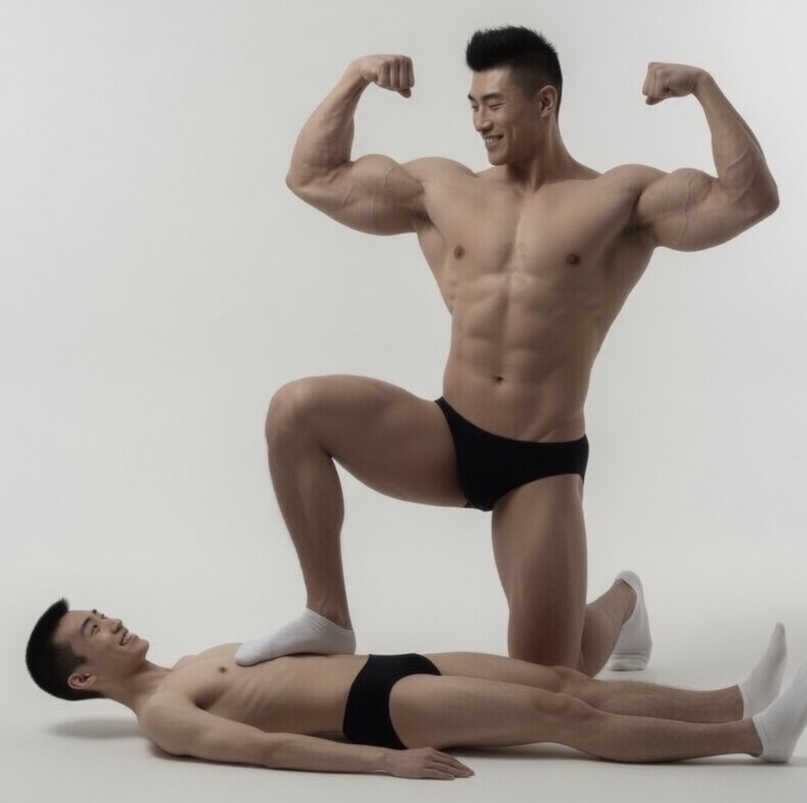 |
| 66 | Create a full-body studio biomechanics and movement-reference photograph of two fully clothed adult male models in neutral athletic clothing, presented as a non-sexual, clinically neutral scale-and-posture study. Use a direct front view at eye level with a pure white seamless background and natural perspective. Keep both figures fully visible from head to planted feet, including hands, knees, ankles, and the floor plane; avoid cropping, wide-angle distortion, perspective compression, and foreshortening. The taller, strongly built adult man stands upright with both feet comfortably apart and fully grounded, knees relaxed, neutral pelvis, vertical trunk, level shoulders, and hands resting on his own hips. His head turns slightly toward the smaller, slender adult man. The smaller man stands beside him with both feet firmly planted, arms relaxed, knees naturally unlocked, and head angled upward toward the taller man's face or upper torso. Maintain a clear lateral gap and no physical contact, so the relative vertical and lower-body proportions remain easy to read. Emphasize the taller man's distinctly elongated but anatomically coherent femurs, tibias, Achilles regions, and feet without compressing them through camera placement. Show natural stance mechanics and crisp separation of the silhouettes. Exclude floating soles, slanted shoulders, occluded legs, forced comparison, reversed joints, wide-angle distortion, or exaggerated perspective. Render the movement with calm cooperative body language, clear skeletal landmarks, individually readable hands and feet, and a continuous floor-to-body support logic suitable for a professional biomechanics and figure-reference session. Use unobstructed lighting so every support surface, joint direction, and major limb contour remains legible. | 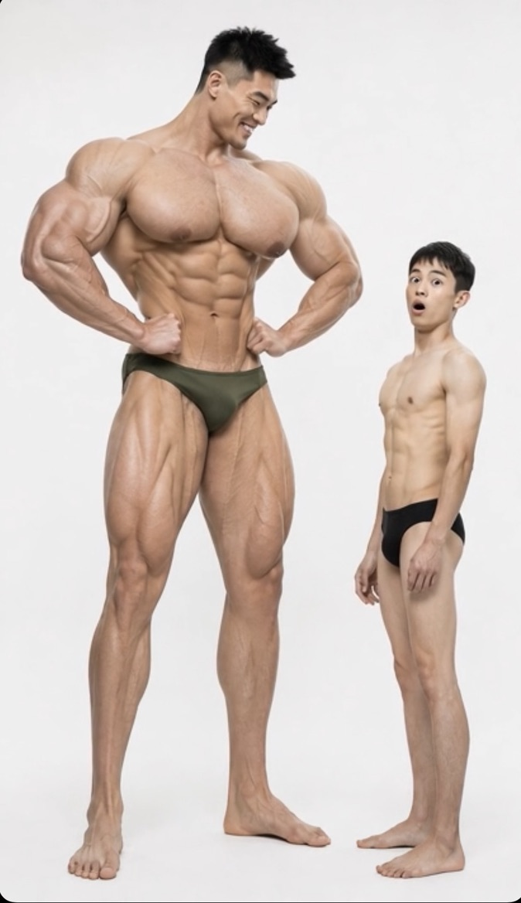 |
| 67 | Create a full-body studio biomechanics and movement-reference photograph of two fully clothed adult male models in neutral athletic clothing, presented as a non-sexual, clinically neutral partner-carry study. Use a direct front view with a pure white seamless background and natural perspective. Keep both bodies fully visible from head to foot, including hands, knees, ankles, feet, and every supporting contact; avoid cropping, wide-angle distortion, perspective compression, and foreshortening. The taller, strongly built adult man stands with feet apart, knees softly flexed, pelvis stable, and trunk upright. An open hand and forearm support the smaller, slender adult man's upper back or shoulder blade while the other open hand supports the bent legs beneath the outer knee and thigh. The smaller man is held level and clearly lifted from the floor, torso resting securely near the carrier's centerline, legs extended or comfortably bent, arms held openly close to the carrier's upper body, and head directed toward either the carrier or camera. Make the full load path visible through the carrier's hands, elbows, shoulders, torso, planted legs, and feet. Preserve the taller man's elongated, anatomically coherent femurs, tibias, Achilles regions, and feet. Keep all limbs separated and joints neutral. Exclude unnecessary close framing, restrictive holds, unsupported floating, hidden grip points, knee reversal, body intersections, or truncated anatomy. Render the movement with calm cooperative body language, clear skeletal landmarks, individually readable hands and feet, and a continuous floor-to-body support logic suitable for a professional biomechanics and figure-reference session. Use unobstructed lighting so every support surface, joint direction, and major limb contour remains legible. | 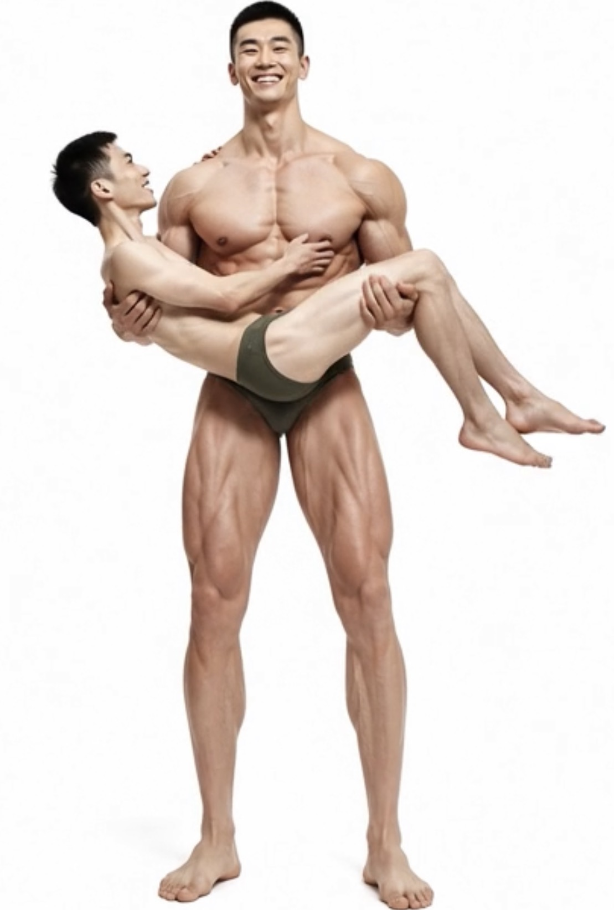 |
| 68 | Create a full-body studio biomechanics and movement-reference photograph of two fully clothed adult male models in neutral athletic clothing, presented as a non-sexual, clinically neutral assisted-foot-mobility study. Use a front-oblique side view with a pure white seamless background and natural perspective. Keep both figures completely visible, including hands, knees, ankles, feet, and floor contacts; avoid cropping, wide-angle distortion, perspective compression, and foreshortening. The taller, strongly built adult man stands on a firm planted leg, with the other leg raised from the hip and bent comfortably so the foot extends forward at a neutral ankle. His arms rest naturally alongside the body and he looks downward toward the guided foot. The smaller, slender adult man takes a low stable squat directly in front of the foot, feet grounded, knees tracking naturally, and open hands under the sole and outer side as gentle positional guides. His wrists remain neutral and he looks upward toward the foot. Make clear that the taller man's planted leg carries the load while the smaller man provides no lifting force. Preserve the taller man's elongated femur, tibia, Achilles region, and foot as a continuous long-limbed line. Exclude foot-to-body pressure, facial proximity, suspended support, reversed knees, distorted hands, unstable crouching, or perspective compression. Render the movement with calm cooperative body language, clear skeletal landmarks, individually readable hands and feet, and a continuous floor-to-body support logic suitable for a professional biomechanics and figure-reference session. Use unobstructed lighting so every support surface, joint direction, and major limb contour remains legible. | 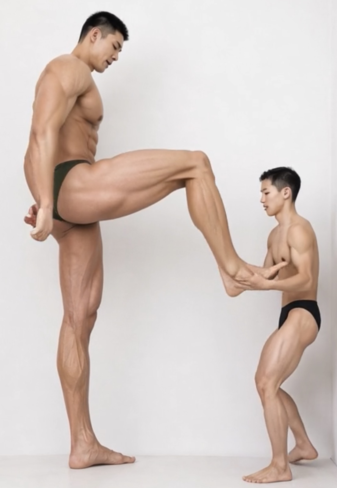 |
| 69 | Create a full-body studio biomechanics and movement-reference photograph of two fully clothed adult male models in neutral athletic clothing, presented as a non-sexual, clinically neutral forward-fold coaching study. Use a strict side view aligned with the main body plane, with a pure white seamless background and natural perspective. Keep both figures fully visible, including heads, hands, knees, ankles, feet, and open clearance around the shoulders; avoid cropping, wide-angle distortion, perspective compression, and foreshortening. The smaller, slender adult man performs a supported forward fold with open hands on the floor, knees softly bent, long back, and head lowered. The taller, strongly built adult man stands beside and slightly behind him on a stable planted stance, torso upright, pelvis neutral, hands held behind his own body, and gaze directed downward in a coaching role. Rather than placing weight on the smaller man, the taller man lifts the free foot to a controlled non-contact alignment point beside the outer shoulder-line, keeping a clear gap. His grounded leg alone carries his bodyweight. Preserve the taller man's elongated femur, tibia, Achilles region, and foot without shortening. Show stable hands-and-feet support for the forward fold, neutral joints, and visible clearance. Exclude stepping, back loading, pressure, spinal collapse, contact at the head, body intersection, or unstable balance. Render the movement with calm cooperative body language, clear skeletal landmarks, individually readable hands and feet, and a continuous floor-to-body support logic suitable for a professional biomechanics and figure-reference session. Use unobstructed lighting so every support surface, joint direction, and major limb contour remains legible. | 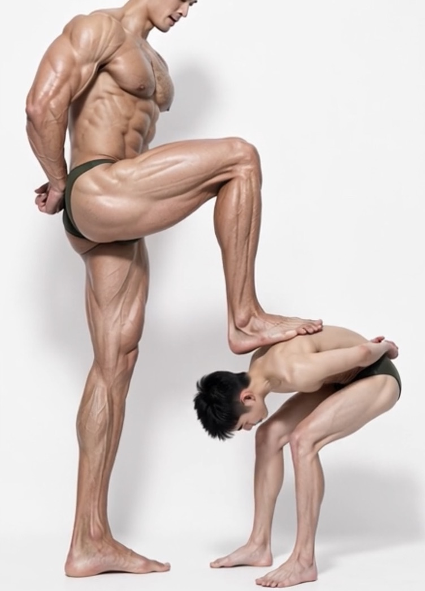 |
| 70 | Create a full-body studio biomechanics and movement-reference photograph of two fully clothed adult male models in neutral athletic clothing, presented as a non-sexual, clinically neutral kneeling leg-alignment study. Use a front-oblique side view with a pure white seamless background and natural perspective. Keep both bodies fully visible, including hands, knees, ankles, feet, and all floor contacts; avoid cropping, wide-angle distortion, perspective compression, and foreshortening. The taller, strongly built adult man stands upright with a planted supporting leg, relaxed arms, neutral pelvis, and gaze lowered to monitor alignment. His other leg is raised from the hip with a comfortable knee bend, neutral ankle, and foot held beside the smaller, slender adult man's outer shoulder-line as a non-loading spatial reference rather than a body-contact point. The smaller man kneels on a stable base, with the other leg available as an auxiliary grounded support, open hands lightly guiding the taller man's ankle or lower leg, neutral wrists, and head lifted toward the guide position. Make the taller man's planted foot the only weight-bearing route and retain a visible body gap around the smaller man's head and upper torso. Preserve the taller man's elongated femur, tibia, Achilles region, and foot. Exclude pressure, restraint, kneeling instability, ankle distortion, reverse joints, hidden supports, or perspective shortening. Render the movement with calm cooperative body language, clear skeletal landmarks, individually readable hands and feet, and a continuous floor-to-body support logic suitable for a professional biomechanics and figure-reference session. Use unobstructed lighting so every support surface, joint direction, and major limb contour remains legible. | 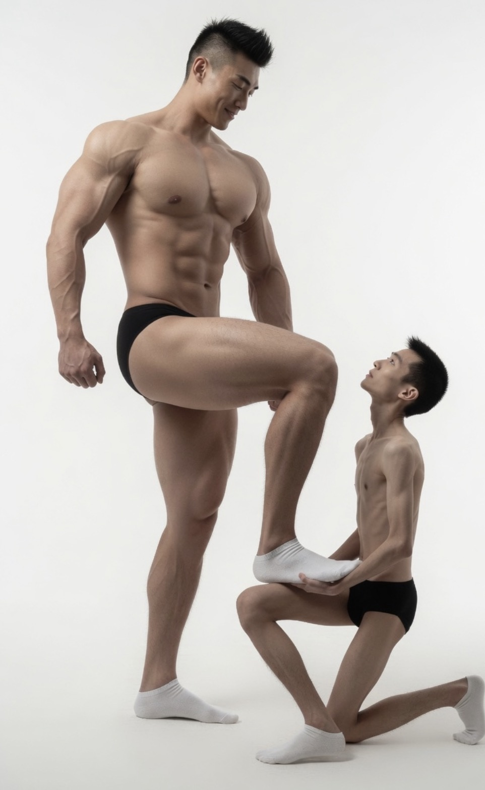 |
| 71 | Create a full-body studio biomechanics and movement-reference photograph of two fully clothed adult male models in neutral athletic clothing, presented as a non-sexual, clinically neutral standing scale study. Use a strict side view aligned with the shared body plane, with a pure white seamless background and natural perspective. Keep both figures fully visible from head to grounded feet, including hands, knees, ankles, and clear silhouette edges; avoid cropping, wide-angle distortion, perspective compression, and foreshortening. The taller, strongly built adult man stands facing the smaller, slender adult man with both feet fully planted, neutral pelvis, upright chest without leaning backward, level shoulders, and hands folded openly behind his own body. He turns his head toward the smaller man. The smaller man stands close to the taller man's front-side without touching, with both feet planted, knees naturally unlocked, arms resting by his sides, and head tilted upward to return the gaze. Maintain a clear, respectful gap between body outlines and no unnecessary close contact. Emphasize the taller man's elongated, anatomically coherent femurs, tibias, Achilles regions, and feet as full side-profile landmarks. Show balanced foot pressure, neutral ankles, coherent spinal alignment, and unoccluded contours. Exclude tiptoeing, forced posture, body overlap, reverse joints, tilted shoulders, twisting, or perspective tricks that shorten the legs. Render the movement with calm cooperative body language, clear skeletal landmarks, individually readable hands and feet, and a continuous floor-to-body support logic suitable for a professional biomechanics and figure-reference session. Use unobstructed lighting so every support surface, joint direction, and major limb contour remains legible. | 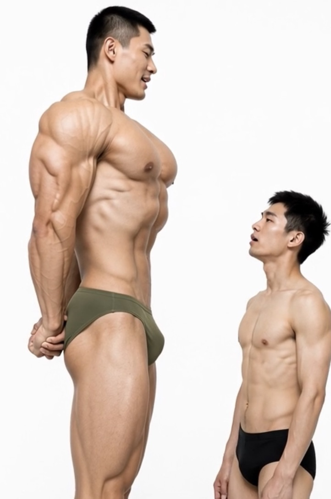 |
| 72 | Create a full-body studio biomechanics and movement-reference photograph of two fully clothed adult male models in neutral athletic clothing, presented as a non-sexual, clinically neutral lateral-leg-range study. Use a low direct front view with a pure white seamless background and natural perspective. Keep every head, hand, torso, pelvis, knee, ankle, foot, and ground contact visible; avoid cropping, wide-angle distortion, perspective compression, and foreshortening. The taller, strongly built adult man stands on a fully planted supporting leg with neutral pelvis and level shoulders, holding a symmetric flexed-arm figure-reference display. His other leg extends outward from the hip in a controlled lateral line, ankle neutral, and foot held beside the smaller, slender adult man's outer shoulder-line as a visible non-contact alignment marker. The smaller man stands at the taller man's front-side on both grounded feet, arms relaxed, torso upright with only a slight natural counterbalance, and head turned toward the raised foot while maintaining a safe clearance from it. The taller man faces the camera or gently turns toward the alignment point. Preserve elongated femurs, tibias, Achilles regions, and feet in the lateral extension. Exclude contact at the head or upper body, pressure, instability, knee reversal, body intersection, hidden soles, or perspective shortening. Render the movement with calm cooperative body language, clear skeletal landmarks, individually readable hands and feet, and a continuous floor-to-body support logic suitable for a professional biomechanics and figure-reference session. Use unobstructed lighting so every support surface, joint direction, and major limb contour remains legible. | 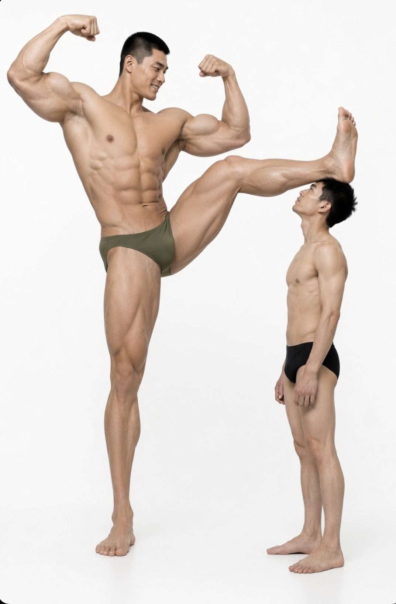 |
| 73 | Create a full-body studio biomechanics and movement-reference photograph of two fully clothed adult male models in neutral athletic clothing, presented as a non-sexual, clinically neutral standing support study. Use a direct front view with a pure white seamless background and natural perspective. Keep both figures fully visible, including all hands, elbows, knees, ankles, feet, and floor supports; avoid cropping, wide-angle distortion, perspective compression, and foreshortening. The taller, strongly built adult man stands just behind and slightly to the side of the smaller, slender adult man with feet separated, knees gently flexed, and pelvis neutral. Instead of enclosing the partner, he uses open hands and forearms to provide light, voluntary support at the outer shoulder blade and side waist, maintaining clear space around the front of the smaller man's torso. The smaller man stands independently with both feet grounded, neutral trunk, arms relaxed or lightly placed at the taller man's side waist without gripping, and head directed forward while the taller man looks toward him or the camera. Make all support contact clearly optional and non-restraining, with both figures bearing their own weight through their feet. Preserve the taller man's elongated femurs, tibias, Achilles regions, and feet. Exclude restraint, constricting holds, pressure, hidden arms, torso bending, reversed knees, loss of balance, or perspective compression. Render the movement with calm cooperative body language, clear skeletal landmarks, individually readable hands and feet, and a continuous floor-to-body support logic suitable for a professional biomechanics and figure-reference session. Use unobstructed lighting so every support surface, joint direction, and major limb contour remains legible. | 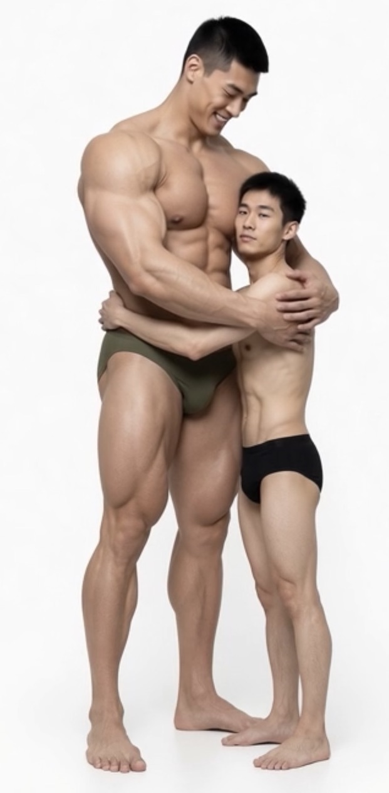 |
| 74 | Create a full-body studio biomechanics and movement-reference photograph of two fully clothed adult male models in neutral athletic clothing, presented as a non-sexual, clinically neutral assisted-leg-placement study. Use a front-oblique view aligned with their shared body plane, with a pure white seamless background and natural perspective. Keep both bodies fully visible, including hands, knees, ankles, feet, and all ground contacts; avoid cropping, wide-angle distortion, perspective compression, and foreshortening. The taller, strongly built adult man stands on a planted leg with a neutral pelvis, vertical trunk, level shoulders, and a symmetric flexed-arm figure-reference display. The other leg is raised with a comfortable knee bend and neutral ankle. Its foot is held beside the smaller, slender adult man's outer shoulder-line as a light non-contact alignment cue, never pressing toward the head or torso. The smaller man stands at the taller man's front-side with both feet planted, a slight natural backward counterbalance, an open hand lightly guiding the ankle or outer foot, the other arm relaxed, and eyes directed toward the cue. Keep the taller man's weight entirely over the grounded leg and show a clear protective gap. Preserve elongated femur, tibia, Achilles region, and foot proportions. Exclude facial contact, pressure, restraint, twisting, knee reversal, hidden supports, imbalance, or perspective distortion. Render the movement with calm cooperative body language, clear skeletal landmarks, individually readable hands and feet, and a continuous floor-to-body support logic suitable for a professional biomechanics and figure-reference session. Use unobstructed lighting so every support surface, joint direction, and major limb contour remains legible. | 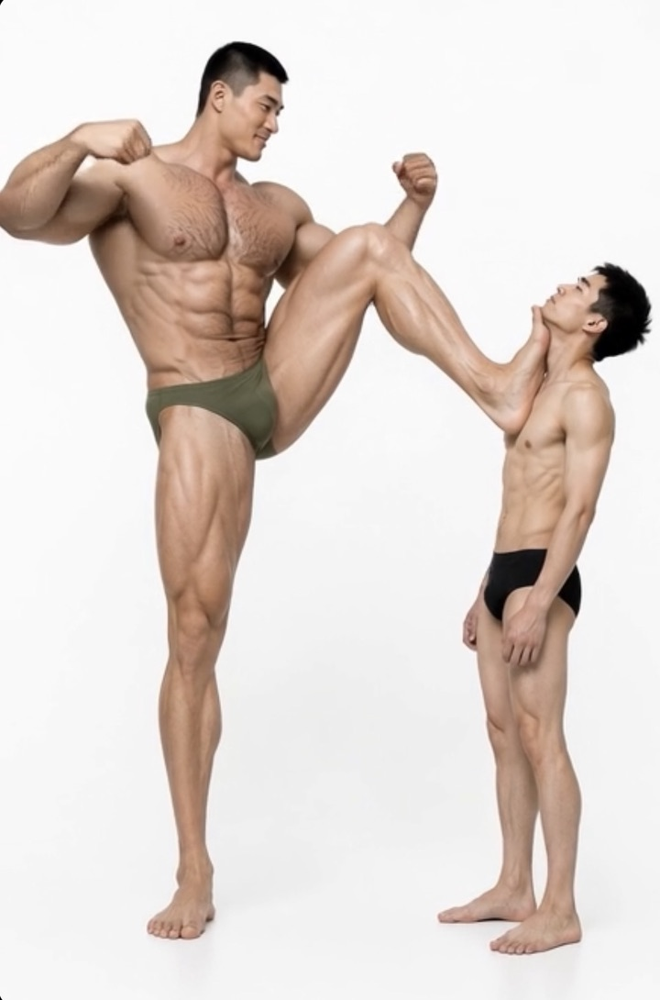 |
| 75 | Create a full-body studio biomechanics and movement-reference photograph of two fully clothed adult male models in neutral athletic clothing, presented as a non-sexual, clinically neutral rehabilitation and spatial-balance study. Use a front-oblique side view with a pure white seamless background and natural perspective. Keep all heads, hands, knees, ankles, feet, and the open zone between the figures fully visible; avoid cropping, wide-angle distortion, perspective compression, and foreshortening. The smaller, slender adult man holds a non-weight-bearing hands-and-knees recovery position with palms flat, knees comfortably apart, a relatively level back, and face directed forward. The taller, strongly built adult man takes a broad, offset low athletic stance beside him, both soles grounded well outside the smaller man's space, knees aligned naturally, hands resting on his own thighs or hips, and torso only slightly inclined forward. He looks downward to supervise spacing. There is no contact or load transfer to the smaller man's back; the arrangement demonstrates offset movement planes rather than containment. Preserve the taller man's elongated, anatomically coherent femurs, tibias, Achilles regions, and feet in the low stance. Show safe ground support, neutral joints, and visible clearance. Exclude back pressure, stepping, body enclosure, unstable supports, hidden limbs, excessive spinal flexion, or perspective compression. Render the movement with calm cooperative body language, clear skeletal landmarks, individually readable hands and feet, and a continuous floor-to-body support logic suitable for a professional biomechanics and figure-reference session. Use unobstructed lighting so every support surface, joint direction, and major limb contour remains legible. | 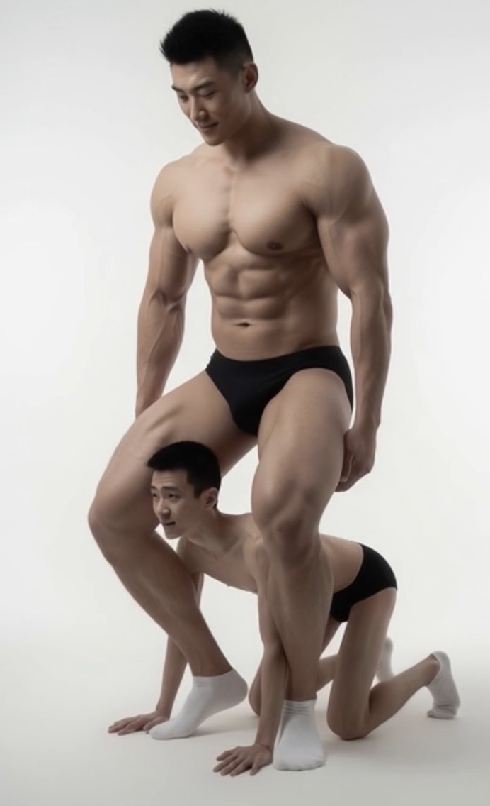 |
| 76 | Create a full-body studio biomechanics and movement-reference photograph of two fully clothed adult male models in neutral athletic clothing, presented as a non-sexual, clinically neutral floor-mobility study. Use a low direct front view with a pure white seamless background and natural perspective. Keep all heads, hands, torsos, pelvises, knees, ankles, feet, and floor contacts fully visible; avoid cropping, wide-angle distortion, perspective compression, and foreshortening. The taller, strongly built adult man demonstrates a broad, stable deep squat with both soles planted, knees tracking outward, pelvis lowered, torso upright, hands resting behind his own body, and gaze lowered to monitor clearance. The smaller, slender adult man lies supine at a safe offset in front of the squat, with upper back grounded, arms opened beside the body, and both legs bent upward in a controlled crossed-leg mobility configuration that remains clearly below and away from the taller man's pelvis. Maintain visible space between both figures, no body-to-body pressure, and independent floor support. Preserve the taller man's elongated femurs, tibias, Achilles regions, and feet even in the deep squat. Show natural ankle direction, continuous skeletal alignment, and stable balance. Exclude body enclosure, compression, knee reversal, foot contact, clipped anatomy, merged limbs, or perspective shortening. Render the movement with calm cooperative body language, clear skeletal landmarks, individually readable hands and feet, and a continuous floor-to-body support logic suitable for a professional biomechanics and figure-reference session. Use unobstructed lighting so every support surface, joint direction, and major limb contour remains legible. | 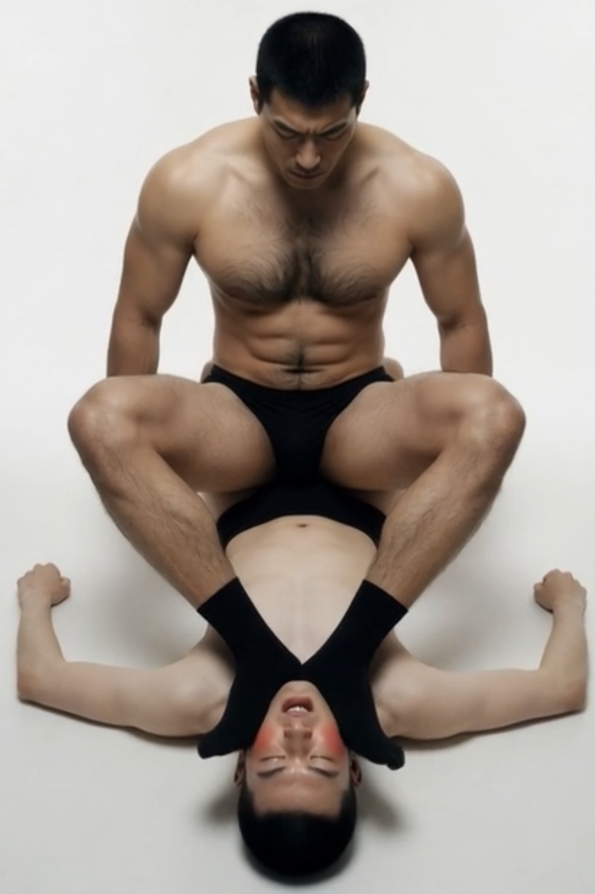 |
| 77 | Create a full-body studio biomechanics and movement-reference photograph of two fully clothed adult male models in neutral athletic clothing, presented as a non-sexual, clinically neutral partner-carry study. Use a front-oblique view with a pure white seamless background and natural perspective. Keep both figures fully visible from head to foot, including every hand, knee, ankle, foot, and support point; avoid cropping, wide-angle distortion, perspective compression, and foreshortening. The taller, strongly built adult man stands upright with feet separated, knees softly flexed, pelvis stable, and torso centered over the ground. An open hand and forearm support the smaller, slender adult man's back while the other open hand supports the bent thigh behind the knee. The smaller man is held level with hips clear of the floor, legs comfortably flexed, arms resting openly alongside the carrier's upper torso or side waist without gripping, and head turned toward the taller man. Both maintain calm eye contact. Make the load path visible from the smaller man's back and thigh through the taller man's arms, shoulders, pelvis, planted legs, and feet. Preserve elongated, anatomically coherent femurs, tibias, Achilles regions, and feet on the taller man. Exclude unnecessary close staging, restrictive holds, floating anatomy, hidden supports, slipping hips, reversed knees, body intersections, or camera tricks. Render the movement with calm cooperative body language, clear skeletal landmarks, individually readable hands and feet, and a continuous floor-to-body support logic suitable for a professional biomechanics and figure-reference session. Use unobstructed lighting so every support surface, joint direction, and major limb contour remains legible. | 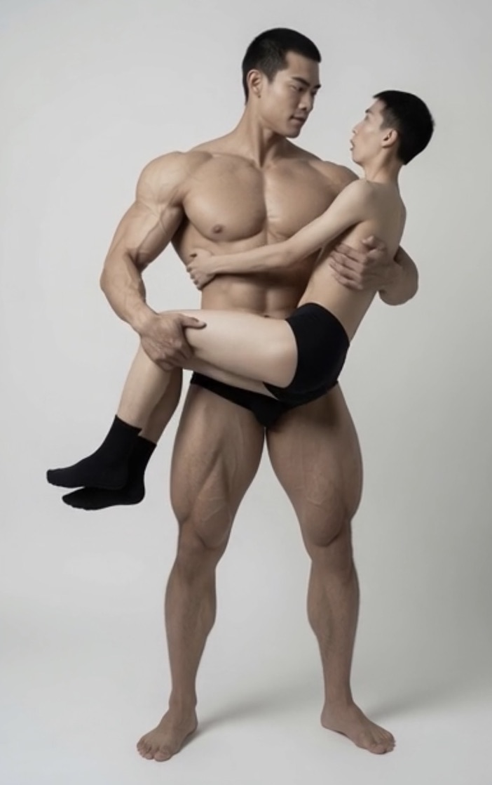 |
| 78 | Create a full-body studio biomechanics and movement-reference photograph of two fully clothed adult male models in neutral athletic clothing, presented as a non-sexual, clinically neutral side-view leg-placement study. Use a strict side view aligned with the main body plane, with a pure white seamless background and natural perspective. Keep all heads, hands, torsos, knees, ankles, feet, elbows, and floor contacts fully visible; avoid cropping, wide-angle distortion, perspective compression, and foreshortening. The taller, strongly built adult man balances on a planted leg with upright trunk, relaxed arms, neutral pelvis, and head lowered to supervise his lifted leg. The other leg bends from the hip with a neutral ankle, and the foot is held beside the smaller, slender adult man's outer shoulder-line as a non-contact spatial marker with visible clearance from the head and torso. The smaller man reclines safely on the floor through both elbows and upper back, knees bent, hands near the sides, and gaze directed toward the taller man. The taller man's planted leg is the only load-bearing route. Preserve the long, anatomically coherent femur, tibia, Achilles region, and foot. Exclude unwanted close foot approach, pressure, stepping, unstable recline, knee reversal, body intersection, hidden support, or leg-shortening perspective. Render the movement with calm cooperative body language, clear skeletal landmarks, individually readable hands and feet, and a continuous floor-to-body support logic suitable for a professional biomechanics and figure-reference session. Use unobstructed lighting so every support surface, joint direction, and major limb contour remains legible. Preserve distinctly elongated yet anatomically coherent femurs, tibias, Achilles regions, and feet on the taller, strongly built adult man. | 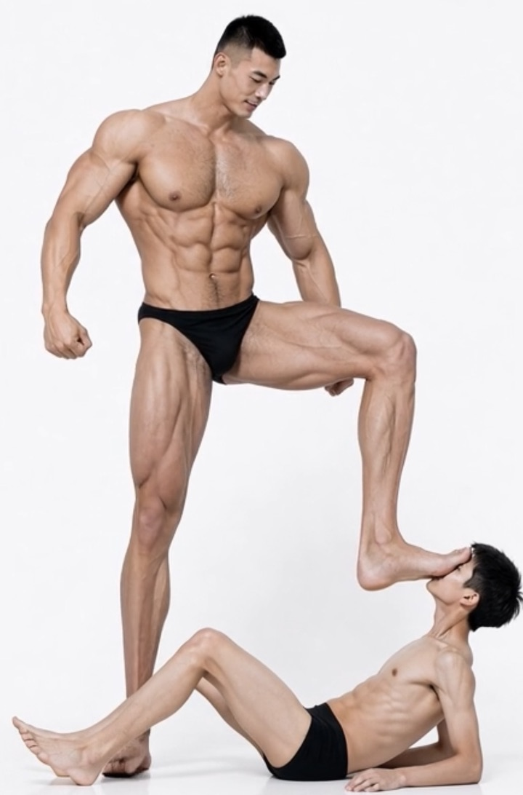 |
| 79 | Create a full-body studio biomechanics and movement-reference photograph of two fully clothed adult male models in neutral athletic clothing, presented as a non-sexual, clinically neutral forward-fold coaching study. Use a front-oblique side view with a pure white seamless background and natural perspective. Keep every head, hand, shoulder, pelvis, knee, ankle, and foot fully visible; avoid cropping, wide-angle distortion, perspective compression, and foreshortening. The smaller, slender adult man holds a non-weight-bearing hands-and-knees recovery position with palms beneath shoulders, knees beneath hips, a long neutral back, and head directed down or gently to the side. The taller, strongly built adult man stands behind at a respectful offset with feet apart, knees relaxed, stable pelvis, and torso inclined only enough to reach the space near the smaller man's shoulder blades. His open hands hover or make a feather-light coaching cue at the outer shoulders without downward force, restraint, or load transfer. He looks downward to supervise alignment. Preserve the taller man's elongated femurs and tibias as coherent lines through the forward inclination, with both feet clearly grounded. Maintain open clearance around the smaller man's spine and upper body. Exclude pressing, back loading, forceful handling, body enclosure, spinal twisting, instability, hidden limbs, or perspective shortening. Render the movement with calm cooperative body language, clear skeletal landmarks, individually readable hands and feet, and a continuous floor-to-body support logic suitable for a professional biomechanics and figure-reference session. Use unobstructed lighting so every support surface, joint direction, and major limb contour remains legible. | 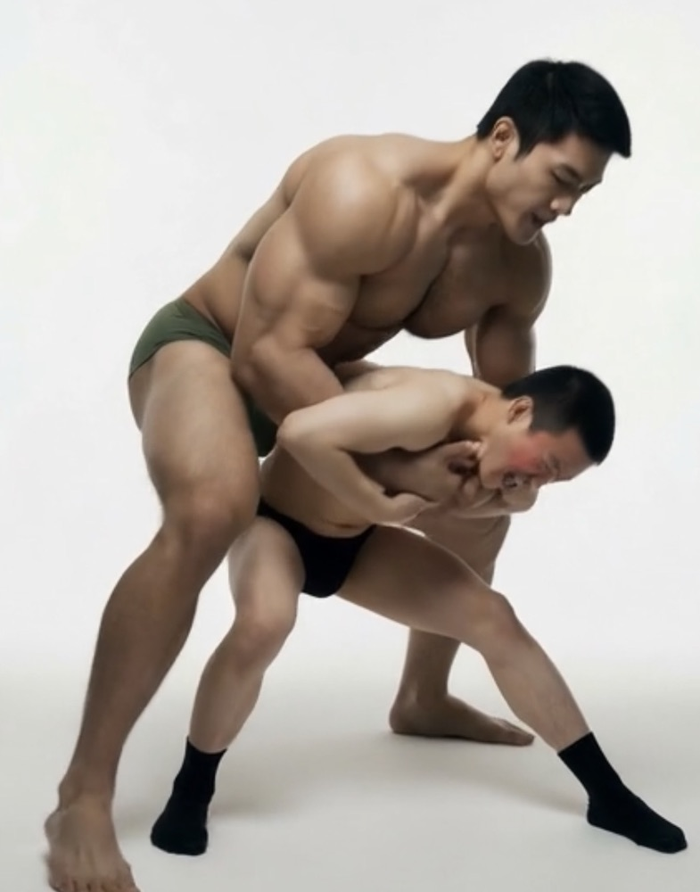 |
| 80 | Create a full-body studio biomechanics and movement-reference photograph of two fully clothed adult male models in neutral athletic clothing, presented as a non-sexual, clinically neutral assisted-carry study. Use a front-oblique view with a pure white seamless background and natural perspective. Keep both figures fully visible, including every hand, knee, ankle, foot, and floor support; avoid cropping, wide-angle distortion, perspective compression, and foreshortening. The taller, strongly built adult man stands in a stable planted stance with knees gently flexed, neutral pelvis, and vertical trunk. He performs a controlled close carry using open support under the smaller, slender adult man's upper back or shoulder blade and a separate open hand under the outer thigh or hip. The smaller man is lifted clear of the floor with legs comfortably flexed toward one side as a secure balance configuration, while both arms remain open and placed at the upper back or shoulder-line rather than constricting the neck. Their torsos stay aligned at the centerline, and they maintain calm eye contact. Make the load path explicit through the carrier's hands, arms, trunk, legs, and planted feet. Preserve the taller man's elongated femurs, tibias, Achilles regions, and feet. Exclude unnecessary close framing, tight wrapping, restraint, slipping pelvises, hidden supports, reversed joints, body intersection, or imbalance. Render the movement with calm cooperative body language, clear skeletal landmarks, individually readable hands and feet, and a continuous floor-to-body support logic suitable for a professional biomechanics and figure-reference session. Use unobstructed lighting so every support surface, joint direction, and major limb contour remains legible. | 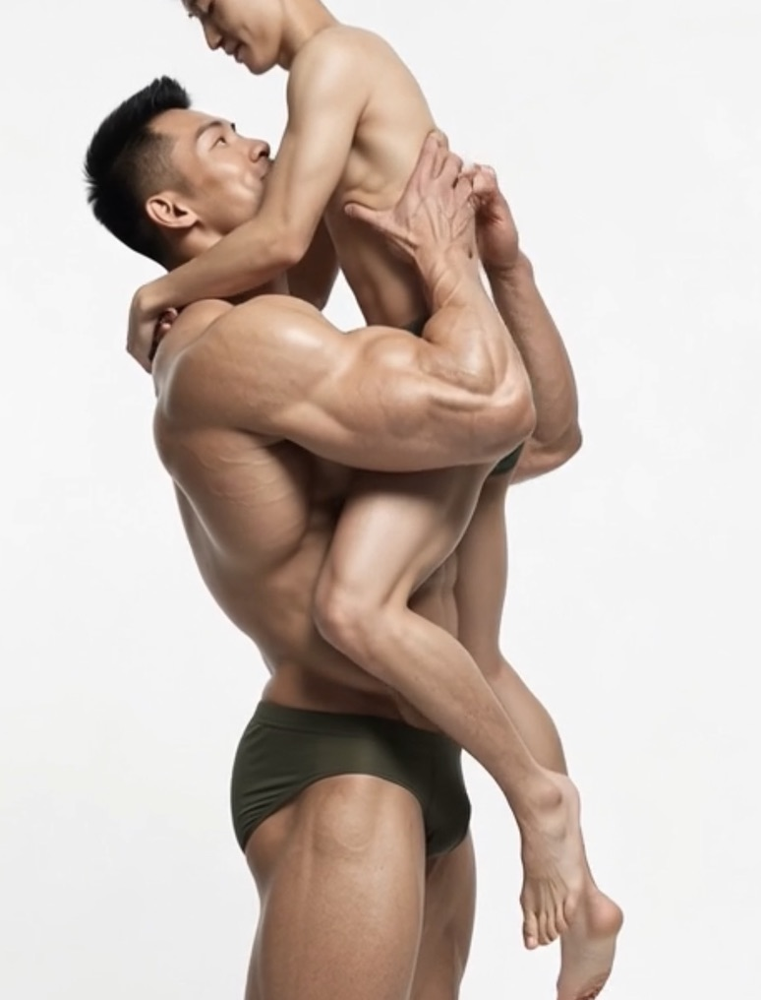 |
| 81 | Create a full-body studio biomechanics and movement-reference photograph of two fully clothed adult male models in neutral athletic clothing, presented as a non-sexual, clinically neutral balance and figure-reference study. Use a low direct front view with a pure white seamless background and natural perspective. Keep all heads, hands, torsos, pelvises, knees, ankles, feet, and floor contact points visible; avoid cropping, wide-angle distortion, perspective compression, and foreshortening. The taller, strongly built adult man stands on a firmly planted supporting leg with a neutral pelvis, level shoulders, and a symmetric flexed-arm figure-reference display. His other leg lifts with a natural knee bend, and the foot is held as a clearly non-weight-bearing proximity marker beside the smaller, slender adult man's outer shoulder blade rather than resting on the back. The smaller man maintains a reverse tabletop recovery pose with both open hands and both feet grounded, chest and hips lifted only to a comfortable neutral level, and head turned toward the taller man or camera. No weight transfers from the raised foot to the smaller man's body. Preserve the taller man's elongated femur, tibia, Achilles region, and foot. Show neutral wrists, stable floor support, and visible clearance. Exclude stepping, pressure, back loading, unstable table support, reversed joints, body intersections, or wide-angle distortion. Render the movement with calm cooperative body language, clear skeletal landmarks, individually readable hands and feet, and a continuous floor-to-body support logic suitable for a professional biomechanics and figure-reference session. Use unobstructed lighting so every support surface, joint direction, and major limb contour remains legible. | 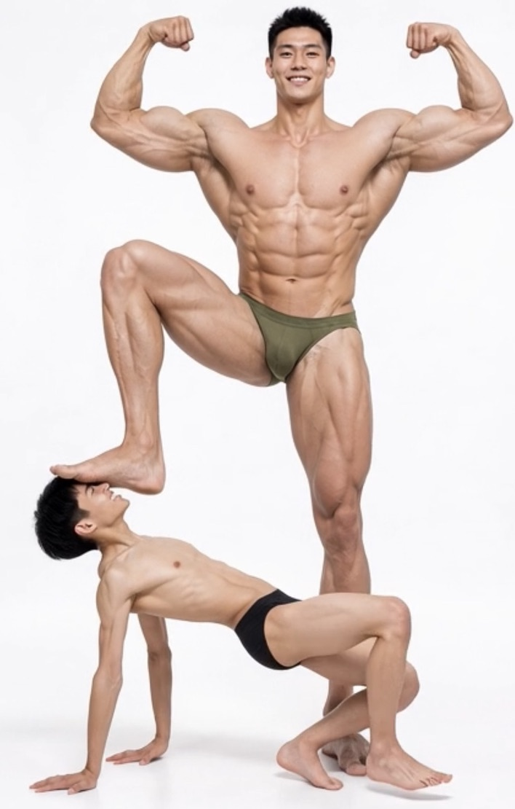 |
| 82 | Create a full-body studio biomechanics and movement-reference photograph of two fully clothed adult male models in neutral athletic clothing, presented as a non-sexual, clinically neutral level-body carry study. Use a front-oblique view aligned with the main body plane, with a pure white seamless background and natural perspective. Keep both figures fully visible from head to foot, including hands, knees, ankles, feet, and every supporting contact; avoid cropping, wide-angle distortion, perspective compression, and foreshortening. The taller, strongly built adult man stands with both soles planted, knees softly flexed, neutral pelvis, and vertical trunk. His open hands support the smaller, slender adult man's upper back and outer thigh or hip in a balanced carry. The smaller man's body remains level and fully clear of the floor, legs extending or softly bending toward one side, arms held openly close to the carrier's torso, and head lifted to look toward the carrier. Make the continuous load route visible through the taller man's hands, forearms, shoulders, torso, hips, legs, and feet. Preserve the taller man's elongated, anatomically coherent femurs, tibias, Achilles regions, and feet without obstruction. Keep every joint in a natural range and all limbs distinct. Exclude restraint, unnecessary close contact, unsupported suspension, hidden hands, body clipping, knee reversal, cropped feet, or perspective compression. Render the movement with calm cooperative body language, clear skeletal landmarks, individually readable hands and feet, and a continuous floor-to-body support logic suitable for a professional biomechanics and figure-reference session. Use unobstructed lighting so every support surface, joint direction, and major limb contour remains legible. | 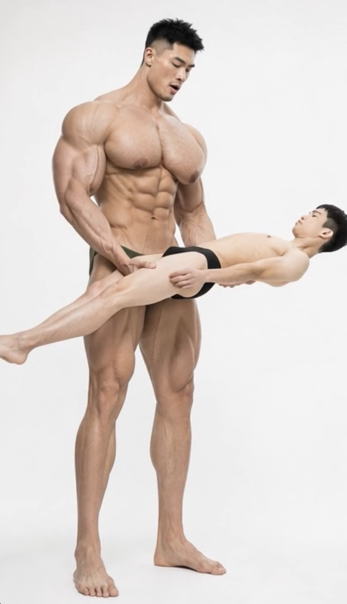 |
| 83 | Create a full-body studio biomechanics and movement-reference photograph of two fully clothed adult male models in neutral athletic clothing, presented as a non-sexual, clinically neutral upright-lift study. Use a direct front view with a pure white seamless background and natural perspective. Keep both figures entirely visible, including hands, knees, ankles, feet, and all floor supports; avoid cropping, wide-angle distortion, perspective compression, and foreshortening. The taller, strongly built adult man stands with feet separated for balance, knees gently flexed, pelvis stable, and arms placed openly around the smaller, slender adult man's outer back and side torso to lift him clear of the floor. The smaller man hangs vertically with legs relaxed and naturally extended, arms placed openly near the taller man's upper shoulder-line without constricting it, torso aligned close to the carrier's center, and head turned toward the taller man. The taller man lowers his gaze to monitor the lift. Make the support chain explicit from the smaller man's torso through the taller man's forearms, shoulders, trunk, legs, and grounded feet. Preserve the taller man's elongated femurs, tibias, Achilles regions, and feet. Exclude restrictive embrace, unnecessary close staging, hidden supports, slipping hips, reverse knees, body intersection, cropped soles, or distorted perspective. Render the movement with calm cooperative body language, clear skeletal landmarks, individually readable hands and feet, and a continuous floor-to-body support logic suitable for a professional biomechanics and figure-reference session. Use unobstructed lighting so every support surface, joint direction, and major limb contour remains legible. |  |
| 84 | Create a full-body studio biomechanics and movement-reference photograph of two fully clothed adult male models in neutral athletic clothing, presented as a non-sexual, clinically neutral lateral-leg-alignment study. Use a front-oblique side view parallel to the main body plane, with a pure white seamless background and natural perspective. Keep all heads, hands, torsos, knees, ankles, feet, and grounded soles completely visible; avoid cropping, wide-angle distortion, perspective compression, and foreshortening. The taller, strongly built adult man stands on a stable planted leg with upright torso, neutral pelvis, hands held naturally behind his own body, and head turned toward the smaller, slender adult man. His other leg lifts laterally and forward in a continuous, extended line, ankle neutral, with the foot held beside the smaller man's outer shoulder-line as a non-contact positioning marker. The smaller man stands at the taller man's side with both feet planted, knees relaxed, an open hand lightly guiding the taller man's ankle or lower leg, the other arm resting at his side, and head raised toward the taller man. Keep a visible gap between the foot and upper body. Preserve the taller man's elongated femur, tibia, Achilles region, and foot in full view. Exclude contact pressure, restraint, shoulder compression, knee reversal, imbalance, hidden soles, or perspective shortening. Render the movement with calm cooperative body language, clear skeletal landmarks, individually readable hands and feet, and a continuous floor-to-body support logic suitable for a professional biomechanics and figure-reference session. Use unobstructed lighting so every support surface, joint direction, and major limb contour remains legible. | 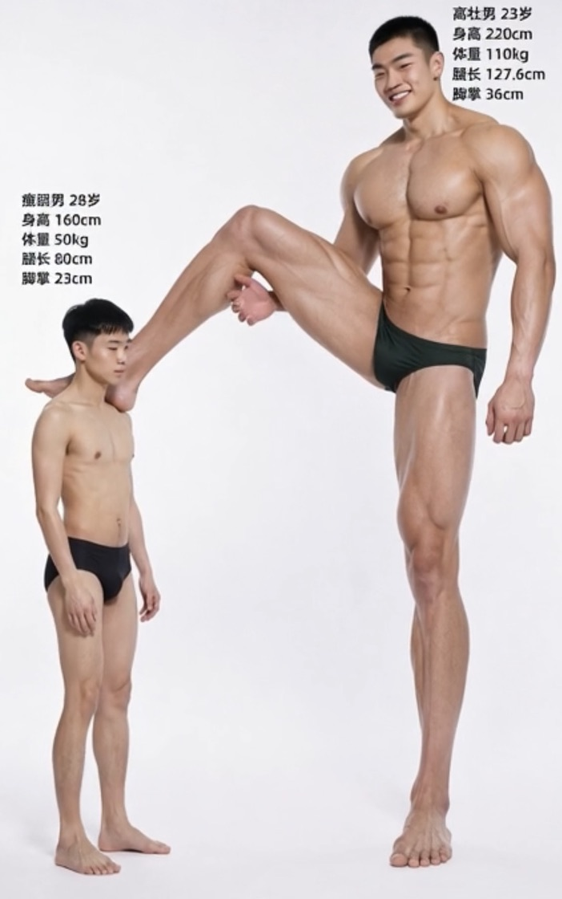 |
| 85 | Create a full-body studio biomechanics and movement-reference photograph of two fully clothed adult male models in neutral athletic clothing, presented as a non-sexual, clinically neutral assisted-squat study. Use a front-oblique view with a pure white seamless background and natural perspective. Keep both figures fully visible from head to grounded feet, including hands, wrists, knees, ankles, and the clear space between their bodies; avoid cropping, wide-angle distortion, perspective compression, and foreshortening. The taller, strongly built adult man stands at the smaller, slender adult man's front-side in a low stable half-squat, with both soles planted, knees tracking naturally, pelvis lowered backward, and trunk inclined slightly forward while remaining balanced. An open hand offers a light forearm-guidance contact near the smaller man's wrist without gripping, while the other arm extends forward as a natural counterbalance. The smaller man remains upright on an independent planted stance with knees relaxed, arm resting freely within the guide, and head lowered to observe the voluntary hand-to-forearm reference. The taller man looks either toward the smaller man or the camera. Make both load paths independent through their own feet, and preserve the taller man's elongated femurs, tibias, Achilles regions, and feet even in the half-squat. Exclude restraint, wrist twisting, knee collapse, floating soles, body intersection, unstable balance, cropped legs, or perspective distortion. Render the movement with calm cooperative body language, clear skeletal landmarks, individually readable hands and feet, and a continuous floor-to-body support logic suitable for a professional biomechanics and figure-reference session. Use unobstructed lighting so every support surface, joint direction, and major limb contour remains legible. | 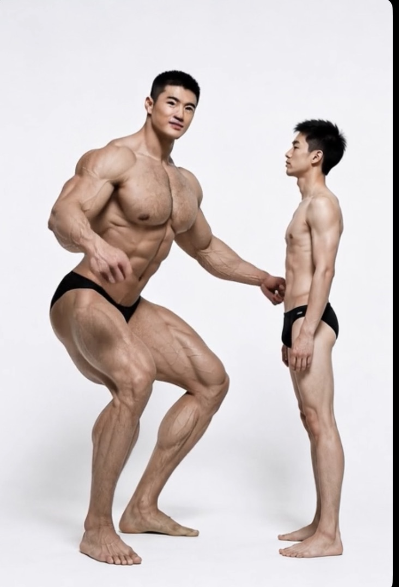 |
